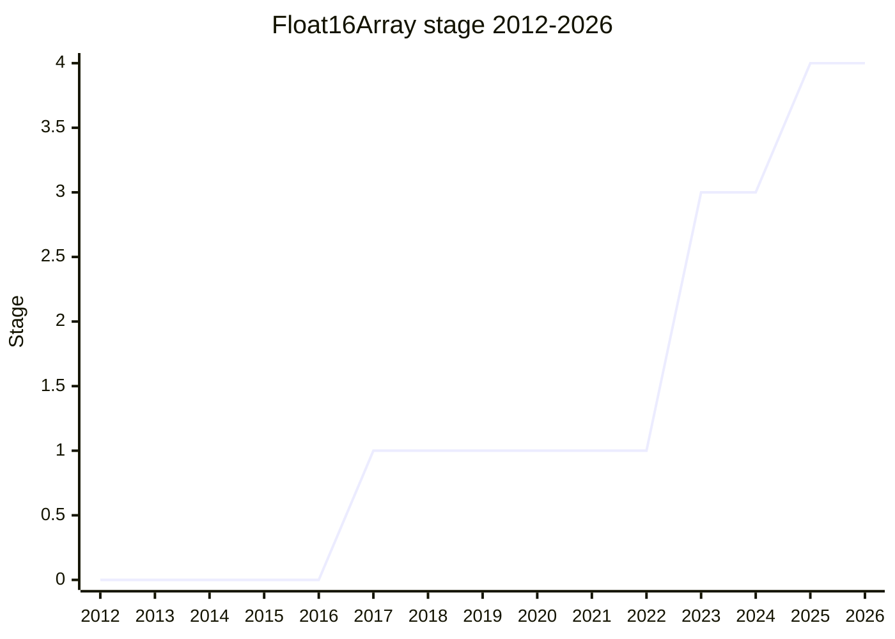

## Overview

`Float16Array` plus `DataView.prototype.getFloat16`/`setFloat16` and `Math.f16round`: IEEE 754 binary16 ("half precision") as a first-class numeric surface, exactly parallel to the existing float32/float64 TypedArrays. The spec text itself is trivial - it copies the `Float32Array` mechanics and swaps binary32 for binary16 - but implementations are "several orders of magnitude more difficult" than the specification, since doing them well means touching platform-specific conversion and SIMD code ([KG](../people/KG.md) at Stage 4).

The motivating case is interchange with the GPU and the web platform, not float16 arithmetic: WebGL, WebGPU (where binary16 support is the first optional extension), float-backed canvases (ColorWeb CG), and WebNN all traffic in 16-bit floats, and before this proposal the only way to hand one over was a `Uint16Array` holding the raw bit patterns. Machine learning reinforced the case: 7-billion-parameter models fit in VRAM at 16 bits where they do not at 32.

## Stage history

| Meeting                                                                            | Event                                                                                                                                                                                                                                                                                                                              | Stage |
| ---------------------------------------------------------------------------------- | ---------------------------------------------------------------------------------------------------------------------------------------------------------------------------------------------------------------------------------------------------------------------------------------------------------------------------------- | ----- |
| [2017-05](https://github.com/tc39/notes/blob/main/meetings/2017-05/may-23.md)      | Presented by [LEO](../people/LEO.md) as "Float16 on TypedArrays, DataView, Math.hfround" for Stage 1 (WebGL/graphics use cases, CPU-GPU transfer). Stage 1 accepted, with the ask to keep exploring the use cases                                                                                                                  | → 1   |
| [2023-03](https://github.com/tc39/notes/blob/main/meetings/2023-03/mar-22.md)      | Brought back by [KG](../people/KG.md) after five or six years ([LEO](../people/LEO.md) stays champion): ColorWeb CG float-backed canvas, WebGPU, ML models. Stage 2 ([SYG](../people/SYG.md) supported 2 but not the same-day Stage 3 ask); `hfround` renamed `f16round`; reviewers [WH](../people/WH.md), [JHD](../people/JHD.md) | 1 → 2 |
| [2023-05](https://github.com/tc39/notes/blob/main/meetings/2023-05/may-16.md)      | Stage 3: [DLM](../people/DLM.md) no concerns; [SYG](../people/SYG.md) support with explicit performance expectations                                                                                                                                                                                                               | 2 → 3 |
| [2025-02](https://github.com/tc39/notes/blob/main/meetings/2025-02/february-18.md) | Stage 4: JSC (Safari) and SpiderMonkey (Firefox) shipping, Chrome on by default in 135 (~April 1); adoption underway in canvas and WebNN                                                                                                                                                                                           | 3 → 4 |

> Reached Stage 1 in 2017-05, then sat dormant for about six years; Stage 2 in 2023-03, Stage 3 in 2023-05, Stage 4 in 2025-02.

## Main issues

### The 2017 ask: use cases without urgency

The first presentation had solid motivations (WebGL shaders, compact storage, CPU-GPU transfer) but no web-platform feature actively blocked on it, and [AWB](../people/AWB.md) probed who was actually prevented from shipping today. Stage 1 was accepted with an explicit instruction to keep exploring - and the proposal then went quiet until 2023, while WebGL's workaround (a `Uint16Array` of raw float16 bit patterns passed to `texImage2D`) became entrenched.

### The 2023 revival and the bfloat16 question

[KG](../people/KG.md)'s restart argument was that the platform had moved: the ColorWeb CG was designing a float-backed canvas, WebGPU lists binary16 support as its first extension, and ML practice (stable diffusion, three.js, a polyfill with hundreds of thousands of weekly downloads) had normalized IEEE float16. [WH](../people/WH.md) raised the one real design question: there are **two** incompatible 16-bit float standards - IEEE binary16 (10 mantissa bits) and Google's bfloat16 (7 mantissa bits, popular in ML). [KG](../people/KG.md)'s answer: canvas, WebGPU, and userland all standardized on IEEE, and adding bfloat16 later is not precluded.

The same session [SYG](../people/SYG.md) supported Stage 2 but refused to rush Stage 3: the competing-standards question meant the design space was not fully rigid, and the urgency (the canvas schedule) was not shared by all browsers. Stage 3 came anyway two months later.

### Performance expectations

At Stage 3, [SYG](../people/SYG.md) set expectations that shaped how the feature is understood: "do not expect float operations to be fast... this is basically for interchange with GPUs" - no asm.js-style cast-to-float16-and-back compute loops will be optimized. The one place the language itself does arithmetic on TypedArray contents is sorting, which implementations can satisfy by promoting to float32. [WH](../people/WH.md)'s Stage 2 condition - a conversion function, since introducing a numeric type requires a way to round into it - became `Math.f16round` (renamed from the proposed `hfround`).

## Related proposals

- [Uint8Array to/from Base64](uint8array-base64.md) - same era of TypedArray surface completion (shipped in 2025-07).
- [Immutable ArrayBuffers](immutable-arraybuffer.md) - the other 2025 TypedArray-adjacent line of work.

## Sources

- [2017-05 may-23](https://github.com/tc39/notes/blob/main/meetings/2017-05/may-23.md) - Stage 1 ([LEO](../people/LEO.md))
- [2023-03 mar-22](https://github.com/tc39/notes/blob/main/meetings/2023-03/mar-22.md) - Stage 2 ([KG](../people/KG.md))
- [2023-05 may-16](https://github.com/tc39/notes/blob/main/meetings/2023-05/may-16.md) - Stage 3
- [2025-02 february-18](https://github.com/tc39/notes/blob/main/meetings/2025-02/february-18.md) - Stage 4
