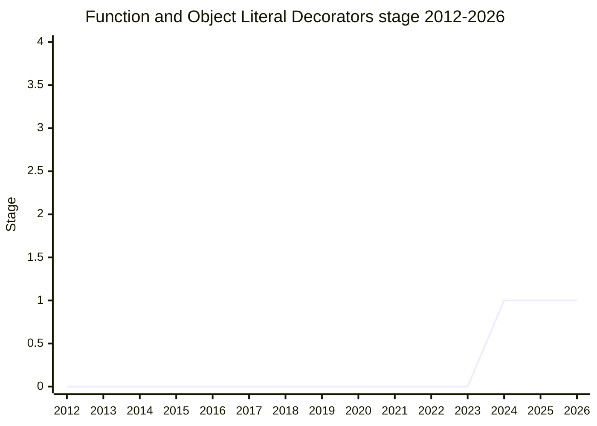

## Overview

Extends [Decorators](../proposals/decorators.md) (Stage 2.7 for classes and class elements) to the two remaining "function-like" places: freestanding functions (declarations, function expressions, arrow functions) and object literal elements (methods, getters/setters, property assignments treated like class fields). The motivation is decorator reuse and consistency - a `@log` or `@debounce` written for a class method should apply unchanged to a function - plus the capabilities functions don't get from DIY pipelining: `context.addInitializer` post-wrap registration (the Amazon Chalice routing example), reflection via `context.name`, and metadata via `Symbol.metadata`.

The proposal grew out of the original decorators design, where function decorators were part of the picture before being pulled out for the MVP. It deliberately came to the committee only after decorators reached Stage 3, to build on settled ground - and, per [RBN](../people/RBN.md), it is also the missing dependency for `parameter decorators`, which several delegates had said could not advance without it.

Championed by [RBN](../people/RBN.md) (Ron Buckton). The committee advanced it while split on the function half: [KG](../people/KG.md) remains skeptical of function decorators ("it's almost indistinguishable" from function calls) but is "much happier about object literal element decorators because they do in fact add considerable expressivity".

## Stage history

| Meeting                                                                      | Event                                                                                                                                                                                                                                                                            | Stage |
| ---------------------------------------------------------------------------- | -------------------------------------------------------------------------------------------------------------------------------------------------------------------------------------------------------------------------------------------------------------------------------- | ----- |
| [2024-02](https://github.com/tc39/notes/blob/main/meetings/2024-02/feb-8.md) | Presented ("Function and Object Literal Element Decorators for stage 1"), followed the same day by a dedicated "Decorated Function Declarations and Hoisting" session. Stage 1 agreed, with [KG](../people/KG.md)'s support conditional on deeper motivation work before Stage 2 | → 1   |

> First presented 2024-02 and at Stage 1 since.

## Main issues

### [KG](../people/KG.md)'s motivation challenge: "a new way of calling functions"

The central dispute. [KG](../people/KG.md): the slides "did not feel like there was motivation other than 'I want a new way of calling functions'... most of the examples on the slides, like I was doing the rewrite in my head to what that looks like if you do it as existing JavaScript, and it's almost indistinguishable." Working through [RBN](../people/RBN.md)'s arguments one at a time: class element decorators earn their syntax because you cannot declare a method as the result of a function call, but a function binding can hold a call result, so function decorators add no expressivity; the registration case is "not 100% straightforward" via application but "doesn't really sound like something that is worth adding new syntax to solve"; and reuse assumes decorating a class field and decorating a function are similar operations, which they are not. [KG](../people/KG.md)'s frame: "The proper understanding of most decorators is that they are of class and object elements, not of functions." [RBN](../people/RBN.md)'s counters were consistency (a decorator shouldn't have to be written defensively for both call shapes), `addInitializer` ordering (with pipelining, the registration call has to go last and be documented to that effect), and reflection.

> [SYG](../people/SYG.md): "my understanding of the two sides here is that it basically boils down to vibes" - and suggested the old comprehension-expressions exercise: side-by-side before/after rewrites, to get "a more honest, signal from people instead of just thinking in your head, I like decorates type of programming. Or I don’t like it."

[KG](../people/KG.md) made before/after comparisons the explicit price of Stage 2 ("it is being primarily proposed as an ergonomics feature"), and noted his personal preference to narrow the proposal to object literal elements during Stage 1. [SYG](../people/SYG.md) also reported that Angular - the original motivating customer for decorators - has internal regrets ("full of foot guns and unwieldy"; the `@inject` decorator "is on the way out"), so it "is not likely to be a motivating customer".

### Parameter decorators must not ride along

[SYG](../people/SYG.md), for the record: "even if function decorators were to advance, … I will like there to be some explicit recognition that that does not in any way open the door to parameter decorators" - adding that he was unconvinced parameter decorators should exist at all. [DE](../people/DE.md) suggested that given the strong objections, parameter decorators should be concluded as "no" rather than maintained at Stage 1. [RBN](../people/RBN.md) kept them in a separate proposal, noting the dependency order ([KG](../people/KG.md) had earlier said parameter decorators could not advance without function decorators).

### Hoisting decorated function declarations

The hard technical problem, split into its own same-day session ("Decorated Function Declarations and Hoisting", discussed on and off since 2016). A hoisted function declaration runs at the top of the block; decorators are expressions that run code. The options:

1. **Pre-evaluation step** - investigated at length over the years and rejected: decorators referencing block-level `const` helpers would hit TDZ, and evaluation order would no longer match user expectations.
2. **Dynamic application on first use** - "too complicated", nondeterministic ordering, and performance "so terrible because it would have to be applied to every variable reference, everywhere".
3. **Don't hoist decorated function declarations** - the champion's strong recommendation. The binding still hoists (like a class declaration) but the value initializes in document order: "new syntax means new semantics", and only code that opts in pays.
4. **Forbid decorators on function declarations** - rejected as an inconsistency ("it would be unfortunately to decorate every other function except a function").
5. **An opt-in marker** (e.g. `let function f`) - an idea [RBN](../people/RBN.md) has shopped around for years; not the lead option.

> [DE](../people/DE.md): "when we reviewed this internally within Bloomberg, multiple people found the nonhoisted version unfortunate... there is a technically correct answer, but that is not universal. It is unclear how to proceed."

[GCL](../people/GCL.md) sided with option 3: "as long as people have to modify their code to add decorators, that is the appropriate point at which they will need to do other things." No consensus was requested; the session closed with [RBN](../people/RBN.md) asking whether option 3 would be the accepted direction _if_ function decorators move forward.

### One proposal or a refocus?

[MF](../people/MF.md) suggested the exploration might be better framed as two spaces - the applicability of decorators to other constructs, versus "just the ergonomics around... modifying the behavior of functions" - possibly as separate proposals. [RBN](../people/RBN.md) kept them together (object literal methods and property-assigned function expressions are too entangled to discuss apart) and resisted [DE](../people/DE.md)'s broader "decorators V2" framing: "having more focused scope is more likely to succeed."

## Related proposals

- [Decorators](../proposals/decorators.md) - the base proposal this extends.
- `parameter-decorators` - Stage 1, kept separate; several delegates want it concluded as "no".

## Sources

- [2024-02 feb-8](https://github.com/tc39/notes/blob/main/meetings/2024-02/feb-8.md) - Stage 1; same-day hoisting session
