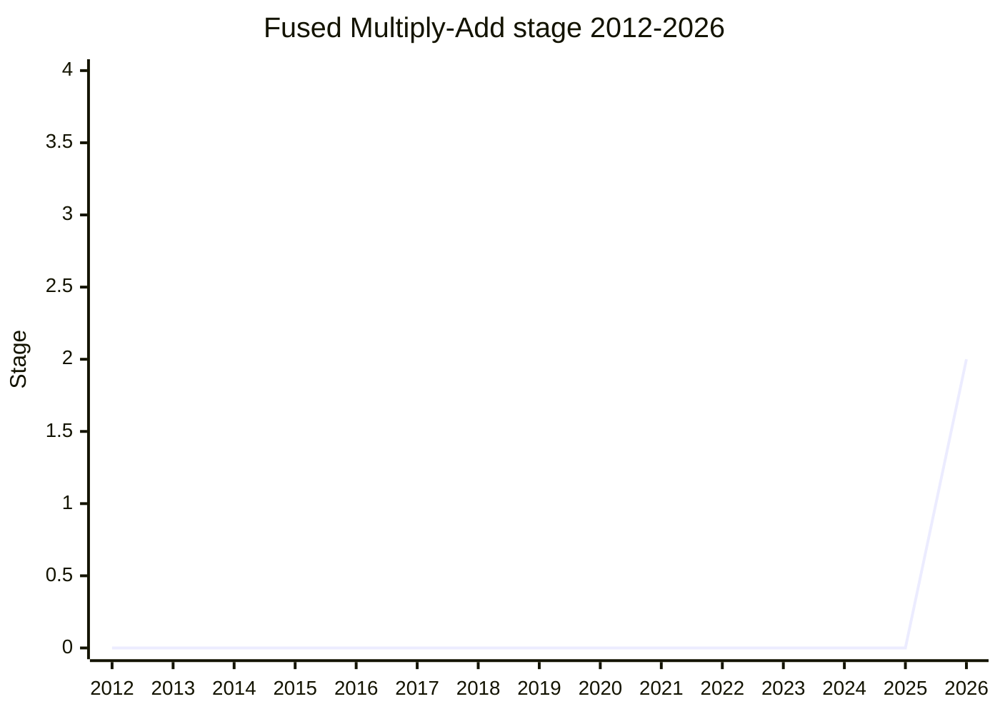

## 概要

Fused Multiply-Add は、IEEE 754-2008 で必須の arithmetic operation となった **FMA(x × y + z を数学的値として計算し、最後に 1 回だけ丸める)** を `Math.fma` として ECMAScript に追加する提案です。中間積の丸め・overflow が発生しないため、`high = a * b` と `low = Math.fma(a, b, -high)` で **exact product** が得られ、`Math.sumPrecise` と組み合わせれば正確な dot product も計算できます。用途は dot product、多項式評価、ニューラルネットワーク、そして任意精度を要する spec algorithm の記述です。

userland 実装は数百行の低速で壊れやすいコードになる一方、ARMv8 / x86-64(SSE)/ RISC-V では単一命令に lower され、C/C++/C#/Python/Rust/Swift/Java など主要言語は全て提供済みです。直接の契機は [Amount](../proposals/amount.md) の unit conversion の spec 記述で、[WH](../people/WH.md) が rounding 誤差の修正に FMA を必要としたことでした(x × p / q を 1 回の丸めで計算する。Amount issue #115)。champion は [WH](../people/WH.md)。

## ステージ遷移

| 会合                                                   | できごと                                                                                                                               | Stage |
| ------------------------------------------------------ | -------------------------------------------------------------------------------------------------------------------------------------- | ----- |
| [2026-07](../../raw/notes/meetings/2026-07/july-22.md) | 「for Stage 1 or 2」として初提示し、そのまま **Stage 2 到達**(0 → 2 直行)。reviewer は [JHD](../people/JHD.md) / [MF](../people/MF.md) | 0 → 2 |

> 横軸=2012-2026、縦軸=Stage。2026-07 の初提示で Stage 2 まで直行(動機自体は 2026-05 の Amount の conversion 精度議論で浮上)。

## 主な論点

### 数学的 invariant の確認

[MM](../people/MM.md) は「正確な数学的結果が表現可能ならその表現を返し、そうでなければ隣接する 2 値の間になる」という +−×÷ と同じ invariant を満たすかを確認しました。[WH](../people/WH.md) は

> FMA(a, b, c) は a × b + c の正確な数学的値を計算し、最も近い double を返す(ties は偶数丸め)。IEEE 754 が bit 単位で完全に規定しており、近似の余地はない

と応答し、[MM](../people/MM.md) は賛成に回りました(rounding mode も ECMAScript は round-to-even 固定)。

### hardware 支援の不均一(WASM の前例)

[DLM](../people/DLM.md) は WASM で FMA が議論された際「hardware 支援が不均一で、IEEE 準拠の software fallback は遅い」ことが論点になった経緯を紹介。[PFC](../people/PFC.md) は JavaScriptCore へのパッチ経験から ARMv8 / x86-64(SSE)での単一命令 lowering を確認し、[KM](../people/KM.md) も RISC-V を含め単一命令であることを Godbolt で確認しました。[WH](../people/WH.md) は「x87 コプロセッサ向けにコンパイルしているなら、これ以前に算術がもっと壊れている」と実害を否定しています。

### 引数の coercion

現行 draft は他の `Math` 関数と同様に引数を Number へ coerce しますが、[JHD](../people/JHD.md) は「新 API は coerce せず throw する」という committee の先行合意(`Math.sumPrecise` も throw)との衝突を指摘。[WH](../people/WH.md) は当初「`Math.sin` 等との一貫性を壊したくない」と反対しましたが、Stage 2 中の議論事項として引き取られました。命名(`fma` か、[SFC](../people/SFC.md) が discoverability から推す `multiplyAdd`/`mulAdd` か)も同様に未決です。

### スコープ

Stage 1 の問題領域は「IEEE 754-2008 の必須 arithmetic operation への準拠」に限定され、`nextUp` / `nextDown` / `scaleB` などの bit 操作系はスコープ外と明言されています。[SFC](../people/SFC.md) は「IEEE にあるからではなく、二重丸めなしの multiply-add という能力そのものに動機がある」と補強しました。

## 関連提案

- [Amount](../proposals/amount.md) — unit conversion の spec 記述が本提案の直接の契機。
- `decimal` — 精度問題への別アプローチ(十進演算)。2026-07 の update では `Math.fma` / `Math.sumPrecise` が「丸め誤差低減のユースケースを引き受けた」と整理された。
- `Math.sumPrecise` — 正確な総和。FMA と組み合わせて正確な dot product が可能。

## 出典

- [2026-07 july-22](../../raw/notes/meetings/2026-07/july-22.md) — 初提示、Stage 2 到達
