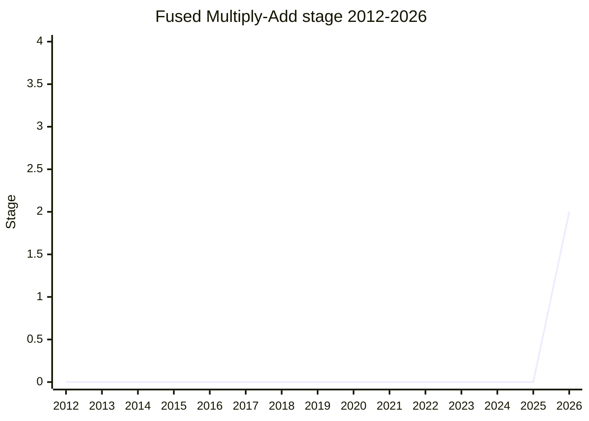

## Overview

Fused Multiply-Add adds to ECMAScript, as `Math.fma`, **FMA (compute x × y + z as a mathematical value, then round only once at the end)**, which became a required arithmetic operation in IEEE 754-2008. Because the intermediate product is neither rounded nor overflowed, `high = a * b` and `low = Math.fma(a, b, -high)` yield an **exact product**, and combined with `Math.sumPrecise` an exact dot product can also be computed. Uses include dot products, polynomial evaluation, neural networks, and writing spec algorithms that need arbitrary precision.

A userland implementation is hundreds of lines of slow, fragile code, whereas on ARMv8 / x86-64 (SSE) / RISC-V it lowers to a single instruction, and major languages — C, C++, C#, Python, Rust, Swift, Java, and others — all already provide it. The immediate trigger was the spec text for unit conversion in [Amount](../proposals/amount.md): [WH](../people/WH.md) needed FMA to fix a rounding error (compute x × p / q with a single rounding; Amount issue #115). The champion is [WH](../people/WH.md).

## Stage history

| Meeting                                                                        | What happened                                                                                                                                                  | Stage |
| ------------------------------------------------------------------------------ | -------------------------------------------------------------------------------------------------------------------------------------------------------------- | ----- |
| [2026-07](https://github.com/tc39/notes/blob/main/meetings/2026-07/july-22.md) | First presented as "for Stage 1 or 2" and **reached Stage 2** on the spot (straight from 0 → 2). Reviewers are [JHD](../people/JHD.md) / [MF](../people/MF.md) | 0 → 2 |

```mermaid
xychart-beta
    title "Fused Multiply-Add stage 2012-2026"
    x-axis [2012, 2013, 2014, 2015, 2016, 2017, 2018, 2019, 2020, 2021, 2022, 2023, 2024, 2025, 2026]
    y-axis "Stage" 0 --> 4
    line [0, 0, 0, 0, 0, 0, 0, 0, 0, 0, 0, 0, 0, 0, 2]
```

> Horizontal axis = 2012-2026, vertical axis = Stage. Went straight to Stage 2 on first presentation in 2026-07 (the motivation itself surfaced in the 2026-05 discussion of Amount conversion precision).

## Main issues

### Confirming the mathematical invariant

[MM](../people/MM.md) checked whether it satisfies the same invariant as +−×÷: "if the exact mathematical result is representable then the result of the operation is the representable number that corresponds to the exact mathematical result, and otherwise it's between those two?" [WH](../people/WH.md) replied

> _FMA_(_a_, _b_, _c_) computes the exact mathematical value of _a_ × _b_ + _c_ and then gives you the closest double to it, rounding ties to even.

> IEEE 754 defines FMA exactly. There is no latitude for approximate results. [...] So this is bit-by-bit specified by IEEE 754.

and [MM](../people/MM.md) came around to supporting it (the rounding mode is also fixed to round-to-even in ECMAScript).

### Uneven hardware support (the WASM precedent)

[DLM](../people/DLM.md) recounted that when FMA was discussed for WASM it was controversial: hardware support is uneven, and software fallbacks are slow if they are fully IEEE-conformant (otherwise rounding can differ by platform). [PFC](../people/PFC.md), from experience patching JavaScriptCore, confirmed single-instruction lowering on ARMv8 / x86-64 (SSE), and [KM](../people/KM.md) also confirmed on Godbolt that it is a single instruction, including on RISC-V. [WH](../people/WH.md) dismissed the practical harm: "If you are compiling for an x86 using the old x87 coprocessor instructions then you have much bigger problems than this—arithmetic will just be broken in subtle ways."

### Argument coercion

The current draft coerces arguments to Number, like the other `Math` functions, but [JHD](../people/JHD.md) pointed out a clash with the committee's prior resolution to stop coercing in new APIs (`Math.sumPrecise` also throws rather than coerces). [WH](../people/WH.md) initially opposed this — "I don't want to break the precedent that `Math.sin`, `Math.cos`, or whatever coerce to Numbers." — but it was taken up as a topic for discussion during Stage 2. Naming (`fma`, or `multiplyAdd`/`mulAdd`, which [SFC](../people/SFC.md) favors for discoverability) is likewise unsettled.

### Scope

The Stage 1 problem space is limited "to conform ECMAScript to include the one new required arithmetic operation in IEEE 754-2008", and bit-manipulation operations such as `nextUp` / `nextDown` / `scaleB` are explicitly out of scope. [SFC](../people/SFC.md) reinforced this from the other side: "having the capability in the language to do the multiply-add operation without the double rounding is motivated on its own", "not just the fact that it's in IEEE."

## Related proposals

- [Amount](../proposals/amount.md) — the spec text for unit conversion is the direct trigger for this proposal.
- `decimal` — a different approach to the precision problem (decimal arithmetic). In the 2026-07 update, `Math.fma` / `Math.sumPrecise` were described as proposals that cover the use case of reducing binary floating-point rounding errors (while not solving decimal's broader problem statement).
- `Math.sumPrecise` — exact summation. Combined with FMA, an exact dot product is possible.

## Sources

- [2026-07 july-22](https://github.com/tc39/notes/blob/main/meetings/2026-07/july-22.md) — first presentation, reached Stage 2
