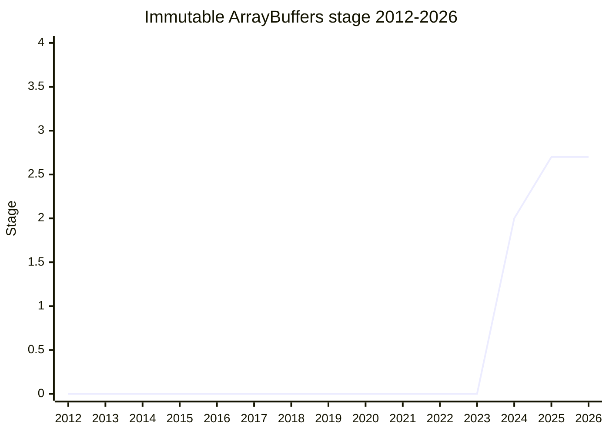

## Overview

A new "immutable" flavor of `ArrayBuffer`, created with `transferToImmutable()`, plus the ability to freeze a `TypedArray` backed by one. The problem statement is "the need for immutable bulk binary data": (1) embedded devices (Moddable/XS) have cheap plentiful ROM but scarce RAM, and today place data in ROM by deviating from the spec; (2) web APIs defensively copy bulk binary data because they cannot trust the caller not to mutate it; (3) immutable data can be shared zero-copy across agents (and via `structuredClone`) with no concurrency hazard; (4) network protocols (OCapN) want binary payloads that cannot diverge after being sent.

Champions are [MM](../people/MM.md), [PHE](../people/PHE.md), [RGN](../people/RGN.md), and [JWK](../people/JWK.md) (Agoric + Moddable; [JWK](../people/JWK.md) had an earlier Stage 1 proposal, `limited-arraybuffer`, of which this covers the frozen-data half). The design deliberately extends the existing API's "flavors" (resizable / non-resizable / detached): an immutable ArrayBuffer is **born** immutable, can never be detached, and a `TypedArray` on it is born non-configurable, non-writable - so it can be frozen.

## Stage history

| Meeting                                                                            | What happened                                                                                                                                                                                | Stage           |
| ---------------------------------------------------------------------------------- | -------------------------------------------------------------------------------------------------------------------------------------------------------------------------------------------- | --------------- |
| [2024-10](https://github.com/tc39/notes/blob/main/meetings/2024-10/october-10.md)  | First presented by [MM](../people/MM.md). Reached Stage 1                                                                                                                                    | → 1             |
| [2024-12](https://github.com/tc39/notes/blob/main/meetings/2024-12/december-03.md) | Reached Stage 2. Decisions: `transferToImmutable` gets an optional length parameter; `sliceToImmutable` and the `mutable` vs `immutable` name left open                                      | 1 → 2           |
| [2025-02](https://github.com/tc39/notes/blob/main/meetings/2025-02/february-18.md) | "Got all approvals needed" - reached Stage 2.7                                                                                                                                               | 2 → 2.7         |
| [2025-04](https://github.com/tc39/notes/blob/main/meetings/2025-04/april-14.md)    | Asked for Stage 3; remained at 2.7 pending test262 ("once tests are landed and known coverage gaps are filled")                                                                              | 2.7             |
| [2025-05](https://github.com/tc39/notes/blob/main/meetings/2025-05/may-29.md)      | test262 PRs completing the testing plan reported as satisfying the Stage 3 requirement at the next meeting                                                                                   | 2.7             |
| [2025-07](https://github.com/tc39/notes/blob/main/meetings/2025-07/july-29.md)     | **Conditional Stage 3** granted, upon the test262 PRs merging. The canonical proposals list still records Stage 2.7 as of its 2026-07-23 snapshot - the condition has not been confirmed met | 2.7 → (cond.) 3 |

> First presented 2024-10; Stage 2 in 2024-12, Stage 2.7 in 2025-02. Conditional Stage 3 was granted in 2025-07, but while the condition (test262 PRs merging) remains unconfirmed the plotted stage stays at 2.7 (same convention as conditional Stage 4 on the Explicit Resource Management page).

## Main issues

### Why not strings / where to start (Stage 1)

[WH](../people/WH.md) asked whether the need is already met by strings with a thin shim ("don't we already also have this functionality in the form of strings with just a thin shim to access strings as though they were immutable byte arrays?"). [MM](../people/MM.md) conceded a shim is possible - indeed the champions need one meanwhile - but argued for a natural, spec-conformant form. [OMT](../people/OMT.md): "I've used strings before as byte arrays and they are useful but they are not nice to use." Normal arrays were ruled out (holes, accessors), `TypedArray`/`DataView` ruled out as starting points (views on a mutable buffer), and web `Blob` ruled out (carries MIME-type baggage).

### Detachment and frozen TypedArrays (Stage 1)

[SYG](../people/SYG.md) probed the freezing and `structuredClone` semantics. The crux: if an immutable ArrayBuffer could be detached, a `TypedArray` on it could not be frozen - [MAH](../people/MAH.md): "We cannot consider that an open question. That would violate the freezability of TypedArrays." The design therefore forbids detaching immutable buffers entirely. [JHD](../people/JHD.md) also asked whether `limited-arraybuffer` would be withdrawn; [JWK](../people/JWK.md) said that proposal would drop its frozen-data half and possibly return with the limited-slice use case.

### API shape at Stage 2: length parameter, slice, naming, throw-vs-silent

At Stage 2 (2024-12), [MM](../people/MM.md) reversed himself and argued **for** the optional length parameter on `transferToImmutable` ("it minimizes the damage from surprise" - a silent deviation from programmer expectation is the dangerous case). [SYG](../people/SYG.md) warned that expanding length may break the zero-copy expectation (zero-filled on-demand pages; "my blind spot is windows"); [KG](../people/KG.md) was fine with non-zero-copy expansion. `sliceToImmutable` (zero-copy window into an immutable buffer) drew skepticism from [SYG](../people/SYG.md) ("I'm on the fence about this inclusion barring a concrete motivation") and a subarray-on-ArrayBuffer alternative from [JLS](../people/JLS.md) was rejected by [SYG](../people/SYG.md) ("ArrayBuffers are never windows... and TypedArrays are"). The accessor name (`mutable` vs `immutable`) was weighed on the positives-naming principle vs absence-is-falsy compatibility, with [MM](../people/MM.md) favoring `immutable`. On failure modes, the grandfathered silent failure of detached ArrayBuffers sets an unpleasant precedent; the champions' stance: "when in doubt, throw."

### Stage 3 held on test262 (2025)

The 2025 meetings were a test-completion march rather than a design fight: Stage 3 was asked for in 2025-04 but remained at 2.7 until the test262 plan landed (2025-05), and conditional Stage 3 in 2025-07 was granted **conditional upon the test262 PRs merging**. A year later the canonical proposals list still records Stage 2.7 (snapshot 2026-07-23), so the condition appears not to have been confirmed met - the wiki therefore keeps `current_stage: 2.7` (raw/proposals is primary for the current stage) while the history row preserves the notes-faithful conditional grant.

## Related proposals

- `limited-arraybuffer` - [JWK](../people/JWK.md)'s earlier proposal; this one covers its frozen-data half.
- [Import Bytes](import-bytes.md) - [MM](../people/MM.md) noted at Stage 1 that importing a file's bytes directly into an immutable ArrayBuffer could be a follow-on proposal; `type: "bytes"` imports landed the mutable-`Uint8Array` version.

## Sources

- [2024-10 october-10](https://github.com/tc39/notes/blob/main/meetings/2024-10/october-10.md) - first presentation, Stage 1
- [2024-12 december-03](https://github.com/tc39/notes/blob/main/meetings/2024-12/december-03.md) - Stage 2; length parameter, sliceToImmutable, naming, failure modes
- [2025-02 february-18](https://github.com/tc39/notes/blob/main/meetings/2025-02/february-18.md) - Stage 2.7
- [2025-04 april-14](https://github.com/tc39/notes/blob/main/meetings/2025-04/april-14.md) - Stage 3 ask deferred on tests
- [2025-05 may-29](https://github.com/tc39/notes/blob/main/meetings/2025-05/may-29.md) - test262 plan completion
- [2025-07 july-29](https://github.com/tc39/notes/blob/main/meetings/2025-07/july-29.md) - Stage 3 (conditional on test262)
