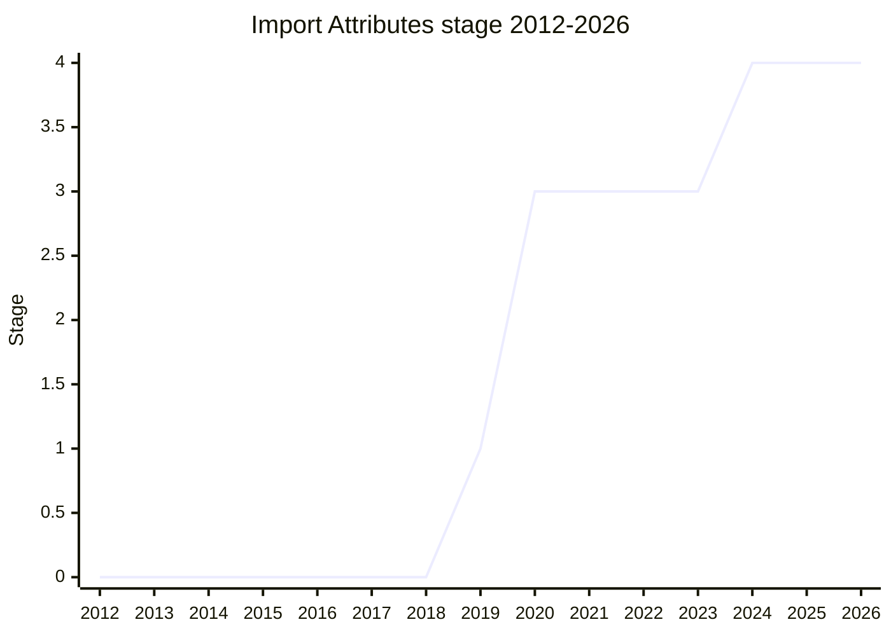

## Overview

Syntax for attaching attributes to an import so the host knows how to treat the module: `import data from "./data.json" with { type: "json" }`. The attribute is a way to pass module-level metadata to the host at the import site - originally motivated by JSON modules (telling the host to parse and validate the payload as JSON instead of executing it) and by the cross-origin trust model, where importing a URL that a server sends as JavaScript when you expected JSON is a privilege escalation concern.

The name turned over three times, and each rename marks a semantic debate: **Module Attributes** (2019) → **Import Assertions** (2020) - the attribute was framed as an assertion that fails the import if it does not hold - → **Import Attributes** (2023), after the `assert` keyword was demoted. The final syntax is `with { ... }`. The original champions were [MBS](../people/MBS.md), [SSA](../people/SSA.md), [DDC](../people/DDC.md), and [DE](../people/DE.md); [NRO](../people/NRO.md) joined later and carried the endgame (the Stage 4 presentation included JSON Modules).

## Stage history

| Meeting                                                                             | Event                                                                                                                                 | Stage |
| ----------------------------------------------------------------------------------- | ------------------------------------------------------------------------------------------------------------------------------------- | ----- |
| [2019-12](https://github.com/tc39/notes/blob/main/meetings/2019-12/december-5.md)   | Presented as "Module Attributes" (two sessions). Reached Stage 1                                                                      | → 1   |
| [2020-02](https://github.com/tc39/notes/blob/main/meetings/2020-02/february-6.md)   | Status update                                                                                                                         | 1     |
| [2020-06](https://github.com/tc39/notes/blob/main/meetings/2020-06/june-3.md)       | Stage 2 requested; no consensus on the day ([JHD](../people/JHD.md): the proposal defines attributes of an _import_, not of a module) | 1     |
| [2020-06](https://github.com/tc39/notes/blob/main/meetings/2020-06/june-4.md)       | Continuation the next day: reached consensus for Stage 2                                                                              | 1 → 2 |
| [2020-09](https://github.com/tc39/notes/blob/main/meetings/2020-09/sept-22.md)      | Reached Stage 3 (as "Import Assertions")                                                                                              | 2 → 3 |
| [2020-11](https://github.com/tc39/notes/blob/main/meetings/2020-11/nov-17.md)       | Status update. Consensus on a new host hook, conditional consensus on the "cache key" issue                                           | 3     |
| [2021-04](https://github.com/tc39/notes/blob/main/meetings/2021-04/apr-19.md)       | Status update                                                                                                                         | 3     |
| [2021-07](https://github.com/tc39/notes/blob/main/meetings/2021-07/july-14.md)      | Status update                                                                                                                         | 3     |
| [2023-01](https://github.com/tc39/notes/blob/main/meetings/2023-01/jan-31.md)       | **Demoted from Stage 3 to 2**: `assert` implied "does not affect the cache key", which did not match how hosts interpreted attributes | 3 → 2 |
| [2023-03](https://github.com/tc39/notes/blob/main/meetings/2023-03/mar-22.md)       | Stage 3 again (conditional), with the semantics reworked                                                                              | 2 → 3 |
| [2023-07](https://github.com/tc39/notes/blob/main/meetings/2023-07/july-11.md)      | Stage 3 confirmed                                                                                                                     | 3     |
| [2023-09](https://github.com/tc39/notes/blob/main/meetings/2023-09/september-26.md) | Implementer feedback (attribute keys, identifiers vs strings)                                                                         | 3     |
| [2024-07](https://github.com/tc39/notes/blob/main/meetings/2024-07/july-29.md)      | Dropped `assert` and unified on `with`                                                                                                | 3     |
| [2024-10](https://github.com/tc39/notes/blob/main/meetings/2024-10/october-08.md)   | **Reached Stage 4** (together with JSON Modules). Chrome and Node had already unshipped `assert` with no problems                     | 3 → 4 |

> Stage 1 in 2019-12, Stage 2 in 2020-06, Stage 3 in 2020-09. **Demoted to Stage 2 in 2023-01** - the dip in the chart - back to Stage 3 in 2023-03, and Stage 4 in 2024-10.

## Main issues

### The `assert` → `with` rename

The central controversy of the proposal's whole life. `assert` suggested the attribute only _checks_ something about the module and does not influence loading - but hosts (following HTML) treat `type` as affecting interpretation and therefore the module cache key. The mismatch was acknowledged by demoting the proposal from Stage 3 to 2 in 2023-01, the syntax settled on `with` in 2023-03, and the `assert` spelling was dropped entirely in 2024-07. By the Stage 4 request the rename had been validated in the field: Chrome unshipped `assert` around June 2024 and Node likewise, "and there have been no problems with that" ([NRO](../people/NRO.md), 2024-10).

> ([NRO](../people/NRO.md), 2024-10) Chrome successfully unshipped `assert`, I think, around June, and there have been no problems with that. Node also successfully unshipped `assert`.

The rename also closed the loop on the original framing dispute: [JHD](../people/JHD.md) had objected back at the Stage 2 request that "it's defining attributes of an import, not of a module" - which is exactly what the final design admits.

### The security motivation and its skeptics

At Stage 1 (2019-12) the privilege escalation concern (a server sending JavaScript where the importer expected JSON) carried the proposal, but [JHD](../people/JHD.md) argued it was "adding a tax to web developers" for a problem CSP could solve out-of-band, and [JFI](../people/JFI.md) warned that a single import construct that can load different content types is dangerous by itself. The committee accepted Stage 1 to explore the space anyway, and the JSON use case (split out as [JSON Modules](json-modules.md)) became the driver that carried the proposal to the end.

## Related proposals

- [JSON Modules](json-modules.md) - the motivating consumer of `with { type: "json" }`, advanced to Stage 4 in the same session.
- [Import Bytes](import-bytes.md) - extends the attribute set with `type: "bytes"`.
- [import defer](import-defer.md) - shares the module-loading layer; the phase axis of the modules family.

## Sources

- [2019-12 december-5](https://github.com/tc39/notes/blob/main/meetings/2019-12/december-5.md) - Stage 1 (as Module Attributes)
- [2020-06 june-3](https://github.com/tc39/notes/blob/main/meetings/2020-06/june-3.md) / [june-4](https://github.com/tc39/notes/blob/main/meetings/2020-06/june-4.md) - Stage 2 (no consensus on day one)
- [2020-09 sept-22](https://github.com/tc39/notes/blob/main/meetings/2020-09/sept-22.md) - Stage 3 (as Import Assertions)
- [2023-01 jan-31](https://github.com/tc39/notes/blob/main/meetings/2023-01/jan-31.md) - demoted to Stage 2
- [2023-03 mar-22](https://github.com/tc39/notes/blob/main/meetings/2023-03/mar-22.md) - Stage 3 (conditional)
- [2023-07 july-11](https://github.com/tc39/notes/blob/main/meetings/2023-07/july-11.md) - Stage 3 confirmed
- [2024-07 july-29](https://github.com/tc39/notes/blob/main/meetings/2024-07/july-29.md) - drop `assert`, unify on `with`
- [2024-10 october-08](https://github.com/tc39/notes/blob/main/meetings/2024-10/october-08.md) - Stage 4 ([NRO](../people/NRO.md))
