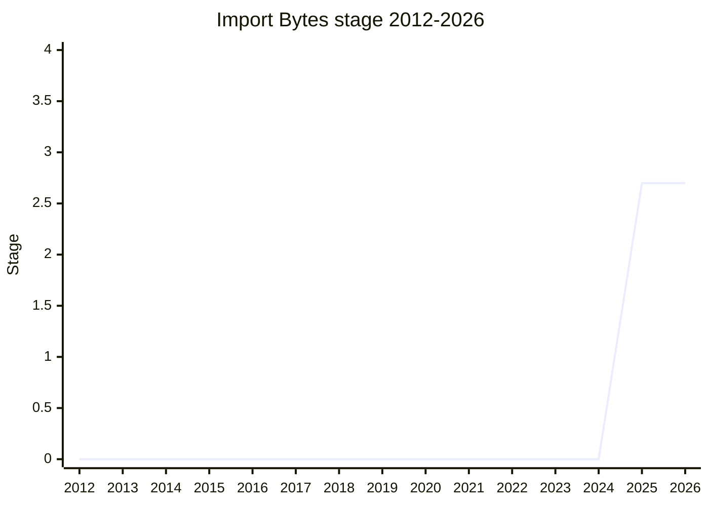

## Overview

`import ... with { type: "bytes" }` (static and dynamic) resolves to an **immutable `Uint8Array`** backed by an immutable `ArrayBuffer` containing the resource's bytes - an isomorphic way to read arbitrary files in every JavaScript environment. Today the same asset needs different code per environment: `fs/promises` in Node, a `Bun` global in Bun, `fetch` + `ArrayBuffer` in the browser, and runtimes without a JS-standard path at all (motivating use case: isomorphic tools like Satori that must ship PNG/WOFF assets to both browser and server). Once the bytes come through the module system, bundlers can also inline them (e.g. as base64) at build time, and embedded runtimes (Moddable) can keep them in ROM instead of RAM.

The champion is [STY](../people/STY.md) (Steven Salat, Vercel); [GB](../people/GB.md) joined as author. It builds directly on import attributes (the `type: "json"` slot) and first appeared as **"Import Buffer"**; the rename to Import Bytes and the `Uint8Array` decision happened during its first presentation, which landed Stage 1 and Stage 2 in a single session.

## Stage history

| Meeting                                                                             | What happened                                                                                                                                                                         | Stage   |
| ----------------------------------------------------------------------------------- | ------------------------------------------------------------------------------------------------------------------------------------------------------------------------------------- | ------- |
| [2025-07](https://github.com/tc39/notes/blob/main/meetings/2025-07/july-30.md)      | First presented as "Import Buffer" for Stage 1. **Reached Stage 1 and then Stage 2 in the same session** (renamed Import Bytes; `"buffer"` → `"bytes"`; `ArrayBuffer` → `Uint8Array`) | 0 → 2   |
| [2025-09](https://github.com/tc39/notes/blob/main/meetings/2025-09/september-23.md) | **Reached Stage 2.7**. Reviewers [NRO](../people/NRO.md) / [EAO](../people/EAO.md) / [JSL](../people/JSL.md) (designated 2025-07)                                                     | 2 → 2.7 |

> First presented 2025-07 (Stage 1 and Stage 2 in the same session), Stage 2.7 in 2025-09.

## Main issues

### `Uint8Array` vs `ArrayBuffer`

The original proposal used `ArrayBuffer`; the committee converged on `Uint8Array`. [NRO](../people/NRO.md): working with bytes means `Uint8Array`, and "the web has W3C guidelines for new APIs... every API that exposes generic binary data should do it as Uint8Array". [JSL](../people/JSL.md), from Cloudflare Workers' existing data modules: "Ideally, like if I could go back in time to do that from the start, it would have been immutable... and we would have done it as a `UInt8Array`." [KM](../people/KM.md) and [MM](../people/MM.md) (retracting an earlier objection) agreed; [KKL](../people/KKL.md) called "`type: bytes` with a Uint8Array backed by an immutable ArrayBuffer... the least controversial selling point." Immutability avoids detachment hazards (`postMessage`) across modules importing the same resource and is what lets embedded runtimes use ROM.

### Module system vs generic IO

[MF](../people/MF.md) questioned the placement: "this isn't really a module system feature. We are not importing a thing that would be eventually used as a module... it just seems like a little bit shoehorned in" - is the real ask generic IO? [KKL](../people/KKL.md) answered that module resolution can express assets crossing package/scope boundaries in a bundler-portable way, which generic IO cannot. [KG](../people/KG.md) gave the deciding property: "if two different modules which don't know anything about each other import the same resource there is only one fetch. That is a property that is true of modules and not generally true of I/O... It is a bit of a kludge, but eh, it seems good." [ABO](../people/ABO.md) noted it could instead live in HTML with WinterTC runtimes adopting it; [GCL](../people/GCL.md) shared the instinctual hesitation but saw no `include_bytes`-style alternative.

### HTML integration as the Stage 2.7 gate

[NRO](../people/NRO.md): "the text for this proposal is very minimal, and most of the semantics would be in HTML, how the fetching of the bytes actually works, how it interacts with HTTPS headers. So before going to stage 2.7, I think we need to have a complete request for HTML that the browsers sign-off."

### The `type: "text"` spin-off

[EAO](../people/EAO.md) tried his luck mid-session: add `type: "text"` (a UTF-8 string) alongside. [MF](../people/MF.md) refused to stage an unseen proposal - "I'm supportive of that generally, but I would like to see that written down"; pressed on whether that means Stage 1: "The word 'that' right there is doing a lot of work." [KG](../people/KG.md): text "would be a different proposal" and "I would be supportive of such a proposal" - which became [Import Text](../proposals/import-text.md).

## Related proposals

- [Import Text](../proposals/import-text.md) - the sibling proposal for text assets, floated in the same session.
- `import-attributes` / `json-modules` - the `type: "..."` attribute mechanism this builds on.

## Sources

- [2025-07 july-30](https://github.com/tc39/notes/blob/main/meetings/2025-07/july-30.md) - first presentation ("Import Buffer"), Stage 1 + Stage 2
- [2025-09 september-23](https://github.com/tc39/notes/blob/main/meetings/2025-09/september-23.md) - Stage 2.7
