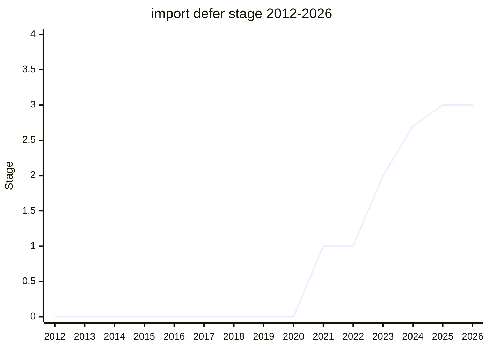

## Overview

`import defer * as ns from "..."`: a module import whose namespace is a **deferred** view - importing does not evaluate the module; evaluation happens on first property access (or other observable read of an export binding). The point is startup performance for large, mature codebases: apps want the graph structure and static declarability of `import` without eagerly executing code that may never run on a given session. It is the standardized descendant of lazy-loading hacks (dynamic `import()` inside getters, lazy re-export shims), kept in static syntax so tooling and the module graph stay declarative.

The namespace is a special "deferred module namespace" object: reading any export triggers the module's evaluation; the namespace never has a `then` property (so it can't be accidentally awaited/adopted as a thenable), and its `toStringTag` is `"deferred module"`. Sibling idea `export defer` (lazy evaluation through the re-export chain) was explored alongside but spun back out to keep this proposal shippable.

## Stage history

| Meeting                                                                            | Event                                                                                                                                                                       | Stage    |
| ---------------------------------------------------------------------------------- | --------------------------------------------------------------------------------------------------------------------------------------------------------------------------- | -------- |
| [2021-01](https://github.com/tc39/notes/blob/main/meetings/2021-01/jan-28.md)      | Presented by [YSV](../people/YSV.md) as "Defer module import eval" for Stage 1 (startup performance for large mature codebases). Reached Stage 1                            | → 1      |
| [2022-11](https://github.com/tc39/notes/blob/main/meetings/2022-11/nov-30.md)      | Update                                                                                                                                                                      | 1 (kept) |
| [2023-07](https://github.com/tc39/notes/blob/main/meetings/2023-07/july-11.md)     | Reached Stage 2. Before Stage 3, champions to investigate the WebAssembly interaction and the top-level-await performance stories                                           | 1 → 2    |
| [2023-11](https://github.com/tc39/notes/blob/main/meetings/2023-11/november-29.md) | Deferred re-exports discussion (the later `export defer` split)                                                                                                             | 2 (kept) |
| [2024-04](https://github.com/tc39/notes/blob/main/meetings/2024-04/april-09.md)    | Stage 2.7 requested (without "tree-shakeable" exports)                                                                                                                      | 2 (kept) |
| [2024-06](https://github.com/tc39/notes/blob/main/meetings/2024-06/june-11.md)     | Stage 2.7                                                                                                                                                                   | 2 → 2.7  |
| [2024-10](https://github.com/tc39/notes/blob/main/meetings/2024-10/october-10.md)  | The thenable/evaluation-trigger problem: `import.defer()`'s promise resolution reads `.then`, forcing evaluation at import time. Six candidate solutions; no resolution yet | 2.7      |
| [2024-12](https://github.com/tc39/notes/blob/main/meetings/2024-12/december-03.md) | Continued work on evaluation triggers                                                                                                                                       | 2.7      |
| [2024-12](https://github.com/tc39/notes/blob/main/meetings/2024-12/december-05.md) | Resolved: evaluation on export-name reads (consensus); namespaces never have `then` (consensus); `toStringTag` "deferred module" (consensus); `Symbol.evaluated` dropped    | 2.7      |
| [2025-02](https://github.com/tc39/notes/blob/main/meetings/2025-02/february-18.md) | Stage 3: no normative changes since 2.7, Test262 merged, WebKit implemented, Babel/prettier support                                                                         | 2.7 → 3  |
| [2025-04](https://github.com/tc39/notes/blob/main/meetings/2025-04/april-16.md)    | `export defer` extracted and reaffirmed at Stage 2 (as its own proposal)                                                                                                    | 3 (kept) |
| [2026-03](https://github.com/tc39/notes/blob/main/meetings/2026-03/march-10.md)    | Normative interaction follow-up (ecma262#3715: dynamic `import(defer)` / Shield PR against `Promise.prototype` monkey patching)                                             | 3 (kept) |
| [2026-07](https://github.com/tc39/notes/blob/main/meetings/2026-07/july-20.md)     | Stage 3 update                                                                                                                                                              | 3 (kept) |

> Stage 1 in 2021-01, Stage 2 in 2023-07, Stage 2.7 in 2024-06, Stage 3 in 2025-02.

## Main issues

### When does a deferred module actually evaluate? (the thenable problem, 2024-10)

The 2.7-era crisis. `import.defer("./x.js")` returns a promise of the namespace - and resolving a promise reads its resolution's `.then` to check for thenables. But touching `.then` is an export read, which by the evaluation rule **evaluates the module** - so the "deferred" import eagerly evaluated anyway. Six candidate solutions went on the table (evaluation triggers, hiding `then`, `Symbol.evaluated` introspection, and more). [ACE](../people/ACE.md) floated hiding `then` behind a special namespace; [YSV](../people/YSV.md) and [SYG](../people/SYG.md) preferred dropping the `import.defer()` function form entirely rather than contort semantics; [GB](../people/GB.md) favored the trigger-based option; [JRL](../people/JRL.md) argued from promise-adoption semantics (the returned promise must be a native promise, so its resolution rules are fixed).

The 2024-12 resolution: a deferred namespace's **export-name reads** trigger evaluation, the namespace object simply has **no `then` property** (killing the accidental-thenable hazard at the root), `toStringTag` is `"deferred module"`, and `Symbol.evaluated` was dropped ([KG](../people/KG.md) had preferred a global function for checking evaluation state, but it did not survive). Each of the three kept changes reached individual consensus.

### Wasm and top-level await (the pre-Stage 3 homework)

Stage 2 in 2023-07 was granted outright, but the conclusion set two things to investigate before Stage 3: how deferred evaluation composes with WebAssembly modules (Wasm instantiation is eager by nature), and what `import defer` of a module with top-level await means (evaluation on first access can now suspend). Both were worked through before Stage 3 rather than blocking Stage 2.

### Scope: import defer vs export defer

`export defer` - a re-export whose own evaluation is also deferred through the chain - was part of the exploration but was split off (reaffirmed as a separate Stage 2 proposal in 2025-04) so that `import defer` could advance on its own. The two share machinery but advance independently.

## Related proposals

- `export defer` - the lazy re-export sibling, split off to its own Stage 2 proposal (no page yet).
- [Import Text](import-text.md) / [Import Bytes](import-bytes.md) - other module-loading surface from the same period.
- [Module Global](module-global.md) - separate module-map/global-scope work.

## Sources

- [2021-01 jan-28](https://github.com/tc39/notes/blob/main/meetings/2021-01/jan-28.md) - Stage 1 ([YSV](../people/YSV.md))
- [2022-11 nov-30](https://github.com/tc39/notes/blob/main/meetings/2022-11/nov-30.md) - update
- [2023-07 july-11](https://github.com/tc39/notes/blob/main/meetings/2023-07/july-11.md) - Stage 2
- [2023-11 november-29](https://github.com/tc39/notes/blob/main/meetings/2023-11/november-29.md) - deferred re-exports
- [2024-04 april-09](https://github.com/tc39/notes/blob/main/meetings/2024-04/april-09.md) - Stage 2.7 request
- [2024-06 june-11](https://github.com/tc39/notes/blob/main/meetings/2024-06/june-11.md) - Stage 2.7
- [2024-10 october-10](https://github.com/tc39/notes/blob/main/meetings/2024-10/october-10.md) - thenable problem
- [2024-12 december-03](https://github.com/tc39/notes/blob/main/meetings/2024-12/december-03.md) - evaluation triggers, continued
- [2024-12 december-05](https://github.com/tc39/notes/blob/main/meetings/2024-12/december-05.md) - resolution (4 changes)
- [2025-02 february-18](https://github.com/tc39/notes/blob/main/meetings/2025-02/february-18.md) - Stage 3
- [2025-04 april-16](https://github.com/tc39/notes/blob/main/meetings/2025-04/april-16.md) - export defer split off
- [2026-03 march-10](https://github.com/tc39/notes/blob/main/meetings/2026-03/march-10.md) - normative interaction follow-up
- [2026-07 july-20](https://github.com/tc39/notes/blob/main/meetings/2026-07/july-20.md) - Stage 3 update
