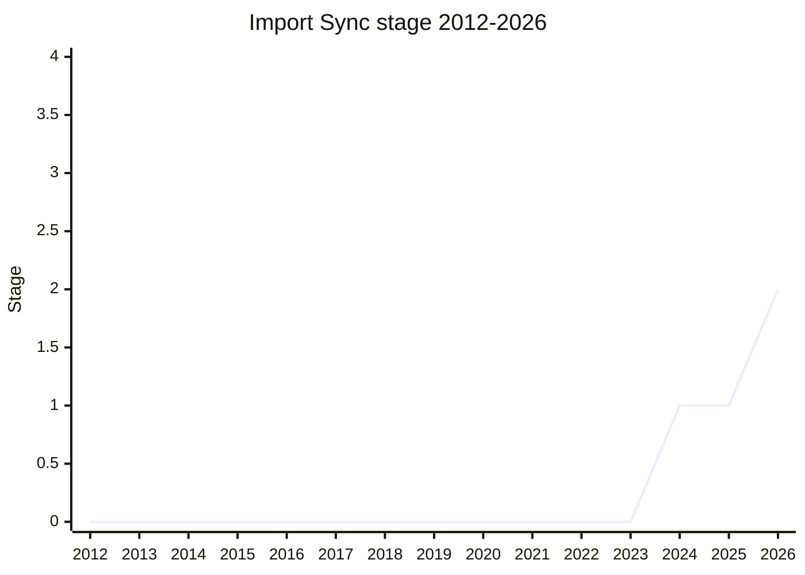

## Overview

A synchronous way to obtain an already-available module - presented with `import.sync("...")` as the straw design - motivated by what [GB](../people/GB.md) called "the last feature of CommonJS that Node.js is struggling with": synchronously requiring a module from ES module code. Node's `require(esm)` PR (#55730) and Bun's built-in sync require showed the ecosystem filling the gap; TC39's choice was to explore it here or watch platforms grow incompatible importers.

What changed to make the discussion possible in 2024: module resolution is now fully synchronous on every platform, and [import defer](import-defer.md) already specifies the semantics of synchronously executing an already-loaded module. The open design axis is strictness - a strict version that only ever reads from the module registry (identical to import defer's execution semantics, browsers and Node agree) versus permitting host loading that browsers cannot honor, with a "not available synchronously" error for top-level await and friends. The interesting interactions are with module expressions/declarations (a sync executor for module sources) and future virtualization/compartments work.

## Stage history

| Meeting                                                                            | Event                                                                                                                                                                  | Stage |
| ---------------------------------------------------------------------------------- | ---------------------------------------------------------------------------------------------------------------------------------------------------------------------- | ----- |
| [2024-12](https://github.com/tc39/notes/blob/main/meetings/2024-12/december-04.md) | Presented by [GB](../people/GB.md). Reservations over exact semantics, but overall interest; Stage 1 requested and obtained ([MM](../people/MM.md) encouraged the ask) | → 1   |
| [2026-01](https://github.com/tc39/notes/blob/main/meetings/2026-01/january-20.md)  | Reached Stage 2 (per the proposals list, which places it in the Stage 2 table; reviewers [NRO](../people/NRO.md) and [JSL](../people/JSL.md))                          | 1 → 2 |

> Stage 1 in 2024-12, Stage 2 in 2026-01.

## Main issues

### Adding a sync path back into an async module system

[SYG](../people/SYG.md) was blunt: "Spent a lot of effort with TLA to move the infrastructure in the spec to implementations to everything async. We will add another sync path that threads through everything that makes me very unhappy." And the dilemma he put to [GB](../people/GB.md): diverge (browsers can't do sync loading - bad) or don't diverge (Node loses the value - then why does Node want it?). [GB](../people/GB.md)'s answer was candor: "I personally have no desire to see import sync today... I am presenting it because it is something that people are doing" - and because ignoring the demand risks platforms working around TC39 with divergent semantics. ("Let my crankiness be noted in the notes." - [SYG](../people/SYG.md), entered into the record by [CDA](../people/CDA.md).)

### The ecosystem pre-emption argument

[JSL](../people/JSL.md)'s support was purely defensive: "I would rather it be done here rather than in node... I don't want to be chasing incompatible and noncompatible extensions to stay compatible with the ecosystem." [ACE](../people/ACE.md) (Bloomberg) pushed back on the idea that import defer gives this a free pass: defer deliberately separates when async work may happen from when sync work must, and "stopping code making assumptions about what other modules are being loaded" is exactly the interaction-at-a-distance Bloomberg is trying to eliminate. [MM](../people/MM.md) supplied the tie-breaker for Stage 1: it is "weak enough" in what it implies about committee commitment, and the raised questions are legitimate Stage 1 explorations. [MM](../people/MM.md) also pointed at XS's `importNow` as prior art to coordinate with.

## Related proposals

- [import defer](import-defer.md) - the strict-semantics foundation; import sync's strict end is defer's execution phase.
- [ESM Phase Imports](esm-phase-imports.md) - the phase framework this slots into; [NRO](../people/NRO.md)'s Module Harmony overview called this the "sync dynamic imports" cluster.
- `source phase imports` - the Stage 3 proposal whose ModuleSource machinery underlies both (no page yet).

## Sources

- [2024-12 december-04](https://github.com/tc39/notes/blob/main/meetings/2024-12/december-04.md) - Stage 1 ([GB](../people/GB.md))
- [2026-01 january-20](https://github.com/tc39/notes/blob/main/meetings/2026-01/january-20.md) - Stage 2 (per the proposals list)
