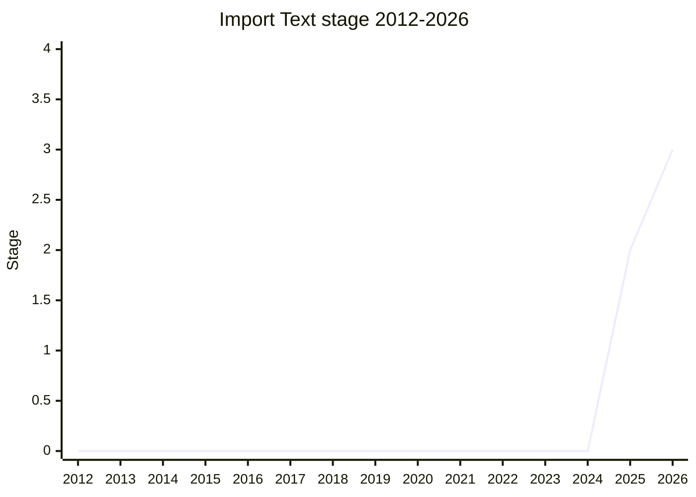

## Overview

Adds `import ... with { type: "text" }`: importing a resource as a string, the same way JSON modules import as parsed data. The problem is the same one [Import Bytes](../proposals/import-bytes.md) solves for bytes - today you need `fetch()` plus `response.text()`, which is always asynchronous, starts late in execution, and (in browsers) resolves relative paths against the page rather than the importing module. The champion (Eemeli Aro, [EAO](../people/EAO.md)) described the approach as speedrunning "how far a proposal can get with minimal effort": a tiny spec change riding on the Import Bytes work, with no way to customize the encoding (do something other than UTF-8 and you should be importing bytes and decoding explicitly).

## Stage history

| Meeting                                                                            | What happened                                                                                                                                                                                                                                  | Stage       |
| ---------------------------------------------------------------------------------- | ---------------------------------------------------------------------------------------------------------------------------------------------------------------------------------------------------------------------------------------------- | ----------- |
| [2025-11](https://github.com/tc39/notes/blob/main/meetings/2025-11/november-18.md) | First presented. **Reached Stage 1, then Stage 2 in the same session** ([JHD](../people/JHD.md)/[NRO](../people/NRO.md) reviewers), plus conditional Stage 2.7 pending [SFC](../people/SFC.md)'s confirmation that no encoding concerns remain | → 2         |
| [2026-03](https://github.com/tc39/notes/blob/main/meetings/2026-03/march-11.md)    | Advanced through Stage 2.7 to **Stage 3**                                                                                                                                                                                                      | 2 → 2.7 → 3 |

> First presented in 2025-11, reaching Stage 2 the same day; Stage 2.7 and 3 in 2026-03.

## Main issues

### Who owns encoding? (2025-11)

Most of the discussion was about the role of the JS spec in defining (or even considering) the encoding of imported text. [SFC](../people/SFC.md) was concerned that text makes encoding failures silent: a mis-decoded JSON file fails loudly at parse, but mis-decoded text yields replacement characters with no error ("It's much less loud if there is actually a problem with the file encoding"). [MF](../people/MF.md) and [JRL](../people/JRL.md) held that encoding is a host/platform concern - the web platform assumes UTF-8, and anyone needing something else has Import Bytes as the escape hatch ("Import text can assume it is UTF-8 ... you can use import byte to decode in the exact representation you want"). [WH](../people/WH.md) noted arbitrary strings are much easier to mis-guess an encoding for than JSON's structured bytes. The JS spec ends up not mentioning encoding at all (as with JSON modules), and the conditional 2.7 was granted pending [SFC](../people/SFC.md)'s review on exactly this point.

### Relation to Import Bytes (2025-11)

An earlier attempt to expand the Import Bytes proposal to cover text did not succeed, so Import Text was filed separately. [LVU](../people/LVU.md) framed it as paving the way for future structured formats: import as `text` first, upgrade to a dedicated type (CSS, YAML, ...) later. On the web side, [JAD](../people/JAD.md) noted JSON imports require the JSON MIME type; for text, any MIME type is fine - an HTML-spec question.

## Related proposals

- [Import Bytes](../proposals/import-bytes.md) - importing raw bytes (`Uint8Array`; first presented as "Import Buffer"). The sibling this proposal rides on.
- [export-all-from](../proposals/export-all-from.md) - unrelated syntactically, but part of the same 2025 wave of module-syntax extensions.

## Sources

- [2025-11 november-18](https://github.com/tc39/notes/blob/main/meetings/2025-11/november-18.md) - Stage 1, Stage 2, conditional 2.7
- [2026-03 march-11](https://github.com/tc39/notes/blob/main/meetings/2026-03/march-11.md) - Stage 2.7 and Stage 3
