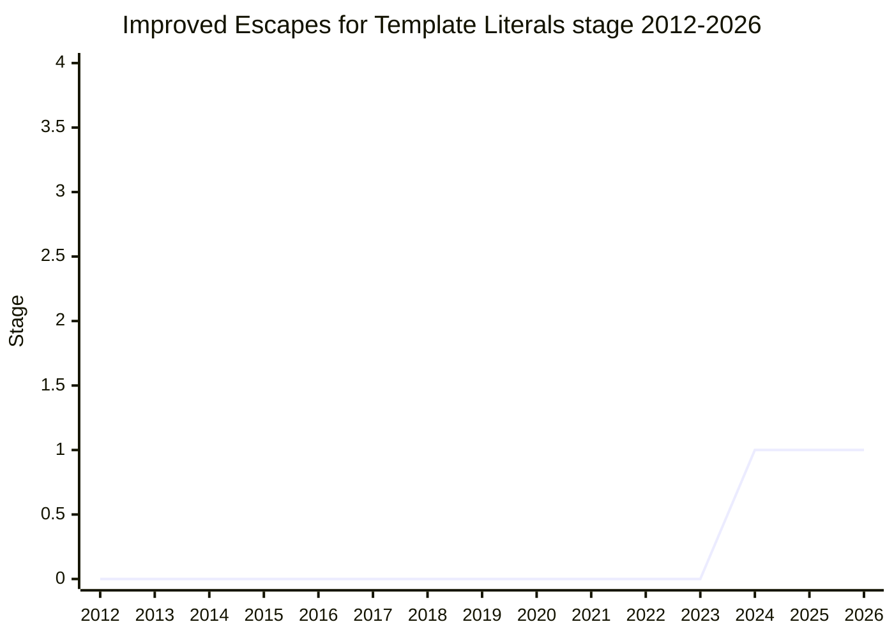

## Overview

An investigation into the limits of template literals: JavaScript has "no general way to create a simple string literal that can take any arbitrary text" ([JHX](../people/JHX.md)). The backtick is a fixed delimiter, so a template cannot contain a backtick without escaping - and under `String.raw`, escapes are not processed, so a raw template simply cannot express a backtick at all. Embedding JS-in-JS is worst of all: the backtick, `$`, and `{` all have to be escaped, and forgetting one does not always fail loudly ([JHX](../people/JHX.md) reported real bugs at his company where unescaped `${` in embedded code became an injection risk).

The proposal started as "Raw String Literals", with Rust/Swift-style hash-wrapped delimiters as the example syntax. The committee did not converge on any syntax - and explicitly did not try to at Stage 1. The agreed scope is deliberately an investigation: "an investigation on how to deal with the limits of template strings, especially when it comes to including backticks or escapes for raw strings" ([DE](../people/DE.md)). At adoption the proposal was also renamed - [DE](../people/DE.md), taking [LCA](../people/LCA.md)'s suggestion: "improve escaped template literals".

The three non-negotiable objectives ([JHX](../people/JHX.md), narrowed under [SYG](../people/SYG.md)'s probing from a longer wish list):

1. All string values must be representable without any escape sequence - the user can always pick delimiters guaranteed not to collide with the text.
2. Same guarantee for interpolation delimiters.
3. Support tag functions, as current tagged templates do.

The longer wish list (dedent, an info string for syntax highlighting, comments inside the literal, nesting with different delimiter lengths) is explicitly not must-have.

Championed by [JHX](../people/JHX.md) (HE Shi-Jun).

## Stage history

| Meeting                                                                      | Event                                                                                                                                                                                                                    | Stage |
| ---------------------------------------------------------------------------- | ------------------------------------------------------------------------------------------------------------------------------------------------------------------------------------------------------------------------ | ----- |
| [2024-02](https://github.com/tc39/notes/blob/main/meetings/2024-02/feb-7.md) | Presented as "Raw String Literals for Stage 1". Substantial skepticism about whether the problem warrants new syntax; Stage 1 agreed as a scoped investigation, renamed "improve escaped template literals" at the table | → 1   |

> First presented 2024-02 and at Stage 1 since.

## Main issues

### Is this worthy of committee time at all?

The first reaction, and never fully resolved: [DE](../people/DE.md) opened with "I am not sure whether this topic is worthy of further committee investigation... extra new syntax is a complicated way to go about it", and [NRO](../people/NRO.md) wanted the do-we-even-want-this question decided before any syntax discussion. What kept it alive: [MM](../people/MM.md)'s admission that the problem is real and self-inflicted -

> [MM](../people/MM.md): "It is a very big regret that template literals went forward without having the escapeability that it should need. If we could fix that, that would be wonderful. But we can't fix it because of compat. And I am skeptical to introduce a new similar template literal syntax to a language to coexist with the old one. I think that the existing one takes too much of the wind out of the need for a better one."

[RBN](../people/RBN.md) relayed this history as grounds for investigating - and noted the syntax on the slides already differed from the repo the week before: "The syntax will fluctuate as things we narrow in on."

### Don't burn `#` (and keep the syntax minimal)

The example syntax (Rust/Swift-style hash wrapping) drew immediate fire. [LCA](../people/LCA.md): "I think the hash sign should be used for something that is more useful than another string literal... if we used it here we probably can't use it anywhere else" - and minimal need not mean short: a rarer literal "could be more verbose to write", it just shouldn't consume a production wanted for a future feature. [DE](../people/DE.md) was "not a fan" of the hash syntax but did not make simplicity a Stage 1 requirement ("Certainly a Stage 2 requirement").

### The unrepresentable trailing backslash

[JRL](../people/JRL.md) pointed out a third case the design missed: template literals have three representability problems - the closing backtick and the interpolation sigil (both addressed by the proposal) and a backslash at the end of the string, which "can't be represented in the new format". [DRR](../people/DRR.md) pressed the deeper design point: any new string kind just re-creates the same problem one level up - "kicking the can down the road" - unless the author can control exactly what the start and end delimiters look like.

## Related proposals

- `string-dedent` - overlaps the indentation item on the wish list ([JHX](../people/JHX.md): a syntax-level answer might get better ergonomics).
- `is-template-object` - adjacent raw-string/template-tooling line, since retired to inactive.

## Sources

- [2024-02 feb-7](https://github.com/tc39/notes/blob/main/meetings/2024-02/feb-7.md) - Stage 1 (as Raw String Literals, renamed at adoption)
