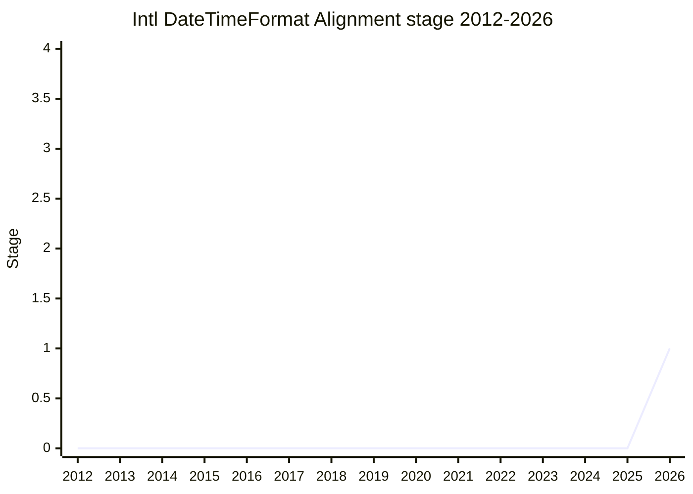

## 概要

Intl.DateTimeFormat Alignment With Other Standards は、**HTML / JavaScript / Unicode MessageFormat で同じ datetime formatting options を使えるようにする**ための ECMA-402 提案です。WHATWG では [LCA](../people/LCA.md) が `<time>` 要素に `format` 属性を追加して JavaScript なしの localized time formatting を可能にする提案を進めており、Unicode MessageFormat でも datetime formatting の API 設計が進行中です。これらが `Intl.DateTimeFormat` に無い option(`dateFields` / `timePrecision`)や異なる綴り(`dateLength` 等)を導入しつつあるため、web stack 全体で formatting options を揃えることが動機です。

具体案は `Intl.DateTimeFormat` に `dateFields`(日付のどの部分を含めるか)と `timePrecision`(時刻をどの精度まで含めるか)を追加し、`dateLength`(`dateStyle` の alias)や `timeZoneStyle`(`timeZoneName` のより良い名前)といった命名整合も検討するというものです。**新しいデータや能力は追加せず**、既存の datetime component options への mapping で表現できる範囲に留めます。ICU4X の semantic skeleton に基づく設計により、現行 API が許してしまう「July at 36」(month + minute だけ)のような nonsensical な組合せも防ぐ方向です。champion は [EAO](../people/EAO.md)。

## ステージ遷移

| 会合                                                   | できごと                                                                                                                                    | Stage |
| ------------------------------------------------------ | ------------------------------------------------------------------------------------------------------------------------------------------- | ----- |
| [2026-07](../../raw/notes/meetings/2026-07/july-22.md) | 初提示(TG2 支持済み)。[JSL](../people/JSL.md) / [SFC](../people/SFC.md) / [LVU](../people/LVU.md) が支持し、実質議論なしで **Stage 1 到達** | 0 → 1 |

> 横軸=2012-2026、縦軸=Stage。2026-07 初出で Stage 1。

## 主な論点

### 綴りの調整はどちら向きにも可能

HTML 側の PR は WHATWG プロセスの stage 1 段階、Unicode MessageFormat も semantic skeleton の最終化待ちであるため、option 名の綴り(`dateLength` vs `dateStyle` 等)は **ECMA-402 側が合わせる/相手側に変更を求める、の双方向で交渉可能**な状態です。[EAO](../people/EAO.md) は MessageFormat WG・WHATWG との協調を前提に「どこでも使える 1 つの options セット」を目指すとしています。

### 解の形は未確定

[SFC](../people/SFC.md) は「問題文(モチベーションのスライド)は良いが、solution は要検討」と付言して Stage 1 を支持しました。`style shortcuts` と `datetime component options` が互いに排他という現行 `Intl.DateTimeFormat` の構造に、新 option 群をどう整合させるかが今後の設計課題です。

## 関連提案

- [Stable Formatting](../proposals/stable-formatting.md) — 同じく [EAO](../people/EAO.md) による、Intl の出力を web stack の他レイヤから使いやすくする系統の提案。
- [Intl.MessageFormat](../proposals/intl-messageformat.md) — Unicode MessageFormat を JS へ公開する提案。本提案の datetime options は MessageFormat の formatting functions と揃えることを狙う。
- [Intl Sequence Units](../proposals/intl-sequence-units.md) — 同時期の ECMA-402 提案。

## 出典

- [2026-07 july-22](../../raw/notes/meetings/2026-07/july-22.md) — 初提示、Stage 1 到達
