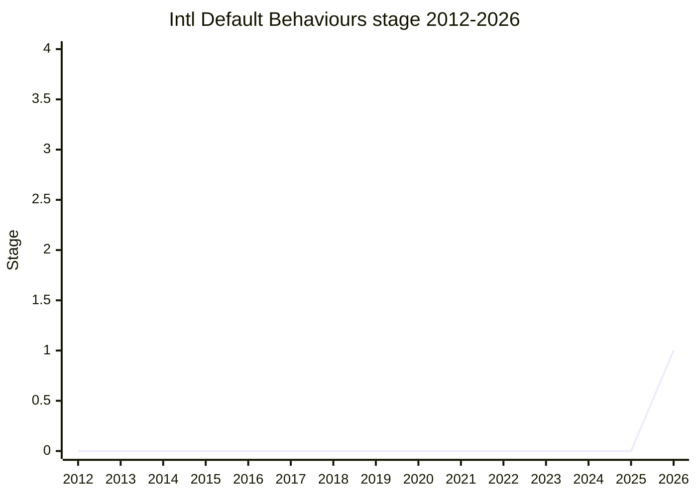

## 概要

Default Behaviours for some Intl APIs は、安定した(`zxx`)挙動を定義できなかった `Intl.Collator` と `Intl.Segmenter` について、**well-defined で locale 非依存なデフォルト挙動**をユーザーに提供する提案です。初期案では、これらの API に `und`(root)ロケールのサポートを追加する方向です。[Stable Formatting](../proposals/stable-formatting.md) が扱えなかった穴を埋める姉妹提案です。

champion は [EAO](../people/EAO.md)(Eemeli Aro)。

## ステージ遷移

| 会合                                                  | できごと         | Stage |
| ----------------------------------------------------- | ---------------- | ----- |
| [2026-05](../../raw/notes/meetings/2026-05/may-20.md) | **Stage 1 到達** | → 1   |

> 横軸=2012-2026、縦軸=Stage。2026-05 に Stage 1 到達(初出)。

## 主な論点

### `und`(root)ロケールのサポート

`Collator`/`Segmenter` に対し、locale 非依存の well-defined な挙動を `und` root ロケールとして公開する初期案。[Stable Formatting](../proposals/stable-formatting.md) では安定挙動を定義できなかった 2 API を補完します。

## 関連提案

- [Stable Formatting](../proposals/stable-formatting.md) — 本提案が補完する姉妹提案(同 champion)。

## 出典

- [2026-05 may-20](../../raw/notes/meetings/2026-05/may-20.md) — Stage 1
