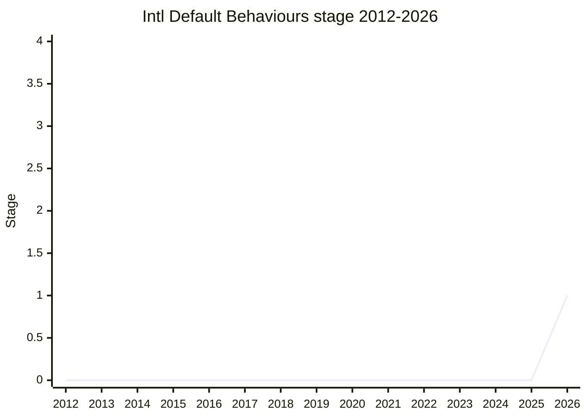

## Overview

Default Behaviours for some Intl APIs gives users a **well-defined, locale-independent default behavior** for `Intl.Collator` and `Intl.Segmenter`, which could not be given a stable (`zxx`) behavior. The early plan adds support for the `und` (root) locale to these APIs. It is the sibling proposal that fills the hole [Stable Formatting](../proposals/stable-formatting.md) could not cover.

The champion is [EAO](../people/EAO.md) (Eemeli Aro).

## Stage history

| Meeting                                                                       | What happened       | Stage |
| ----------------------------------------------------------------------------- | ------------------- | ----- |
| [2026-05](https://github.com/tc39/notes/blob/main/meetings/2026-05/may-20.md) | **Reached Stage 1** | → 1   |

```mermaid
xychart-beta
    title "Intl Default Behaviours stage 2012-2026"
    x-axis [2012, 2013, 2014, 2015, 2016, 2017, 2018, 2019, 2020, 2021, 2022, 2023, 2024, 2025, 2026]
    y-axis "Stage" 0 --> 4
    line [0, 0, 0, 0, 0, 0, 0, 0, 0, 0, 0, 0, 0, 0, 1]
```

> Horizontal axis = 2012-2026, vertical axis = Stage. Reached Stage 1 in 2026-05 (first presented).

## Main issues

### Support for the `und` (root) locale

The early plan exposes a locale-independent, well-defined behavior for `Collator` / `Segmenter` as the `und` root locale. It complements the two APIs for which [Stable Formatting](../proposals/stable-formatting.md) could not define a stable behavior.

## Related proposals

- [Stable Formatting](../proposals/stable-formatting.md) — the sibling proposal this one complements (same champion).

## Sources

- [2026-05 may-20](https://github.com/tc39/notes/blob/main/meetings/2026-05/may-20.md) — Stage 1
