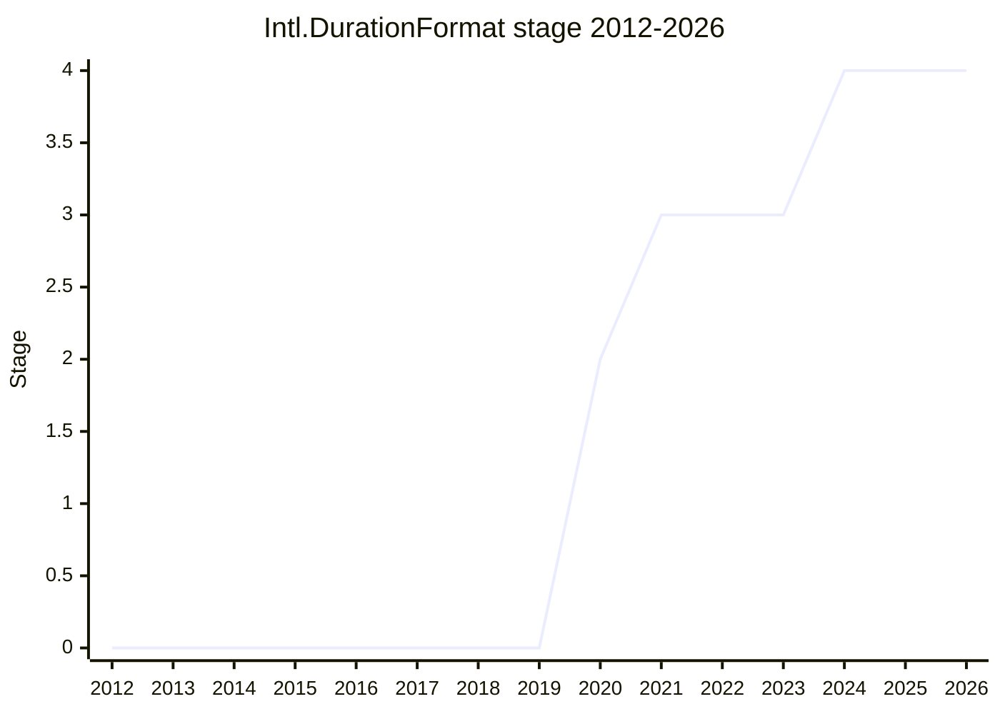

## Overview

`Intl.DurationFormat`: locale-sensitive formatting of time durations ("1 yr 3 days 30 min"), as a standalone low-level formatter in the `Intl` formatter family. Durations may be composite (multiple units) or single-unit, and each unit can take its own `style`/width - the pattern real products need (a travel site shows hours as "2h" but minutes bare-numerically, because the lowest unit is implied).

It exists because locales disagree on how durations are written, and because the obvious workaround - assembling the string from `Intl.NumberFormat` and `Intl.PluralRules` pieces by hand - cannot reproduce the locale data. It was designed from the start as the formatting counterpart to [Temporal](temporal.md)'s `Temporal.Duration`, and Temporal plans to incorporate it once both shipped.

## Stage history

| Meeting                                                                            | Event                                                                                                                                                                          | Stage    |
| ---------------------------------------------------------------------------------- | ------------------------------------------------------------------------------------------------------------------------------------------------------------------------------ | -------- |
| [2020-02](https://github.com/tc39/notes/blob/main/meetings/2020-02/february-6.md)  | Presented as "Time Duration Format Proposal"; Stage 1                                                                                                                          | → 1      |
| [2020-06](https://github.com/tc39/notes/blob/main/meetings/2020-06/june-2.md)      | Stage 2                                                                                                                                                                        | 1 → 2    |
| [2021-10](https://github.com/tc39/notes/blob/main/meetings/2021-10/oct-25.md)      | Stage 3, conditional on settling whether fractional digits have a minimum as well                                                                                              | 2 → 3    |
| [2022-06](https://github.com/tc39/notes/blob/main/meetings/2022-06/jun-07.md)      | Stage 3 update                                                                                                                                                                 | 3 (kept) |
| [2022-09](https://github.com/tc39/notes/blob/main/meetings/2022-09/sep-13.md)      | Stage 3 update: consensus on presented normative changes                                                                                                                       | 3 (kept) |
| [2022-11](https://github.com/tc39/notes/blob/main/meetings/2022-11/dec-01.md)      | Stage 3 update: consensus on minor bug-fix PRs                                                                                                                                 | 3 (kept) |
| [2023-01](https://github.com/tc39/notes/blob/main/meetings/2023-01/jan-31.md)      | Stage 3 update: PR #126 consensus - a large overhaul of `formatToParts` output (bug fixes)                                                                                     | 3 (kept) |
| [2023-05](https://github.com/tc39/notes/blob/main/meetings/2023-05/may-17.md)      | Stage 3 update: consensus on changes, explicit support from [DLM](../people/DLM.md) and [PFC](../people/PFC.md)                                                                | 3 (kept) |
| [2023-07](https://github.com/tc39/notes/blob/main/meetings/2023-07/july-12.md)     | Stage 3 update: normative changes PR #150 / #158                                                                                                                               | 3 (kept) |
| [2023-11](https://github.com/tc39/notes/blob/main/meetings/2023-11/november-28.md) | Stage 3 update                                                                                                                                                                 | 3 (kept) |
| [2024-02](https://github.com/tc39/notes/blob/main/meetings/2024-02/feb-8.md)       | Stage 3 update                                                                                                                                                                 | 3 (kept) |
| [2024-06](https://github.com/tc39/notes/blob/main/meetings/2024-06/june-13.md)     | Stage 3 update and normative PRs                                                                                                                                               | 3 (kept) |
| [2024-07](https://github.com/tc39/notes/blob/main/meetings/2024-07/july-29.md)     | Normative fix: negative sign was dropped erroneously on leading numeric-style zeroes                                                                                           | 3 (kept) |
| [2024-10](https://github.com/tc39/notes/blob/main/meetings/2024-10/october-09.md)  | Normative change: no grouping separators in the digital (clock-like) style                                                                                                     | 3 (kept) |
| [2024-12](https://github.com/tc39/notes/blob/main/meetings/2024-12/december-02.md) | Stage 4: Test262 shipped, two compatible implementations passing the suite, ECMA-402 PR #943 approved by TG2. Support from [DLM](../people/DLM.md) and [PFC](../people/PFC.md) | 3 → 4    |

> Stage 1 in 2020-02, Stage 2 six months later, Stage 3 in 2021-10 - then nearly three years of Stage 3 polish before Stage 4 in 2024-12.

## Main issues

### Three years at Stage 3

[USA](../people/USA.md)'s own accounting at Stage 4: the long Stage 3 was the result of "a lot of implementer feedback" and of deliberately working in a different order - "developing our API and then going back to making sure that it works in different tools". The tail was a steady drip of consensus PRs (2022-09 through 2024-10) reshaping output details: the `formatToParts` overhaul (PR #126), the negative-sign fix for leading numeric-style zeroes, and dropping grouping separators from the digital style. None contentious enough to stall, all numerous enough to add up.

### The Temporal coupling

[PFC](../people/PFC.md)'s Stage 4 support came "with my Temporal hat on": DurationFormat is the formatter [Temporal](temporal.md) `Duration` was waiting for, and Temporal will incorporate it after Stage 4. The two proposals matured in parallel on purpose - DurationFormat was one of the original motivations for Temporal's duration type - and their fates were kept deliberately independent so the formatter could advance even while Temporal (at the time still Stage 3) continued.

### Not listed in the proposals repo

Despite reaching Stage 4, the proposal does not appear in tc39/proposals' finished-proposals table in the current snapshot, so the Stage 4 transition rests on the meeting notes (the conclusion is unambiguous: "DurationFormat reached Stage 4 with supporting comments from [DLM](../people/DLM.md) and [PFC](../people/PFC.md)").

## Related proposals

- [Temporal](temporal.md) - `Temporal.Duration` is the type this formats; incorporation planned post-Stage-4.
- [Intl keep trailing zeros](intl-keep-trailing-zeros.md) / [Intl unit protocol](intl-unit-protocol.md) - other ECMA-402 formatting refinements from the same period.

## Sources

- [2020-02 february-6](https://github.com/tc39/notes/blob/main/meetings/2020-02/february-6.md) - Stage 1
- [2020-06 june-2](https://github.com/tc39/notes/blob/main/meetings/2020-06/june-2.md) - Stage 2
- [2021-10 oct-25](https://github.com/tc39/notes/blob/main/meetings/2021-10/oct-25.md) - Stage 3
- [2022-06 jun-07](https://github.com/tc39/notes/blob/main/meetings/2022-06/jun-07.md) - Stage 3 update
- [2022-09 sep-13](https://github.com/tc39/notes/blob/main/meetings/2022-09/sep-13.md) - Stage 3 update
- [2022-11 dec-01](https://github.com/tc39/notes/blob/main/meetings/2022-11/dec-01.md) - Stage 3 update
- [2023-01 jan-31](https://github.com/tc39/notes/blob/main/meetings/2023-01/jan-31.md) - formatToParts overhaul (PR #126)
- [2023-05 may-17](https://github.com/tc39/notes/blob/main/meetings/2023-05/may-17.md) - Stage 3 update
- [2023-07 july-12](https://github.com/tc39/notes/blob/main/meetings/2023-07/july-12.md) - PR #150 / #158
- [2023-11 november-28](https://github.com/tc39/notes/blob/main/meetings/2023-11/november-28.md) - Stage 3 update
- [2024-02 feb-8](https://github.com/tc39/notes/blob/main/meetings/2024-02/feb-8.md) - Stage 3 update
- [2024-06 june-13](https://github.com/tc39/notes/blob/main/meetings/2024-06/june-13.md) - Stage 3 update and normative PRs
- [2024-07 july-29](https://github.com/tc39/notes/blob/main/meetings/2024-07/july-29.md) - negative sign fix
- [2024-10 october-09](https://github.com/tc39/notes/blob/main/meetings/2024-10/october-09.md) - digital style grouping separators
- [2024-12 december-02](https://github.com/tc39/notes/blob/main/meetings/2024-12/december-02.md) - Stage 4
