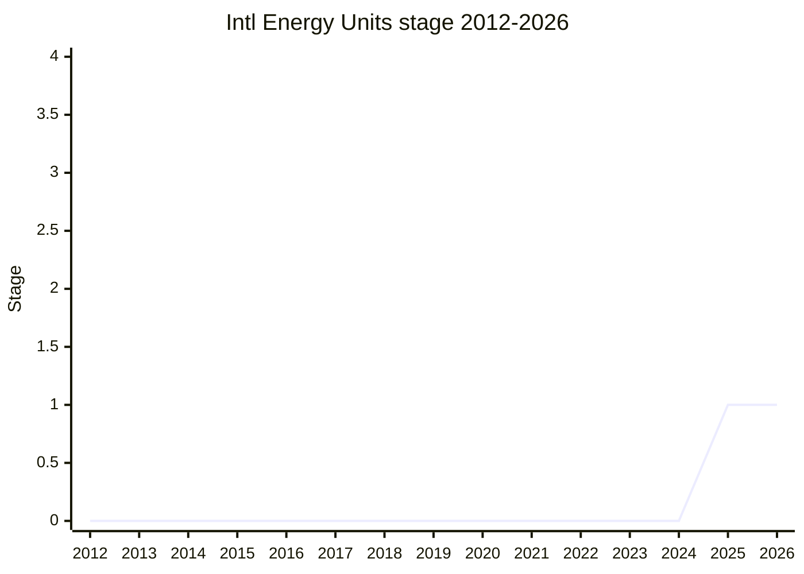

## Overview

Adds energy units - watt, kilowatt, kilowatt-hour - to `Intl.NumberFormat`'s unit formatting. `Intl.NumberFormat` supports units but deliberately ships only a subset of CLDR's units to control binary size; this proposal is driven by developer demand (one of the most upvoted issues on the ECMA-402 repository) from EV / battery / solar-panel / electricity-bill UIs. The exact unit list is to be settled at Stage 2.

Presented by [NRO](../people/NRO.md) on behalf of champion [BAN](../people/BAN.md) (Ben Allen); the canonical list also credits [NRO](../people/NRO.md) and [SFC](../people/SFC.md).

## Stage history

| Meeting                                                                            | What happened                                   | Stage |
| ---------------------------------------------------------------------------------- | ----------------------------------------------- | ----- |
| [2025-11](https://github.com/tc39/notes/blob/main/meetings/2025-11/november-20.md) | First presented. Reached Stage 1                | → 1   |
| [2026-03](https://github.com/tc39/notes/blob/main/meetings/2026-03/march-11.md)    | Stage 1 update; will seek Stage 2 in the future | 1     |

> Stage 1 in 2025-11.

## Main issues

### Narrow batches vs a holistic units proposal (2025-11)

[SFC](../people/SFC.md) reported that TG2 explicitly chose small batches of units driven by concrete use cases over one holistic proposal (he was the only one in the TG2 room preferring holistic). [WH](../people/WH.md) objected to the problem area itself: "I see that you are not even considering any SI units for energy. Kilowatt-hour is not an SI unit. A joule is" - and found it disturbing that scientific applications were marked low priority, arguing that "units in general" would be a better Stage 1 problem area than units for a specific application. [MF](../people/MF.md) disagreed: a large proposal risks one small part holding back all the others, while narrow proposals flow through the process and add little binary size each (~1KB of locale data per unit). [WH](../people/WH.md) accepted the CLDR dependency as a limiting principle but extracted a commitment that unit conversion must not become dependent on CLDR support.

## Related proposals

- [Amount](../proposals/amount.md) - the primordial number-plus-unit proposal; [WH](../people/WH.md)'s concern about conversion not depending on CLDR came up here too.
- [Intl Unit Protocol](../proposals/intl-unit-protocol.md) - the protocol for associating units with numbers at format time.

## Sources

- [2025-11 november-20](https://github.com/tc39/notes/blob/main/meetings/2025-11/november-20.md) - Stage 1
- [2026-03 march-11](https://github.com/tc39/notes/blob/main/meetings/2026-03/march-11.md) - Stage 1 update
