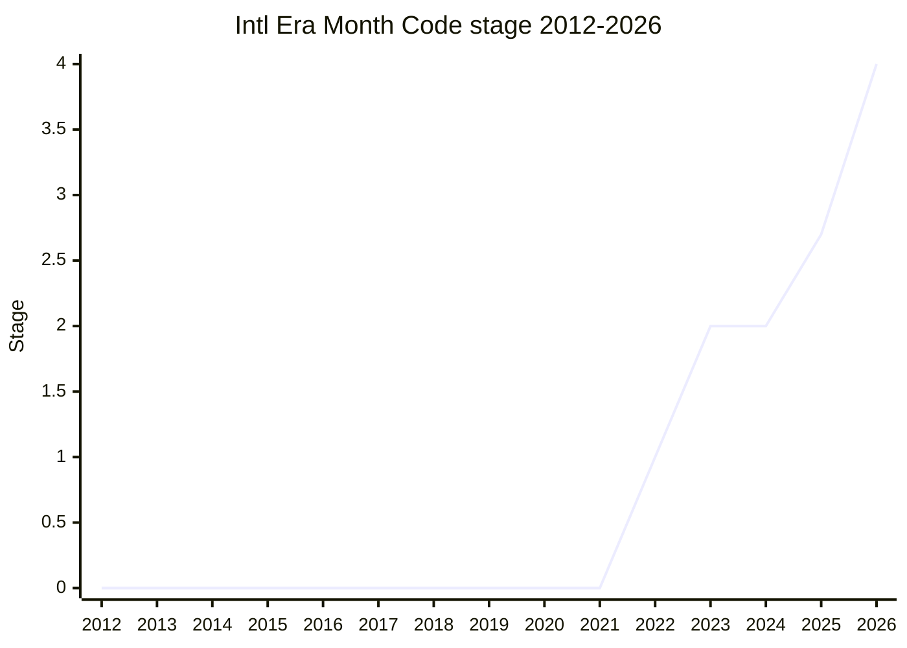

## 概要

Intl Era/Month Code は、[Temporal](../proposals/temporal.md) が意図的にスコープ外とした **非 ISO 8601 カレンダーの era / eraYear / monthCode の挙動**を ECMA-402 に規定する提案です。Temporal は ISO 8601 カレンダーと UTC のみを完全に規定し、Hebrew・各種 Islamic・Buddhist・Chinese・Ethiopian・Coptic・Japanese・Dangi など CLDR が定義する約 20 のカレンダーについては era code・month code のセマンティクスを空白のまま残していました。本提案はその空白を最小限のセマンティクスで埋めます。

設計の眼目は「過剰規定の回避」と「実装間の差異 (divergence) の最小化」の両立です。各カレンダーの暦算そのもの(ECMAScript が権威を持つべきでない事柄)は規定せず、しかし識別子文字列(era code, monthCode)を揃えないと同じ JS コードがエンジン間で別解釈されうるため、そこにガードレールを設けます。識別子の権威は TC39 が独自に発明するのではなく **CLDR (Unicode) を権威とし、ECMA-402 はそれを参照する**方針に落ち着きました。元作者の [FYT](../people/FYT.md) が CLDR TC と調整して era code を upstream しています。

規定する主な内容は、サポートするカレンダーの記述(最終的に **closed list**)、有効な era code とエイリアス、各カレンダーの era year の有効範囲、PlainDate の epoch year、lunisolar カレンダーでの「年の加算」時の制約挙動、PlainMonthDay の reference year 選定範囲などです。Temporal の Stage 4 と歩調を合わせ、2026-03 に両者そろって Stage 4 へ到達しました。

## ステージ遷移

| 会合                                                        | できごと                                                                                                              | Stage   |
| ----------------------------------------------------------- | --------------------------------------------------------------------------------------------------------------------- | ------- |
| [2022-11](../../raw/notes/meetings/2022-11/dec-01.md)       | Stage 1 到達。[SFC](../people/SFC.md) が [FYT](../people/FYT.md) 代理で発表。識別子の権威の所在が論点に               | 0 → 1   |
| [2023-01](../../raw/notes/meetings/2023-01/feb-01.md)       | Stage 2 到達。[FYT](../people/FYT.md) 発表。[EAO](../people/EAO.md) と [SFC](../people/SFC.md) が Stage 3 reviewer に | 1 → 2   |
| [2025-04](../../raw/notes/meetings/2025-04/april-16.md)     | Stage 2 update。[SFC](../people/SFC.md) が引き継ぎ、era code を era 名ベースへ変更、Hijri/範囲外方針を提示。遷移なし  | 2       |
| [2025-07](../../raw/notes/meetings/2025-07/july-30.md)      | **Stage 2.7 到達**(conditional)。[USA](../people/USA.md) が [PFC](../people/PFC.md) と共同で発表                      | 2 → 2.7 |
| [2025-09](../../raw/notes/meetings/2025-09/september-23.md) | 2.7 update + normative 2 件に consensus(leap month の `overflow:reject` へ revert、reference year を 2035 まで許容)   | 2.7     |
| [2025-11](../../raw/notes/meetings/2025-11/november-20.md)  | late-breaking な normative 変更のため Stage 3 を**見送り**。CLDR の era alias 削除等に consensus                      | 2.7     |
| [2026-01](../../raw/notes/meetings/2026-01/january-20.md)   | **Stage 3 到達**。[BAN](../people/BAN.md) 発表。closed calendar list 化、稀な leap month の reference year テーブル等 | 2.7 → 3 |
| [2026-03](../../raw/notes/meetings/2026-03/march-10.md)     | **Stage 4 到達**。[BAN](../people/BAN.md) 発表。SpiderMonkey 99.9% / V8 99.7% 適合、editor sign-off 済み              | 3 → 4   |

> 横軸=2012-2026、縦軸=Stage。提案 repo は 2022-06 開設で、コーパスの大半の年は存在しない (0)。2022-11 に Stage 1、2023-01 に Stage 2。2023-2024 は約 2 年停滞 (2 横ばい)。2025-07 に Stage 2.7、2026-01 に Stage 3、2026-03 に Stage 4。2026 年内に 3 と 4 を経たため年末値は 4。

## 主な論点

### 識別子の権威は TC39 か CLDR か

era code / monthCode の識別子を ECMA-402 が独自に発明するのか、外部の権威に委ねるのかが Stage 1 (2022-11) の中心論点でした。[MF](../people/MF.md) が懸念を表明しています。

> ([MF](../people/MF.md), 2022-11) このデータを我々が定義することには不安がある。もっと多くの専門家を擁する別の団体が定義し、我々はそれを規範的に参照する方が望ましい。

[USA](../people/USA.md) も「当初の提案は標準化を完全に TC39 に依存しているように見えた」と懸念し、[FYT](../people/FYT.md) が CLDR を権威とする方向へ舵を切り、CLDR TC と working group を組成して era code を upstream することで決着しました。

### lunisolar カレンダーでの「年の加算」と leap month

Hebrew 5784 の Adar I のような leap month を持つ年から翌年へ `+1 year` したとき、その月が翌年に存在しない場合の扱いが論点でした。2025-07 では次の非 leap month へ進める挙動でしたが、2025-09 で `overflow: "reject"` 時に RangeError を投げる以前の挙動に **revert** しました(ISO 8601 の 2/29 の扱いと整合)。

> ([BAN](../people/BAN.md), 2025-09) leap month から前進する際にどの月へ行くべきかの基準はカレンダーごとに異なり、多くの点で我々の管轄外だ。厳格さの方向に倒す。失えば後でいつでも緩める方向に行けるからだ。

### 稀な leap month/day のための reference year

PlainMonthDay は内部的に ISO 8601 の実在日付を参照しますが、Chinese 暦の冬の leap month のように数百年に一度しか起きない月日には 1972 を基準年にできません。2025-09 で基準年範囲を 1972 → 最大 2035 へ拡張(2033/2034 の Chinese leap month を拾うため)し、2026-01 でごく稀な組合せはハードコードのテーブルで扱い、未収載は `overflow: reject` で RangeError、constrain では非 leap 版へ clamp する方針になりました。

### footgun カレンダー(islamic / islamic-rgsa)の扱い

実体のない / 誤用を招くカレンダー識別子を残すかが 2026-01 の論点でした。`islamic-rgsa`(Oracle が要望したが未実装・未使用)を format の `ca` オプションから無視し、simulation ベースの "islamic" も fallback 化。あわせて利用可能カレンダーを **closed list** 化して interoperability 問題を避けました。

> ([SFC](../people/SFC.md), 2026-01) 2010 年代初頭に要望されたこのカレンダーの仕様は一度も実装されず、実装されなかったがゆえにエンジンが出荷しても footgun にしかならない。

## 関連提案

- [Temporal](../proposals/temporal.md) — 親提案。本提案は Temporal が意図的にスコープ外とした非 ISO 8601 カレンダーの era/monthCode 挙動を ECMA-402 側で埋める。Temporal が "forcing function" となり、Stage 4 PR も Temporal と一緒にマージされる予定。

## 出典

- [2022-11 dec-01](../../raw/notes/meetings/2022-11/dec-01.md) — Stage 1(識別子の権威の論点)
- [2023-01 feb-01](../../raw/notes/meetings/2023-01/feb-01.md) — Stage 2
- [2025-04 april-16](../../raw/notes/meetings/2025-04/april-16.md) — Stage 2 update([SFC](../people/SFC.md) 引き継ぎ)
- [2025-07 july-30](../../raw/notes/meetings/2025-07/july-30.md) — Stage 2.7 到達
- [2025-09 september-23](../../raw/notes/meetings/2025-09/september-23.md) — 2.7 update + normative changes
- [2025-11 november-20](../../raw/notes/meetings/2025-11/november-20.md) — Stage 3 見送り + normative
- [2026-01 january-20](../../raw/notes/meetings/2026-01/january-20.md) — Stage 3 到達
- [2026-03 march-10](../../raw/notes/meetings/2026-03/march-10.md) — Stage 4 到達
