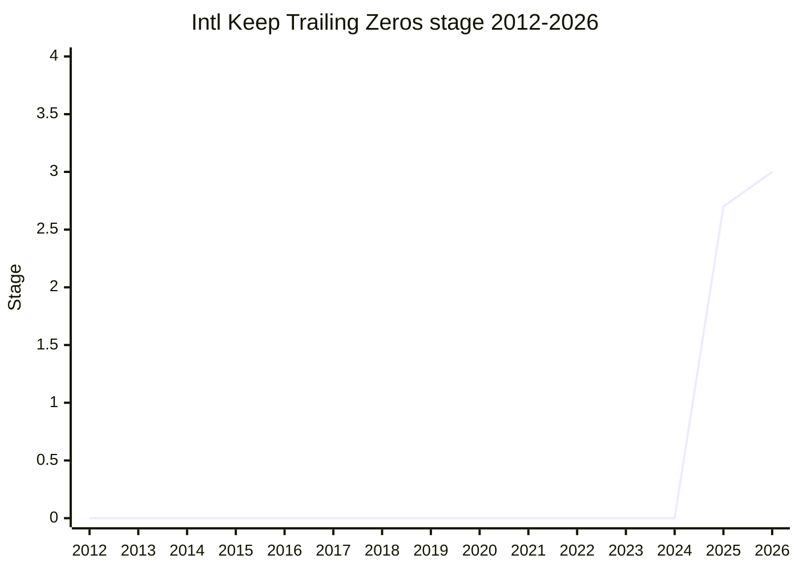

## 概要

Keep Trailing Zeros は、`Intl.NumberFormat` と `Intl.PluralRules` で**末尾の小数ゼロを保持**する手段を追加する提案です。たとえば有効桁を示すために `1.5` を `"1.50"` と整形したい場合に、現状の丸め/桁設定では落ちてしまう trailing zero を維持できるようにします。

champion は [EAO](../people/EAO.md)(Eemeli Aro)。ECMA-402 の提案で `intl` family に属します。

## ステージ遷移

| 会合                                                       | できごと                                                                                                   | Stage   |
| ---------------------------------------------------------- | ---------------------------------------------------------------------------------------------------------- | ------- |
| [2025-05](../../raw/notes/meetings/2025-05/may-28.md)      | Stage 1 到達                                                                                               | → 1     |
| [2025-07](../../raw/notes/meetings/2025-07/july-29.md)     | **Stage 2 到達**。[RGN](../people/RGN.md) / [SFC](../people/SFC.md) が reviewer となり会期中にレビュー完了 | 1 → 2   |
| [2025-07](../../raw/notes/meetings/2025-07/july-30.md)     | **Stage 2.7 到達**(同会期 day 3 の継続。[WH](../people/WH.md) の blocking 懸念は別議論へ分離)              | 2 → 2.7 |
| [2025-11](../../raw/notes/meetings/2025-11/november-18.md) | update(PR #10 / #12 のマージ方針、issue #11 の現挙動を妥当と確認)                                          | 2.7     |
| [2026-05](../../raw/notes/meetings/2026-05/may-19.md)      | **Stage 3 到達**。PR #19 / #20 を reviewer 承認の上マージ                                                  | 2.7 → 3 |

> 横軸=2012-2026、縦軸=Stage。Stage 1 が 2025-05。2025-07 の同一会期で Stage 2(day 1)→ Stage 2.7(day 3)を連続通過し、2026-05 に Stage 3。2025 年末値は 2.7。

## 主な論点

### bugfix 的な位置づけ

本提案は公開 API を変えず、`Intl.NumberFormat` / `Intl.PluralRules` の内部挙動(digit string の末尾ゼロ保持)を直す bugfix と整理されています。現挙動に有用性が示されたり web 非互換が判明した場合は、既存の `trailingZeroDisplay` オプションに値を足して対応する想定です。

### 同会期での Stage 2 → 2.7 連続通過(2025-07)

day 1 で Stage 2 に到達し、reviewer の [RGN](../people/RGN.md) / [SFC](../people/SFC.md) が**会期中にレビューを完了**、day 3 の継続で Stage 2.7 に到達しました。[WH](../people/WH.md) が `ToIntlMathematicalValue` 抽象操作について挙げた blocking 懸念は「本提案のスコープ外」として別議論に切り出され、前進の妨げにはなりませんでした。

### Stage 3 到達(2026-05)

open PR #19・#20 が reviewer 承認済みで提示され、両 PR をマージした上で Stage 3 への支持を得ました。

## 関連提案

- [Stable Formatting](../proposals/stable-formatting.md) / [Intl Default Behaviours](../proposals/intl-default-behaviours.md) / [Intl Sequence Units](../proposals/intl-sequence-units.md) — 同会期で動いた ECMA-402 提案群(うち trailing zeros と stable formatting は [EAO](../people/EAO.md) champion)。
- family: `intl`

## 出典

- [2025-05 may-28](../../raw/notes/meetings/2025-05/may-28.md) — Stage 1
- [2025-07 july-29](../../raw/notes/meetings/2025-07/july-29.md) — Stage 2
- [2025-11 november-18](../../raw/notes/meetings/2025-11/november-18.md) — update
- [2026-05 may-19](../../raw/notes/meetings/2026-05/may-19.md) — Stage 3
