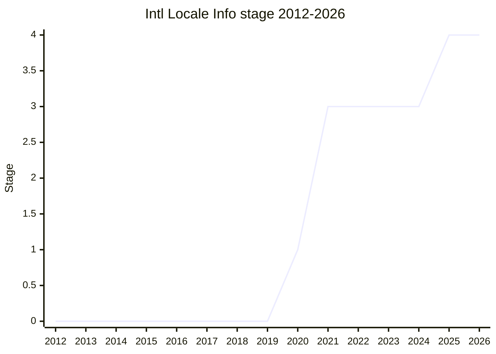

## Overview

Exposes locale data that `Intl` uses internally but never surfaced: week information (`firstDayOfWeek`, weekend brackets, minimal days in first week), hour cycles, measurement systems, and other `Intl.Locale` properties. The motivating use cases include building custom calendar UIs from the same data CLDR feeds to `Intl`.

Championed by [FYT](../people/FYT.md) (Frank Yung-Fong Tang). What was expected to be "a small proposal" spent five years in Stage 3 collecting normative fixes before reaching Stage 4.

## Stage history

| Meeting                                                                            | What happened                                                                                       | Stage |
| ---------------------------------------------------------------------------------- | --------------------------------------------------------------------------------------------------- | ----- |
| [2020-09](https://github.com/tc39/notes/blob/main/meetings/2020-09/sept-23.md)     | Reached Stage 1                                                                                     | → 1   |
| [2021-01](https://github.com/tc39/notes/blob/main/meetings/2021-01/jan-26.md)      | Reached Stage 2                                                                                     | 1 → 2 |
| [2021-04](https://github.com/tc39/notes/blob/main/meetings/2021-04/apr-20.md)      | Reached Stage 3                                                                                     | 2 → 3 |
| [2025-02](https://github.com/tc39/notes/blob/main/meetings/2025-02/february-19.md) | Stage 3 update                                                                                      | 3     |
| [2025-05](https://github.com/tc39/notes/blob/main/meetings/2025-05/may-28.md)      | Normative change: return `undefined` for an unknown direction (`Intl.Locale.prototype.getTextInfo`) | 3     |
| [2025-11](https://github.com/tc39/notes/blob/main/meetings/2025-11/november-18.md) | **Reached Stage 4** after merging PR 92 (explicit fallback behavior)                                | 3 → 4 |

> Stage 1 in 2020-09, Stage 2 in 2021-01, Stage 3 in 2021-04, Stage 4 in 2025-11.

## Main issues

### Explicit fallback behavior (2025-11, PR 92)

The last blocker before Stage 4 was issue 76: several abstract operations left fallback behavior vague ("implementation-dependent"), which Mozilla refused to ship against. Anba (Mozilla) proposed PR 92 to make the fallback explicit - not changing behavior, but specifying what was unspecified - which was agreed at the 2025-10 TG2 meeting and approved by TC39 in 2025-11 immediately before the Stage 4 request. At that point Chrome (since M99) and Safari (since 18, 2023-09) already shipped the API, and Mozilla's only blocker was this issue.

## Related proposals

- [Intl Keep Trailing Zeros](../proposals/intl-keep-trailing-zeros.md), [Intl Era/Month Code](../proposals/intl-era-month-code.md) - other ECMA-402 proposals that advanced alongside it in the same period.

## Sources

- [2020-09 sept-23](https://github.com/tc39/notes/blob/main/meetings/2020-09/sept-23.md) - Stage 1
- [2021-01 jan-26](https://github.com/tc39/notes/blob/main/meetings/2021-01/jan-26.md) - Stage 2
- [2021-04 apr-20](https://github.com/tc39/notes/blob/main/meetings/2021-04/apr-20.md) - Stage 3
- [2025-02 february-19](https://github.com/tc39/notes/blob/main/meetings/2025-02/february-19.md) - Stage 3 update
- [2025-05 may-28](https://github.com/tc39/notes/blob/main/meetings/2025-05/may-28.md) - normative change (unknown direction)
- [2025-11 november-18](https://github.com/tc39/notes/blob/main/meetings/2025-11/november-18.md) - PR 92 consensus + Stage 4
