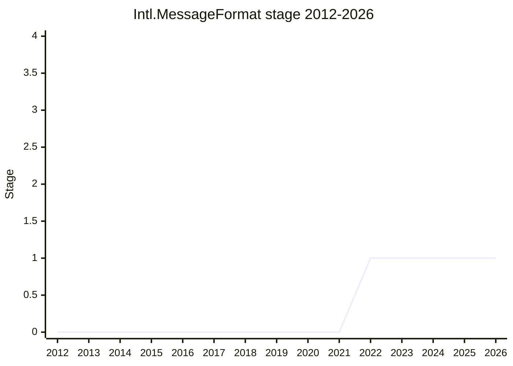

## 概要

`Intl.MessageFormat` は、Unicode Consortium で策定が進む **MessageFormat 2.0 (MF2)** を JavaScript に公開する ECMA-402 提案です。MF2 は、複数形 (plural)・性 (gender)・選択 (select) などを含む翻訳メッセージを、開発者と翻訳者の双方が扱える形で表現する DSL(専用構文)とデータモデルからなります。従来 ICU MessageFormat (v1) や ICU4J の polyfill が担ってきた領域を、CLDR を権威とする新しい標準構文として整理し直すものです。

提案は当初、単一メッセージの整形 (`Intl.MessageFormat`) と、複数の関連メッセージをまとめた「リソース」の整形を 1 本に含んでいましたが、2022-11 に後者が `Intl.MessageResource` として別の Stage 1 提案へ分離されました(本ページは前者を扱う)。整形 API は他の `Intl.*` フォーマッタと異なり、入力が翻訳者の手を経た**ユーザデータ**であるため失敗しやすく、エラーを throw せず非致命的に扱う(`onError` コールバック等)モデルを志向する点が大きな特徴です。

2026-06 時点で本提案は **Stage 1 に留まり「stuck(行き詰まり)」**の状態にあります。Stage 2 への前進をめぐっては「実績の乏しい新規 DSL/parser を言語に入れてよいか」という根本的な懸念が繰り返し争点となり、解決していません。

## ステージ遷移

| 会合                                                        | できごと                                                                                                                                         | Stage |
| ----------------------------------------------------------- | ------------------------------------------------------------------------------------------------------------------------------------------------ | ----- |
| [2022-03](../../raw/notes/meetings/2022-03/mar-30.md)       | **Stage 1 到達**。[EAO](../people/EAO.md) 発表(co-champion: [DLM](../people/DLM.md))。`message` という語の曖昧さ、library か language かが論点に | 0 → 1 |
| [2022-11](../../raw/notes/meetings/2022-11/nov-29.md)       | リソース整形部分を `Intl.MessageResource` として分離、そちらが Stage 1 到達。本体は単一メッセージに集中(Stage 据え置き)                          | 1     |
| [2023-09](../../raw/notes/meetings/2023-09/september-26.md) | Stage 1 update。進捗におおむね賛同。error handling と custom formatter API の複雑さが論点。遷移なし                                              | 1     |
| [2024-02](../../raw/notes/meetings/2024-02/feb-7.md)        | Stage 2 を議論するも見送り。**syntax parser を外しデータモデルのみで Stage 2 を狙う**方針で再来予定に。遷移なし                                  | 1     |
| [2024-04](../../raw/notes/meetings/2024-04/april-10.md)     | status update。TG2(特に Google i18n)が parser 除去に反対し **proposal は stuck**。判断は業界の MF2 採用待ちへ                                    | 1     |
| [2024-06](../../raw/notes/meetings/2024-06/june-11.md)      | Stage 1 open question。error handling の設計パターン(option 1〜6)を議論。新 option を champion group へ。遷移なし                                | 1     |

> 2022-03 に Stage 1 到達。以降 2026 まで Stage 1 のまま停滞。2024-02 に「parser を外してデータモデルのみで Stage 2」案が出たが、2024-04 に TG2 の反対で頓挫し、現在まで前進していない(横ばい)。

## 主な論点

### 言語に入れるべきか — 実績のない DSL/parser への懸念

最大の争点。新しい DSL とその parser を JavaScript 本体に「永続的に」入れることへの強い慎重論が繰り返し示された。Stage 1 の時点で [KG](../people/KG.md) は「標準ツールがあるのは良いが、これが本質的に『language 的』であって『library 的』でない、とは思えない」と述べ、テンプレートエンジンは既に多数あると指摘した。

2024-02 では [MF](../people/MF.md) が、JSON のように「時の試練を経た (time-tested)」ものだけを言語に入れるべきだとし、「JavaScript に刻み込む (enshrine) には、何年かの使用経験を経て『恒久的な妥当性』への確信を持てるまで難しい」と主張。[KG](../people/KG.md) も「使用経験なしに DSL を正しく設計するのは、非人間的に困難か不可能かの間だ」「3 社より多くが数年使い、満足しているのを見たい」と述べた。[SYG](../people/SYG.md) は 2023 年に CLDR 変更が原因でブラウザの date/time 整形障害が起きた例を挙げ、Unicode の安定性保証に疑問を呈した。

反対に [ZB](../people/ZB.md) は「ローカライゼーション形式の進化を、MF2 を設計している人々ほど理解し気にかけている者は世界に他にいない」「DSL を JavaScript に入れないことで、web ローカライゼーションの発展を悲劇的に 10 年遅らせている」と前進を訴えた。

### syntax parser を外す案と、その頓挫

2024-02 (feb-7) の結論は、構文 parser を含めると標準化に数年かかりうるため、**当面はメッセージのデータモデル表現のみをサポートし parser を外せば前進を解除できる**、というものだった。Speaker's Summary は「構文 (DSL) を標準化するには、MF2 開発に関与していなかった組織を含むさまざまな規模の十数組織が、本番でスタック全体にわたり MF2 構文を有意に使っているのを見ることが説得力を持つ。これは恐らく Stage 2.7 で要求される」と記す。[KG](../people/KG.md) は「API 部分だけで Stage 2 に進むのは懸念が少ない。私の懸念は DSL に固有のものだ」と述べ、[MF](../people/MF.md) も「surface syntax 抜きでデータモデルだけ進めるのは助けになる」と最終的に同意した。

ただし [SFC](../people/SFC.md) が「TG2 のデリゲート全員がこの案を review したか分からない。数か月待っても害はない」と促し、[EAO](../people/EAO.md) は「TG2 で議論する前に Stage 2 を求めない」とこの会合での要求を見送った。

2024-04 (april-10) の status update で、この案は頓挫したことが報告される。[EAO](../people/EAO.md) によれば、TG2 のフィードバックは parser 除去への懸念(特に Google の i18n グループ)を示した。[EAO](../people/EAO.md)「全体として今これは行き詰まっており (stuck)、いつか進むかもしれない」。さらに「TC39 / TG2 は、ある意味で開発を Unicode CLDR に外注した。我々は MF2.0 が良いかどうかを論評せず、業界に採用されるのを待つ。採用されれば良いものということで、さらなる前進を検討するかもしれない」と、次の一手が標準化団体の外(業界の採用)に委ねられたことを述べた。

### Unicode との分業構造 — 構文は Unicode、API は TC39

MF2 の本体(構文 DSL とデータモデル)は **Unicode 側で策定**され、TC39 はその上に JS API を被せるだけ、という垂直スタックの分業になっている。[EAO](../people/EAO.md) はこの構造を「stacking」と表現した(2024-04 april-10):

> MessageFormat 2 の message syntax は **Unicode で定義**されている。そして JavaScript API は **TC39 でのみ**定義している。

層は 3 つに整理できる:

1. **Unicode** — MF2 の構文とデータモデルそのもの(規範)。
2. **ICU**(ICU4C / ICU4J)— その参照実装。2024-04 時点で **tech preview** に入った段階。[DE](../people/DE.md) は「ICU の tech preview で 6〜12〜18 か月かけて安定化すれば、構文が安定だという強いシグナルを TC39 に与える」と述べた。
3. **TC39 / TG2** — 上記を前提に `Intl.MessageFormat` の JS API を定義するだけ。[EAO](../people/EAO.md) によればこの JS API は 2013 年以来ほぼ同形で、web ローカライゼーションの約 1/3 が既に旧版(ICU MessageFormat 1)相当の polyfill `intl-messageformat` に依存している。

この分業ゆえ、TG2 は MF2 の中身の評価そのものを Unicode 側に委ねた(上記「syntax parser を外す案」で引用した [EAO](../people/EAO.md) の「Unicode CLDR に外注した」発言)。[SFC](../people/SFC.md) も「今は **Unicode 側の開発**に注力しており、それが片付いたら JavaScript / web platform 側にエネルギーを注ぐ」と、Unicode 先行・TC39 後追いの順序を明言している。結果として TC39 の前進条件は「Unicode 発の構文が業界に採用され安定したか」に従属し、[SYG](../people/SYG.md) が挙げた CLDR 由来の date/time 整形障害(2023)のような **Unicode/CLDR の安定性への疑念**が、そのまま TC39 での前進をためらわせる要因になっている。

> 補足: Unicode 内部では MF2 は CLDR Technical Committee 配下の Message Format Working Group が策定する技術標準で、ICU がその参照実装にあたる(議事録では [EAO](../people/EAO.md) がこれらをまとめて「Unicode CLDR」と呼ぶ)。

### error handling — throw しないモデルと API 形

`Intl.MessageFormat` は入力がユーザ/翻訳者起源で失敗しやすいため、エラーで throw しない設計を志向する。[EAO](../people/EAO.md) は 2023-09 に「他の Intl フォーマッタと違いユーザデータに依存し、翻訳者など複数のワークフローを経てくるため、最終的に(部分的に)失敗する可能性が他より高い」と非致命エラーの理由を説明した。これに対し [DE](../people/DE.md) は「エラーがあれば throw するのを期待していた」と述べ、また custom formatter API の規模・複雑さへの懸念を示した。[JHD](../people/JHD.md) は `onError` が void を返す設計に疑問を呈した。

2024-06 (june-11) は [SFC](../people/SFC.md) が error handling の設計パターンを 3 案提示して議論した。メッセージ生成時に検出される **message error** と、整形時(プレースホルダ供給時)に出る **resolution error** の 2 種を区別したうえで:

- **Option 1**(`onError` コールバック。現行案)— [DLM](../people/DLM.md)「最も強い選好は throw しないこと。throw は書き忘れやすく、ローカライズ済み文字列の欠落はよくある」。[JWS](../people/JWS.md) も「ユーザ空間で最も一般的なのは Option 1」。
- **Option 2**(例外を throw)— ほとんどのデリゲートが望ましくないと合意。
- **Option 3**(メタデータ付きの戻り値オブジェクト)— [USA](../people/USA.md) は「1 か 3、2 よりはるかに良い」とし、Option 1 を「より JavaScript 的」、Option 3 を「より Rust 的」と評した。

[RGN](../people/RGN.md) は `onError` コールバックが制御フロー上 reentrancy で紛らわしいと反対。結論は「Option 1 の reentrancy 懸念」「Option 2 は不採用で概ね合意」「Option 3 に強い反対はないが多数は別案を選好」「新たに option 4・5・6 を追加し champion group で検討」となり、決着には至っていない。

### `message` という語の混乱

Stage 1 の場で [CM](../people/CM.md) が「『message』という語の使い方にとても混乱している。私の世界ではこれは message ではなく、ひとかたまりのテキストだ」と述べた。[EAO](../people/EAO.md) は後の会合(2022-11)で「ここでの message は人間が読むことを意図したメッセージで、コンピュータ間でやり取りされるものではない」と用語を明示し直している。一方で [USA](../people/USA.md) は「これは国際化というパズルの最も重要なピースの 1 つ。Stage 1 に来たのを本当に嬉しく思う」と支持した。

## 関連提案

- `Intl.MessageResource` — 2022-11 に本提案から分離して Stage 1 到達した姉妹提案(関連メッセージの「リソース」整形)。未精読。
- [Intl Era/Month Code](../proposals/intl-era-month-code.md) — 同じ ECMA-402 の国際化提案。
- [Temporal](../proposals/temporal.md) — `Intl.MessageFormat` から日時値を扱う際に参照されうる(2026-03 に MF2 が Temporal の `PlainTime` parse 挙動の問題を発見、という言及あり)。
- `Measure` / `Amount` — 数値+単位/通貨を MessageFormat へ渡し、翻訳者が値をローカライズしてしまうのを防ぐ用途として MF2 が動機に挙げられている(2024-10 / 2024-12 / 2025-09 ほか)。未精読。

### 混同しやすい別物 — Template Instantiation / DOM Parts(参考・TC39 スコープ外)

`Intl.MessageFormat` は「HTML の Template Instantiation と被るのでは」と混同されることがあるが、両者は別物。Template Instantiation / DOM Parts は **W3C/WHATWG(WICG webcomponents)の DOM 側提案**であり、TC39 の管轄外(本 wiki の素材 `raw/notes` には登場しない)。以下は外部資料に基づく参考整理:

- **Template Instantiation** — 2017-11 に Apple が提案。`<template>` を mustache 構文 `{{ }}` で値置換・条件分岐・ループしながら clone する**宣言的テンプレート API**(`HTMLTemplateElement.createInstance()` → `TemplateInstance`、`update()`、template parts、拡張可能な template processors)。当初スコープが広すぎる(構文 + parts + processor 一式)とされ、2017/2019 の議論を経て、低レイヤの **DOM Parts を先に固める**方針へ分割された。
- **DOM Parts** — Apple/Google 合同提案。DOM ツリー中の可変箇所(child nodes / content attribute / JS property 等)を id 並みに高速に**マークし更新する低レイヤ機構**(`ChildNodePart` / `NodePart` / `AttributePart`、imperative API と `<template>` 内の declarative API)。式評価・if/else・loop・テンプレート処理モデルは**含まない**(将来検討に先送り)。
- **棲み分け** — DOM Parts =「DOM のどこを更新するか」を示す低レイヤ、Template Instantiation =その上で「構文とデータバインディング」を与える高レイヤ。競合ではなく階層関係で、2025-03 時点では DOM Parts を先行させる方針で議論が継続。
- **`Intl.MessageFormat` との違い** — MessageFormat は i18n の**文字列**整形(plural / gender / select の言語依存分岐)であり、出力は DOM ではなく文字列。「テンプレートに値を差し込む」表層だけ似るが、解く問題(言語別整形 vs DOM 構築)も標準化団体(Unicode+TC39 vs W3C/WHATWG)も別。

> 出典(外部、wiki 素材外): [WICG/webcomponents DOM-Parts.md](https://github.com/WICG/webcomponents/blob/gh-pages/proposals/DOM-Parts.md) / [Template-Instantiation.md](https://github.com/WICG/webcomponents/blob/gh-pages/proposals/Template-Instantiation.md) / [Template Instantiation 2025-03-26 minutes](https://www.w3.org/2025/03/26-webcomponents-minutes.html)。

## 出典

- [2022-03/mar-30](../../raw/notes/meetings/2022-03/mar-30.md) — Intl.MessageFormat for Stage 1
- [2022-11/nov-29](../../raw/notes/meetings/2022-11/nov-29.md) — Intl MessageResource for Stage 1(本提案からの分離)
- [2023-09/september-26](../../raw/notes/meetings/2023-09/september-26.md) — Stage 1 update and discussion
- [2024-02/feb-6](../../raw/notes/meetings/2024-02/feb-6.md) — I have some questions(いつ DSL を標準化するか)
- [2024-02/feb-7](../../raw/notes/meetings/2024-02/feb-7.md) — Continuation: parser を外す案、Stage 2 見送り
- [2024-04/april-10](../../raw/notes/meetings/2024-04/april-10.md) — status update(stuck)
- [2024-06/june-11](../../raw/notes/meetings/2024-06/june-11.md) — error handling design patterns
