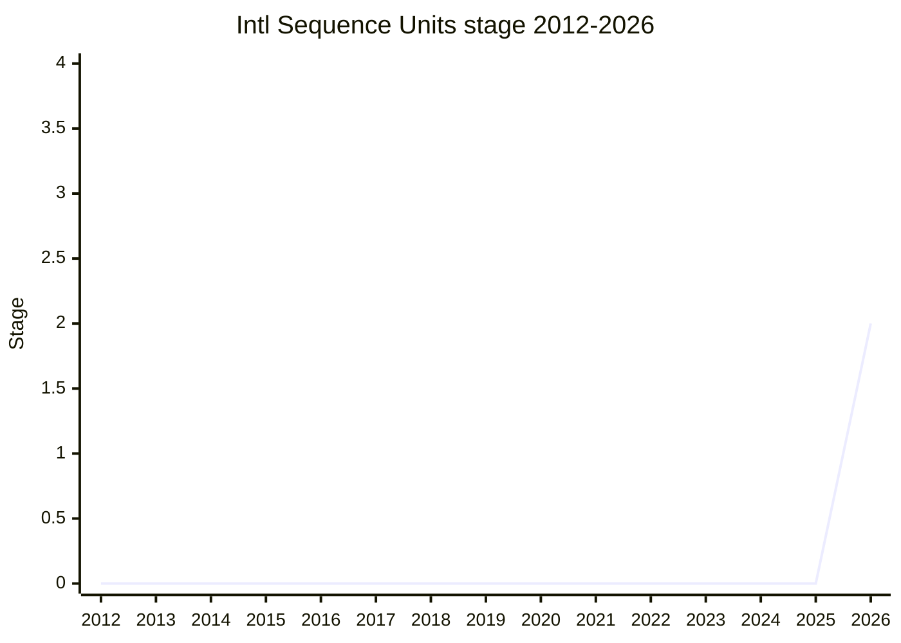

## 概要

Intl Sequence Units は、複合的な単位の並び(例: `6 ft 0 in` のようなフィート+インチ)を `Intl` で整形する提案です。複数単位を 1 つの量として組み合わせて表示するための API を提供します。

champion は [SFC](../people/SFC.md)(Shane Carr)。

## ステージ遷移

| 会合                                                  | できごと                                                                                                                | Stage   |
| ----------------------------------------------------- | ----------------------------------------------------------------------------------------------------------------------- | ------- |
| [2026-05](../../raw/notes/meetings/2026-05/may-20.md) | **Stage 1 と Stage 2 に到達**(object ベースの入力設計で)。reviewer は [EAO](../people/EAO.md) / [DLM](../people/DLM.md) | → 1 → 2 |

> 横軸=2012-2026、縦軸=Stage。2026-05 に初出かつ Stage 1・Stage 2 へ連続到達。

## 主な論点

### scalar 入力か object 入力か

入力の形をめぐって大きく議論になりました。[JHD](../people/JHD.md) は scalar 入力(例: `6.5` が 6.5 feet か 6.5 inches か)の直観性に疑問を呈し、[EAO](../people/EAO.md) は `fractionDigits` 等のオプション適用時に scalar が曖昧さを生むとして object 入力を支持。[WH](../people/WH.md) は「もし scalar を使うなら浮動小数点誤差を避けるため最小単位でなければならない」と指摘しました。最終的に **object ベース設計で Stage 2** に合意し、[JHD](../people/JHD.md) も「scalar は必要なら後から追加・再検討できる」と支持しました。

### ゼロ値の扱いと対応単位の範囲

[WH](../people/WH.md) はゼロ値(例: `6 ft 0 in`)を表示するか隠すか、開発者が選べるかを質問(follow-up issue 化)。arc 分・秒は現状 `Intl` 非対応でスコープ外と整理されました。

## 関連提案

- [Amount](../proposals/amount.md) — 数値+単位を束ねる container 提案。単位整形という点で隣接。

## 出典

- [2026-05 may-20](../../raw/notes/meetings/2026-05/may-20.md) — Stage 1 / Stage 2
