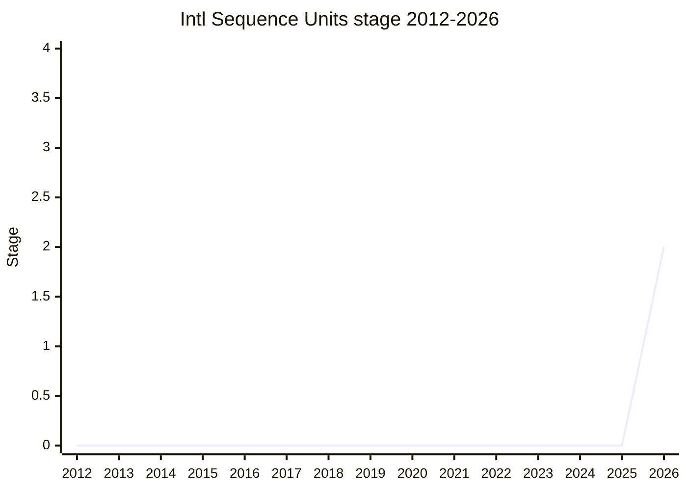

## Overview

Intl Sequence Units is a proposal for formatting compound sequences of units with `Intl` (for example feet plus inches, as in `6 ft 0 in`). It provides an API for combining multiple units and displaying them as one quantity.

The champion is [SFC](../people/SFC.md) (Shane Carr).

## Stage history

| Meeting                                                                        | What happened                                                                                                                        | Stage   |
| ------------------------------------------------------------------------------ | ------------------------------------------------------------------------------------------------------------------------------------ | ------- |
| [2026-05](https://github.com/tc39/notes/blob/main/meetings/2026-05/may-20.md)  | **Reached Stage 1 and Stage 2** (with an object-based input design). Reviewers are [EAO](../people/EAO.md) / [DLM](../people/DLM.md) | → 1 → 2 |
| [2026-07](https://github.com/tc39/notes/blob/main/meetings/2026-07/july-22.md) | Presented both sides on how to treat duration units at plenary (views were split in TG2). Iteration continues                        | 2       |

```mermaid
xychart-beta
    title "Intl Sequence Units stage 2012-2026"
    x-axis [2012, 2013, 2014, 2015, 2016, 2017, 2018, 2019, 2020, 2021, 2022, 2023, 2024, 2025, 2026]
    y-axis "Stage" 0 --> 4
    line [0, 0, 0, 0, 0, 0, 0, 0, 0, 0, 0, 0, 0, 0, 2]
```

> X-axis = 2012-2026, y-axis = Stage. First appearance in 2026-05, when it reached Stage 1 and Stage 2 in succession.

## Main issues

### Scalar input or object input

The shape of the input was debated at length. [JHD](../people/JHD.md) questioned how intuitive scalar input is (for example, whether `6.5` is 6.5 feet or 6.5 inches), and [EAO](../people/EAO.md) supported object input because a scalar becomes ambiguous when options such as `fractionDigits` are applied. [WH](../people/WH.md) pointed out that if a scalar is used, it must be in the smallest unit, in order to avoid floating-point error. In the end there was agreement on **Stage 2 with an object-based design**, and [JHD](../people/JHD.md) also supported it, saying a scalar can be added or reconsidered later if it is needed.

### Zero values, and which units are in scope

[WH](../people/WH.md) asked whether zero values (for example `6 ft 0 in`) are shown or hidden, and whether the developer can choose (this became a follow-up issue). Arcminutes and arcseconds are not currently supported by `Intl` and were treated as out of scope.

### Whether to include time/duration units (undecided)

In 2026-07 [SFC](../people/SFC.md) raised whether to handle time-based sequence units such as hours-and-minutes. Views split in TG2, so both sides were presented to plenary with no recommendation. The exclusion side ([PFC](../people/PFC.md) and others) emphasized duration footguns (DST and the length of calendar months) and that the proper path, [Temporal](../proposals/temporal.md) plus `Intl.DurationFormat`, already exists, and asked that the committee not create a second set of duration-conversion rules different from Temporal. The inclusion side ([WH](../people/WH.md), [RGN](../people/RGN.md)) cited consistency with CLDR units.xml, and that since [Amount](../proposals/amount.md) allows any well-formed unit, rejecting only time units is inconsistent. Including a hybrid proposal (automatically choosing NumberFormat or DurationFormat at format time), iteration continues and the question is undecided.

## Related proposals

- [Amount](../proposals/amount.md) — a container proposal that bundles a number and a unit. Adjacent in that both are about formatting units.

## Sources

- [2026-05 may-20](https://github.com/tc39/notes/blob/main/meetings/2026-05/may-20.md) — Stage 1 / Stage 2
- [2026-07 july-22](https://github.com/tc39/notes/blob/main/meetings/2026-07/july-22.md) — both sides on duration units presented (iteration continues)
