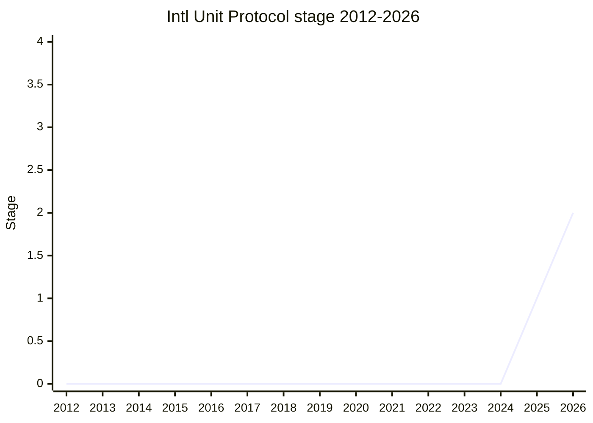

## Overview

A protocol for associating a unit with a number at formatting time: instead of fixing the unit in the `Intl.NumberFormat` constructor, `format()` accepts an options bag with `unit` (and the number) per call. The unit is part of the data model, not a formatting option - which is what unlocks automatic unit conversion later. Currency is proposed to be folded into the same protocol.

Championed by [SFC](../people/SFC.md) (Shane Carr). The proposal was split out of [Amount](../proposals/amount.md): "this proposal is the unit protocol piece of the amount proposal", keeping the primordial (Amount) and the Intl-side protocol as independently discussable questions.

## Stage history

| Meeting                                                                            | What happened                                                                 | Stage |
| ---------------------------------------------------------------------------------- | ----------------------------------------------------------------------------- | ----- |
| [2025-11](https://github.com/tc39/notes/blob/main/meetings/2025-11/november-18.md) | First presented. Reached Stage 1 ("explore associating a unit with a number") | → 1   |
| [2026-03](https://github.com/tc39/notes/blob/main/meetings/2026-03/march-11.md)    | Reached Stage 2                                                               | 1 → 2 |

> Stage 1 in 2025-11, Stage 2 in 2026-03.

## Main issues

### What kind of "protocol"? (2025-11)

[SFC](../people/SFC.md) presented several shapes: a plain options-bag object with `number`/`unit` fields, getter functions, Symbol-keyed functions, or an annotated string. [NRO](../people/NRO.md) argued against over-engineering: "what I'm seeing here is just an options bag. It's not different from many of the places where we have options bags ... It's just a naming thing. It's not really a design question." [JHD](../people/JHD.md) raised a design-principle objection: a protocol without a first-class exemplar is confusing (the iterable protocol "doesn't have a thing"; everyone uses `Promise` for thenables) - in the absence of first-class protocols he would expect Amount to exist and provide the protocol. [SFC](../people/SFC.md) noted the protocol shape is novel for Intl, where everything formatted so far has had a language type.

### Conflicting units (2025-11)

Specifying a unit in both the constructor and `format()` throws. [JHD](../people/JHD.md) asked how to override a formatter whose units are already defined, and [LVU](../people/LVU.md) argued the constructor unit should be a default that `format()` overrides rather than an error. [SFC](../people/SFC.md) kept the `RangeError` for Stage 1 to preserve design space (e.g. opt-in conversion of compatible units), with the behavior to be worked out before Stage 2.

### Construction vs formatting performance (2025-11)

Intl separates constructor options from `format()` arguments partly so locale data (unit display names) can be preloaded. Moving the unit to `format()` means the display names cannot be preloaded the same way - [SFC](../people/SFC.md) named this as "the cost" of the proposal, mitigable but "not going to be zero impact".

### Relation to Amount (2026-03)

At the Stage 2 request [SFC](../people/SFC.md) clarified the split: the two proposals are independently motivated, and Intl Unit Protocol deliberately throws on conversion until Amount reaches Stage 2, at which point a programmatic conversion API (Amount) lets the protocol convert without incentivizing parsing of localized output - a TG2 principle learned from timezone/calendar conversion misuse of Intl.

## Related proposals

- [Amount](../proposals/amount.md) - the primordial side of the same problem space; this proposal was split out of it.
- [Intl Keep Trailing Zeros](../proposals/intl-keep-trailing-zeros.md) - its string-based precision handling is what lets the protocol accept units with retained precision.
- `Intl Energy Units` - a units-in-CLDR proposal in the same `Intl.NumberFormat` area.

## Sources

- [2025-11 november-18](https://github.com/tc39/notes/blob/main/meetings/2025-11/november-18.md) - Stage 1
- [2026-03 march-11](https://github.com/tc39/notes/blob/main/meetings/2026-03/march-11.md) - Stage 2
