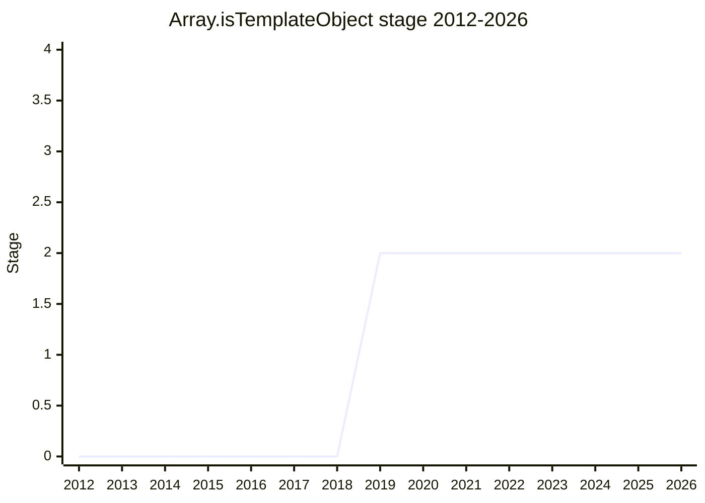

## 概要

`Array.isTemplateObject` は、あるオブジェクトが本物の template literal の call-site object(タグ付きテンプレートの第 1 引数として渡される配列)かどうかを判定する API の提案でした。tagged template を使った安全な DSL(SQL/HTML など)で、入力が確かにソース由来の固定テンプレートであることを保証する用途を想定していました。Trusted Types 系の安全性ユースケースと近い動機を持ちます。

champion は [MSL](../people/MSL.md)(Mike Samuel)・[KOT](../people/KOT.md)(Krzysztof Kotowicz)・[JHD](../people/JHD.md)(Jordan Harband)・[ZTZ](../people/ZTZ.md)(Zbigniew Tenerowicz)。2026-05 に withdrawn(canonical の inactive proposals のうち "Withdrawn" 区分)となりました。

## ステージ遷移

| 会合                                                      | できごと                                                                                                                                      | Stage         |
| --------------------------------------------------------- | --------------------------------------------------------------------------------------------------------------------------------------------- | ------------- |
| [2019-06](../../raw/notes/meetings/2019-06/june-5.md)     | **Stage 2 到達**(`for Stage 1 or 2` を要求し直接 Stage 2)。Stage 3 reviewer に [MM](../people/MM.md) / [JRL](../people/JRL.md)                | → 2           |
| [2019-12](../../raw/notes/meetings/2019-12/december-4.md) | update。Stage 2 据え置き                                                                                                                      | 2             |
| [2021-01](../../raw/notes/meetings/2021-01/jan-25.md)     | 継続討議。same/cross-realm の扱いが論点。Stage 2 据え置き                                                                                     | 2             |
| [2024-04](../../raw/notes/meetings/2024-04/april-10.md)   | next steps。Stage 2 据え置き                                                                                                                  | 2             |
| [2024-07](../../raw/notes/meetings/2024-07/july-31.md)    | Stage 2.7 を要求(未達)                                                                                                                        | 2             |
| [2026-05](../../raw/notes/meetings/2026-05/may-19.md)     | **withdrawn に consensus**([JHD](../people/JHD.md)・[CDA](../people/CDA.md) が "withdrawn" と明示。実装側の需要・関心不足 + realm 関連の懸念) | 2 → withdrawn |

> 横軸=2012-2026、縦軸=Stage。2019-06 に Stage 1 を経ず **直接 Stage 2** へ(議題は `for Stage 1 or 2`、結論は "Stage 2 acceptance")。以後 Stage 2 で長く停滞し、2024-07 に 2.7 を狙うも未達、2026-05 に withdrawn(線は 2026 で終端)。

## 主な論点

### same / cross realm 問題

template object の同一性を realm をまたいで判定する設計が、好ましくない制約(realm 初期化制御への依存)を生むことが繰り返し論点になりました。Web 標準側の realm 初期化制御に依存しうる点が懸念でした。

### withdrawn(2026-05)

実装側の必要性・関心が乏しく、加えて realm 関連の懸念が残ったため、proposal を取り下げることに consensus。議事録の Conclusion 文面は umbrella 用語の "inactive" だが、[JHD](../people/JHD.md) は「This one I'm going to mark as withdrawn」、[CDA](../people/CDA.md) も「this one is withdrawn」と明示しており、canonical の inactive proposals でも "Withdrawn" 区分。したがって status は `withdrawn`。

## 関連提案

- [Dynamic Code Brand Checks](../proposals/dynamic-code-brand-checks.md) — 同じ Mike Samuel / Krzysztof Kotowicz が関与する Trusted Types / 安全性文脈の brand check 系。

## 出典

- [2019-06 june-5](../../raw/notes/meetings/2019-06/june-5.md) — Stage 2 到達("Stage 2 acceptance")
- [2019-12 december-4](../../raw/notes/meetings/2019-12/december-4.md) — update(Stage 2 据え置き)
- [2021-01 jan-25](../../raw/notes/meetings/2021-01/jan-25.md) — 継続討議(Stage 2 据え置き)
- [2024-04 april-10](../../raw/notes/meetings/2024-04/april-10.md) — Stage 2 据え置き
- [2024-07 july-31](../../raw/notes/meetings/2024-07/july-31.md) — Stage 2.7 要求(未達)
- [2026-05 may-19](../../raw/notes/meetings/2026-05/may-19.md) — withdrawn
