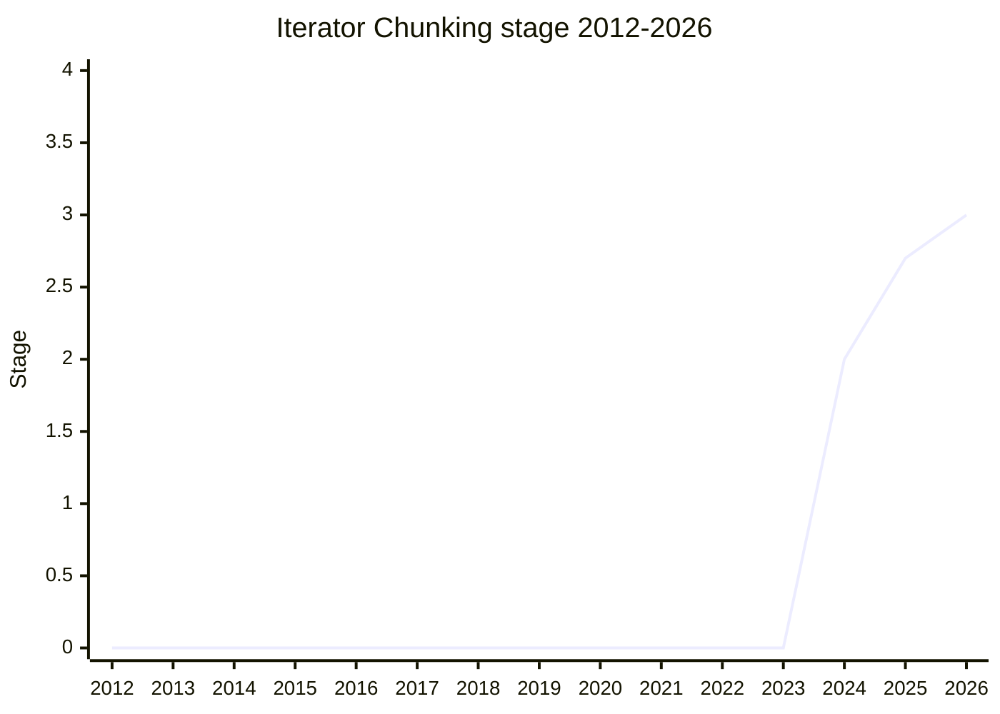

## 概要

Iterator Chunking は、iterator から**複数の値をまとめて消費する** helper を追加する提案です。`Iterator.prototype.chunks(n)` は重なりのない固定長チャンクを、`windows(n)` は 1 要素ずつずれる重なりありのスライディングウィンドウを yield します。手書きでは状態管理が面倒なパターンを遅延 iterator として標準化します。

champion は [MF](../people/MF.md)(Michael Ficarra)。iterator helpers 系の後続群の一つで、`iterator` family に属します。

## ステージ遷移

| 会合                                                      | できごと                                                               | Stage   |
| --------------------------------------------------------- | ---------------------------------------------------------------------- | ------- |
| [2024-02](../../raw/notes/meetings/2024-02/feb-7.md)      | Stage 1 到達                                                           | → 1     |
| [2024-10](../../raw/notes/meetings/2024-10/october-09.md) | Stage 2 到達                                                           | 1 → 2   |
| [2025-05](../../raw/notes/meetings/2025-05/may-29.md)     | Stage 2.7 到達                                                         | 2 → 2.7 |
| [2026-05](../../raw/notes/meetings/2026-05/may-20.md)     | **Stage 3 到達**。test262 テスト完備・delegate review 済みで十分と判断 | 2.7 → 3 |

> 横軸=2012-2026、縦軸=Stage。Stage 1 が 2024-02、Stage 2 が 2024-10、Stage 2.7 が 2025-05、Stage 3 が 2026-05。

## 主な論点

### Stage 3 到達(2026-05)

2026-05 では「テストが揃い、delegate のレビューも済んでおり Stage 3 に十分」との報告で consensus に達しました。設計上の新規論点ではなく、テスト/レビューの完了が前進の条件でした。

## 関連提案

- [Joint Iteration](../proposals/joint-iteration.md) / `iterator-includes` / `iterator-join` — 同じ iterator helpers 後続群。
- family: [Iterator helpers and friends](../families/iterator.md)

## 出典

- [2024-02 feb-7](../../raw/notes/meetings/2024-02/feb-7.md) — Stage 1
- [2024-10 october-09](../../raw/notes/meetings/2024-10/october-09.md) — Stage 2
- [2025-05 may-29](../../raw/notes/meetings/2025-05/may-29.md) — Stage 2.7
- [2026-05 may-20](../../raw/notes/meetings/2026-05/may-20.md) — Stage 3
