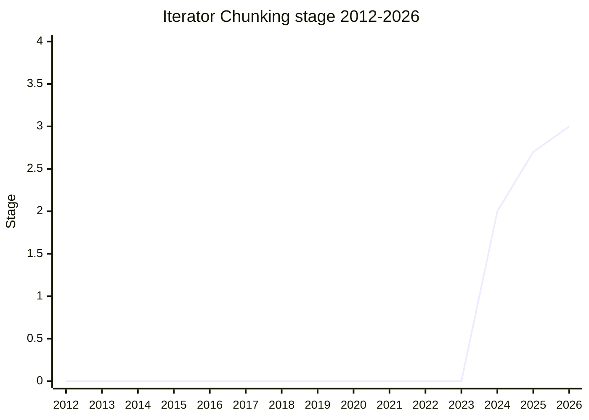

## Overview

Iterator Chunking adds helpers that **consume several values from an iterator at once**. `Iterator.prototype.chunks(n)` yields non-overlapping fixed-length chunks, and `windows(n)` yields an overlapping sliding window that advances one element at a time. It standardizes a pattern whose state is tedious to manage by hand, as a lazy iterator.

The champion is [MF](../people/MF.md) (Michael Ficarra). It is one of the follow-ons to iterator helpers and belongs to the `iterator` family.

## Stage history

| Meeting                                                                             | What happened                                                                                                                            | Stage   |
| ----------------------------------------------------------------------------------- | ---------------------------------------------------------------------------------------------------------------------------------------- | ------- |
| [2024-02](https://github.com/tc39/notes/blob/main/meetings/2024-02/feb-7.md)        | Reached Stage 1                                                                                                                          | → 1     |
| [2024-10](https://github.com/tc39/notes/blob/main/meetings/2024-10/october-09.md)   | Reached Stage 2                                                                                                                          | 1 → 2   |
| [2025-05](https://github.com/tc39/notes/blob/main/meetings/2025-05/may-29.md)       | Requested Stage 2.7 but did not advance; agreed to support both "no windows" and "undersized window" behaviors, initially as two methods | 2       |
| [2025-07](https://github.com/tc39/notes/blob/main/meetings/2025-07/july-29.md)      | Requested Stage 2.7 with a separate `sliding` method; did not advance - committee leaned toward a single method with an option           | 2       |
| [2025-09](https://github.com/tc39/notes/blob/main/meetings/2025-09/september-22.md) | Reached Stage 2.7: `windows` takes an `undersized` parameter (`"only-full"` default / `"allow-partial"`), with kebab-case values         | 2 → 2.7 |
| [2026-05](https://github.com/tc39/notes/blob/main/meetings/2026-05/may-20.md)       | **Reached Stage 3**. Judged sufficient: test262 coverage is complete and delegate review is done                                         | 2.7 → 3 |

```mermaid
xychart-beta
    title "Iterator Chunking stage 2012-2026"
    x-axis [2012, 2013, 2014, 2015, 2016, 2017, 2018, 2019, 2020, 2021, 2022, 2023, 2024, 2025, 2026]
    y-axis "Stage" 0 --> 4
    line [0, 0, 0, 0, 0, 0, 0, 0, 0, 0, 0, 0, 2, 2.7, 3]
```

> Horizontal axis = 2012-2026, vertical axis = Stage. Stage 1 in 2024-02, Stage 2 in 2024-10, Stage 2.7 in 2025-09 (after unsuccessful 2.7 requests in 2025-05 and 2025-07), Stage 3 in 2026-05.

## Main issues

### What `.windows()` owes the leftover values (2025-05 to 2025-09)

The last open design question before 2.7: what should `.windows(n)` do when the underlying iterator does not yield enough items to fill even one window? Four candidates were on the table - (1) yield no windows (the spec as written), (2) throw on `next()` (PR #14), (3) yield an undersized window (PR #15), (4) pad the window to full size (PR #16). [MF](../people/MF.md) surveyed other languages and JS libraries: option 1 is the most common by far, Elm and Kotlin expose both 1 and 3 (Kotlin via a parameter), Java's Stream and Scala take option 3, Python's more-itertools takes option 4. He argued throwing is "kind of an abuse of exceptions" ("Having too few items doesn’t mean it’s broken.") and that padding is only reasonable with a caller-supplied pad value.

The discussion split on the dropping-values question. [NRO](../people/NRO.md) and [PFC](../people/PFC.md) preferred option 1 - [PFC](../people/PFC.md) added that option 3 is awkward in TypeScript, where element types of the output become optional unless you can prove the length at compile time. [DMM](../people/DMM.md) erred toward option 3, citing Java's reasoning that "you will cause more bugs by dropping things on the floor"; [MF](../people/MF.md) answered that `drop` and `filter` already drop values as part of the behavior you opt into. [JHD](../people/JHD.md) floated carrying the leftovers in the final `done: true` result, but [MF](../people/MF.md) rejected it because chaining iterator helpers loses that information - which pushed toward two separate methods instead.

Deeper skepticism resurfaced about whether `windows` belongs in the language at all: [MM](../people/MM.md) said "if these cases for `windows` are obscure enough, I would just prefer to leave it out of the language" (non-blocking), and [RGN](../people/RGN.md) asked for real-world evidence - "`windows` seems more like filling out a grid than actually serving a real need." Use cases came back from [SFC](../people/SFC.md) (~15 call sites, mostly scanning over sorted lists), [KG](../people/KG.md) (peephole optimization over operation streams), and [CM](../people/CM.md) (image processing over serial sources); [LCA](../people/LCA.md) counted ~41,000 public Rust uses of `windows` against ~90,000 for `chunks`.

The 2025-05 conclusion split the difference: options 1 and 3 "are both useful for different use cases that we care about", and [MF](../people/MF.md) would split `.windows()` into two methods (one per behavior) rather than take a parameter. The same session also applied a change made to the other `Iterator.prototype` methods: the receiver now closes on argument-validation failure. `chunks` itself was left as-is, keeping its intentional undersized final chunk. Stage 2.7 was not granted at that meeting.

The two-method split did not last. In 2025-07 [MF](../people/MF.md) came back with a second method named `sliding` (after Scala's equivalent), but late feedback from [KG](../people/KG.md) asked to combine `windows`/`sliding` into one method with a string parameter, and [NRO](../people/NRO.md) asked that, with two methods, the names at least say how they differ. The meeting concluded that the committee was "leaning as a committee towards a single method with an option of some sort", deferring 2.7. In 2025-09 the proposal reached Stage 2.7 with a single `windows` method taking an `undersized` parameter whose value can be omitted, `"only-full"` (the default), or `"allow-partial"` - including a last-minute switch of the values to kebab case.

### Reaching Stage 3 (2026-05)

In 2026-05 the committee reached consensus for Stage 3 on the basis that the proposal has test262 tests, they have been reviewed by a delegate ([KG](../people/KG.md)), and that this is sufficient for Stage 3. This was not a new design issue. Completing tests and review was the condition for advancing.

## Related proposals

- [Joint Iteration](../proposals/joint-iteration.md) / `iterator-includes` / `iterator-join` — the same follow-on group of iterator helpers.
- family: [Iterator helpers and friends](../families/iterator.md)

## Sources

- [2024-02 feb-7](https://github.com/tc39/notes/blob/main/meetings/2024-02/feb-7.md) — Stage 1
- [2024-10 october-09](https://github.com/tc39/notes/blob/main/meetings/2024-10/october-09.md) — Stage 2
- [2025-05 may-29](https://github.com/tc39/notes/blob/main/meetings/2025-05/may-29.md) — `windows` undersized-behavior options; Stage 2.7 not reached
- [2025-07 july-29](https://github.com/tc39/notes/blob/main/meetings/2025-07/july-29.md) — `sliding` method; Stage 2.7 deferred
- [2025-09 september-22](https://github.com/tc39/notes/blob/main/meetings/2025-09/september-22.md) — Stage 2.7 (single `windows` with `undersized` parameter)
- [2026-05 may-20](https://github.com/tc39/notes/blob/main/meetings/2026-05/may-20.md) — Stage 3
