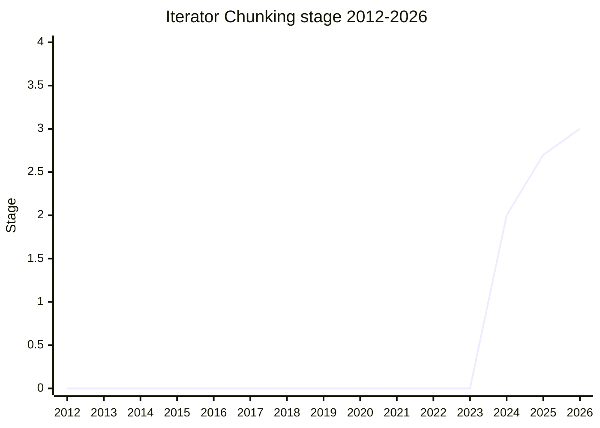

## Overview

Iterator Chunking adds helpers that **consume several values from an iterator at once**. `Iterator.prototype.chunks(n)` yields non-overlapping fixed-length chunks, and `windows(n)` yields an overlapping sliding window that advances one element at a time. It standardizes a pattern whose state is tedious to manage by hand, as a lazy iterator.

The champion is [MF](../people/MF.md) (Michael Ficarra). It is one of the follow-ons to iterator helpers and belongs to the `iterator` family.

## Stage history

| Meeting                                                                           | What happened                                                                                    | Stage   |
| --------------------------------------------------------------------------------- | ------------------------------------------------------------------------------------------------ | ------- |
| [2024-02](https://github.com/tc39/notes/blob/main/meetings/2024-02/feb-7.md)      | Reached Stage 1                                                                                  | → 1     |
| [2024-10](https://github.com/tc39/notes/blob/main/meetings/2024-10/october-09.md) | Reached Stage 2                                                                                  | 1 → 2   |
| [2025-05](https://github.com/tc39/notes/blob/main/meetings/2025-05/may-29.md)     | Reached Stage 2.7                                                                                | 2 → 2.7 |
| [2026-05](https://github.com/tc39/notes/blob/main/meetings/2026-05/may-20.md)     | **Reached Stage 3**. Judged sufficient: test262 coverage is complete and delegate review is done | 2.7 → 3 |

```mermaid
xychart-beta
    title "Iterator Chunking stage 2012-2026"
    x-axis [2012, 2013, 2014, 2015, 2016, 2017, 2018, 2019, 2020, 2021, 2022, 2023, 2024, 2025, 2026]
    y-axis "Stage" 0 --> 4
    line [0, 0, 0, 0, 0, 0, 0, 0, 0, 0, 0, 0, 2, 2.7, 3]
```

> Horizontal axis = 2012-2026, vertical axis = Stage. Stage 1 in 2024-02, Stage 2 in 2024-10, Stage 2.7 in 2025-05, Stage 3 in 2026-05.

## Main issues

### Reaching Stage 3 (2026-05)

In 2026-05 the committee reached consensus on a report that "the tests are in place, delegate review is done, and that is enough for Stage 3." This was not a new design issue. Completing tests and review was the condition for advancing.

## Related proposals

- [Joint Iteration](../proposals/joint-iteration.md) / `iterator-includes` / `iterator-join` — the same follow-on group of iterator helpers.
- family: [Iterator helpers and friends](../families/iterator.md)

## Sources

- [2024-02 feb-7](https://github.com/tc39/notes/blob/main/meetings/2024-02/feb-7.md) — Stage 1
- [2024-10 october-09](https://github.com/tc39/notes/blob/main/meetings/2024-10/october-09.md) — Stage 2
- [2025-05 may-29](https://github.com/tc39/notes/blob/main/meetings/2025-05/may-29.md) — Stage 2.7
- [2026-05 may-20](https://github.com/tc39/notes/blob/main/meetings/2026-05/may-20.md) — Stage 3
