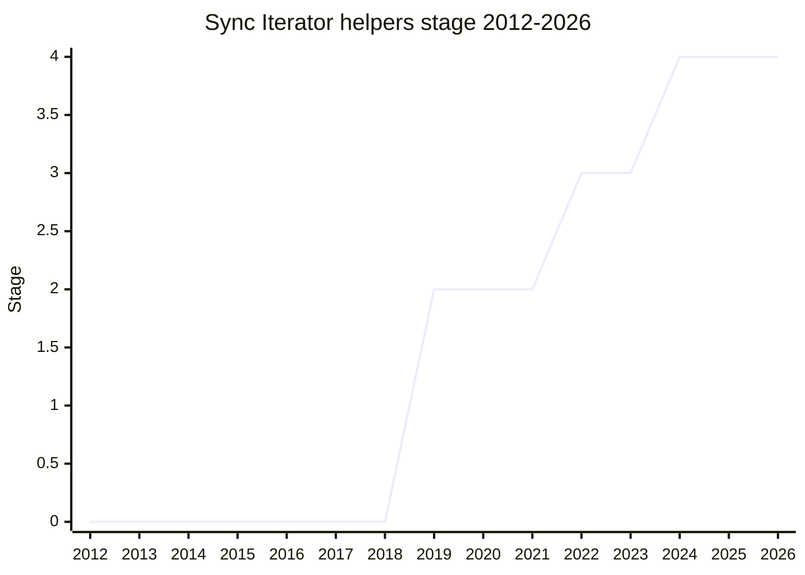

## Overview

A standard library for iterators: `map`, `filter`, `flatMap`, `take`, and `drop` as lazy transforming methods, and `reduce`, `forEach`, `some`, `every`, `find`, and `toArray` as consuming methods on `Iterator.prototype`, plus the `Iterator` global constructor. The original champion was [GCL](../people/GCL.md); [MF](../people/MF.md) carried it from 2022 onward with [JKN](../people/JKN.md) and [KG](../people/KG.md).

The helpers are lazy (each method returns a new iterator, nothing runs until consumption) and deliberately do **not** implicitly iterate strings or other non-iterables - `Iterator.from` needed special handling for strings, and the "malformed iterator" and fallback-check debates below are all about how strictly the helpers treat things that are not quite iterators.

## Stage history

| Meeting                                                                             | Event                                                                                                                                                             | Stage |
| ----------------------------------------------------------------------------------- | ----------------------------------------------------------------------------------------------------------------------------------------------------------------- | ----- |
| [2019-01](https://github.com/tc39/notes/blob/main/meetings/2019-01/jan-31.md)       | Reached Stage 1                                                                                                                                                   | → 1   |
| [2019-07](https://github.com/tc39/notes/blob/main/meetings/2019-07/july-24.md)      | Reached Stage 2 (Stage 3 reviewers [MF](../people/MF.md) and [DT](../people/DT.md))                                                                               | 1 → 2 |
| [2020-06](https://github.com/tc39/notes/blob/main/meetings/2020-06/june-1.md)       | Feedback session on whether helper results should carry `return`/`throw` like generators: "no approach has consensus yet" (issue #97)                             | 2     |
| [2020-07](https://github.com/tc39/notes/blob/main/meetings/2020-07/july-21.md)      | Status update                                                                                                                                                     | 2     |
| [2021-08](https://github.com/tc39/notes/blob/main/meetings/2021-08/aug-31.md)       | Status update                                                                                                                                                     | 2     |
| [2022-07](https://github.com/tc39/notes/blob/main/meetings/2022-07/jul-21.md)       | Status update ([JHD](../people/JHD.md) and [RBN](../people/RBN.md) joined the effort)                                                                             | 2     |
| [2022-09](https://github.com/tc39/notes/blob/main/meetings/2022-09/sep-14.md)       | Status update                                                                                                                                                     | 2     |
| [2022-11](https://github.com/tc39/notes/blob/main/meetings/2022-11/dec-01.md)       | **Reached Stage 3**, conditional on changing `Iterator.from`'s handling of strings                                                                                | 2 → 3 |
| [2023-01](https://github.com/tc39/notes/blob/main/meetings/2023-01/jan-31.md)       | **Async iterator helpers split out** into their own proposal and demoted to Stage 2; sync helpers stay at Stage 3                                                 | 3     |
| [2023-03](https://github.com/tc39/notes/blob/main/meetings/2023-03/mar-21.md)       | Status update                                                                                                                                                     | 3     |
| [2023-05](https://github.com/tc39/notes/blob/main/meetings/2023-05/may-16.md)       | Two design questions settled: the `Symbol.iterator` fallback (callable check vs null/undefined check) and whether malformed iterators fail early or when iterated | 3     |
| [2023-07](https://github.com/tc39/notes/blob/main/meetings/2023-07/july-11.md)      | Small optimization: avoid creating string wrapper objects                                                                                                         | 3     |
| [2023-09](https://github.com/tc39/notes/blob/main/meetings/2023-09/september-26.md) | **Web incompatibility hit Chrome stable** (regenerator runtime × airgap.js, see below). Chrome unshipped                                                          | 3     |
| [2023-11](https://github.com/tc39/notes/blob/main/meetings/2023-11/november-28.md)  | Web-compat continuation: settle on the accessor approach for `constructor` ([KG](../people/KG.md): "leaving out ‘constructor’ is pretty risky")                   | 3     |
| [2024-06](https://github.com/tc39/notes/blob/main/meetings/2024-06/june-11.md)      | Status check ("Sync Iterator helpers")                                                                                                                            | 3     |
| [2024-10](https://github.com/tc39/notes/blob/main/meetings/2024-10/october-08.md)   | **Reached Stage 4**. V8 (unshipped and reshipped), SpiderMonkey, JSC, LibJS; test262 PR merged                                                                    | 3 → 4 |
| [2024-12](https://github.com/tc39/notes/blob/main/meetings/2024-12/december-02.md)  | Normative fixes: close the receiver when argument validation fails; reusing IteratorResult objects in take/drop/filter/concat                                     | 4     |

> Stage 1 in 2019-01, Stage 2 in 2019-07, Stage 3 in 2022-11, Stage 4 in 2024-10. The 2020-06 feedback impasse and the async split (2023-01) are flat stretches, not demotions - sync helpers never lost their stage.

## Main issues

### The web-compat saga: regenerator × airgap.js and the override mistake

Chrome shipped the sync helpers to stable in 2023 and immediately found breakage: old copies of the **regenerator runtime** (the Babel-era async/generator polyfill, still embedded in countless sites) assign to their polyfill generator function's `constructor` property, while **airgap.js** (Transcend's closed-source privacy product, which freezes the `Iterator` prototype whenever the global exists) turned that assignment into a silent failure via the override mistake. Sites broke; Chrome unshipped.

> ([SYG](../people/SYG.md), 2023-09) a lot of code on a lot of websites on the web ship an old version of the regenerator run time [...] it tries to assign to the constructor property of its polyfill generator function with dot access and it just does dot constructor equals blah. [...] And the override mistake now means that after you freeze the built-in prototype, the iterator prototype is on the prototype chain of the generator prototype, so when you do a dot constructor, the constructor is read only on the prototype, which means this fails and it breaks the existing code.

The committee first tried a "social fix" (getting Transcend to migrate its customers, capped at about two months - [DE](../people/DE.md): "I want to not delay due to iterator helper due to an issue we’ve been stalled on for ten years."). The fallback was making `constructor` and `Symbol.toStringTag` _accessors_ whose setters emulate the pre-freeze behavior (PR #287) - the "funny accessors" [MF](../people/MF.md) apologized for at Stage 4, and the web-compat hacks [JHD](../people/JHD.md) "hates" (as relayed by [RPR](../people/RPR.md)) while still supporting Stage 4. [MM](../people/MM.md) argued the real fix is either language-wide or nothing - and this thread is what later grew into the [Stabilize](stabilize.md) integrity traits (`overridable`).

### Should helper results behave like generators? (2020 impasse)

The 2020-06 feedback session deadlocked on whether the iterators produced by the helpers should carry `return`/`throw` methods that forward to the underlying iterator (generator-like cleanup semantics) or be simpler objects. [JHD](../people/JHD.md) wanted consistency with the existing iterator ecosystem, [JTO](../people/JTO.md) (presenter at the time) argued the `Iterator` interface need not mimic generators, and [KG](../people/KG.md) resisted making future collection types observably generator-like. No approach reached consensus; the question moved to issue #97 and was worked out over the following years in favor of forwarding semantics.

### The async split

In 2023-01, rather than keep blocking the sync helpers on async design questions, the committee split the async iterator helpers into their own proposal and demoted them back to Stage 2, letting the sync helpers proceed to the endgame. (Async Iterator Helpers remains a separate Stage 2 proposal.)

### Strictness at the boundaries

Three smaller design fights, all settled in 2022-2023: `Iterator.from`'s string handling (the Stage 3 condition - strings are iterable but should not be implicitly iterated), whether the `Symbol.iterator` fallback checks callability or just null/undefined (2023-05), and whether malformed iterators fail eagerly or only when iterated (2023-05). The through-line is the family's standing policy: be strict about what counts as an iterator, and never implicitly iterate strings.

## Related proposals

- [Joint Iteration](joint-iteration.md) - `Iterator.zip`/`zipKeyed`, built on the helpers' foundation.
- [iterator-sequencing](iterator-sequencing.md) - `Iterator.concat`.
- [Iterator chunking](iterator-chunking.md) - `Iterator.prototype.chunks`/`windows`.
- `async-iterator-helpers` - the 2023 split-off (no page yet).
- [Stabilize](stabilize.md) - the integrity-traits proposal that grew out of this saga's override-mistake thread.

## Sources

- [2019-01 jan-31](https://github.com/tc39/notes/blob/main/meetings/2019-01/jan-31.md) - Stage 1
- [2019-07 july-24](https://github.com/tc39/notes/blob/main/meetings/2019-07/july-24.md) - Stage 2
- [2020-06 june-1](https://github.com/tc39/notes/blob/main/meetings/2020-06/june-1.md) - feedback impasse (issue #97)
- [2022-11 dec-01](https://github.com/tc39/notes/blob/main/meetings/2022-11/dec-01.md) - Stage 3 (conditional on Iterator.from strings)
- [2023-01 jan-31](https://github.com/tc39/notes/blob/main/meetings/2023-01/jan-31.md) - async helpers split out
- [2023-05 may-16](https://github.com/tc39/notes/blob/main/meetings/2023-05/may-16.md) - fallback check and malformed iterators
- [2023-09 september-26](https://github.com/tc39/notes/blob/main/meetings/2023-09/september-26.md) - web incompatibility (regenerator × airgap.js)
- [2023-11 november-28](https://github.com/tc39/notes/blob/main/meetings/2023-11/november-28.md) - accessor resolution
- [2024-10 october-08](https://github.com/tc39/notes/blob/main/meetings/2024-10/october-08.md) - Stage 4 ([MF](../people/MF.md))
- [2024-12 december-02](https://github.com/tc39/notes/blob/main/meetings/2024-12/december-02.md) - normative fixes
