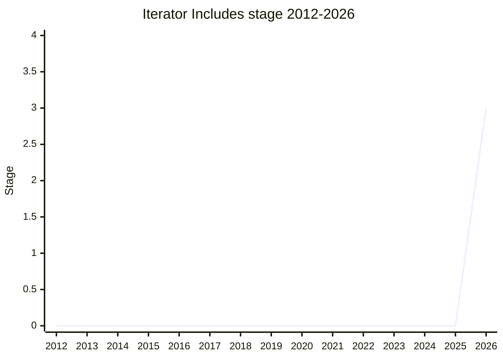

## 概要

Iterator Includes は `Iterator.prototype.includes(value)` を追加する提案で、`Array.prototype.includes` の iterator 版です。名前・`SameValueZero` 比較・skipped elements パラメータなど、可能な限り `Array` 側に揃える方針です。iterator を一度作ってしまうと `includes` 相当を自前で書くのは手間なため、helper として標準化します。

champion は [MF](../people/MF.md)(Michael Ficarra)。`iterator` family のメンバー。

## ステージ遷移

| 会合                                                    | できごと                                                               | Stage   |
| ------------------------------------------------------- | ---------------------------------------------------------------------- | ------- |
| [2026-03](../../raw/notes/meetings/2026-03/march-10.md) | **Stage 2.7 到達**(Stage 1/2/2.7 を一括要求)。`Array` 互換の設計で合意 | → 2.7   |
| [2026-03](../../raw/notes/meetings/2026-03/march-12.md) | 引数不正時に receiver を close しない spec バグの修正 PR を承認        | 2.7     |
| [2026-05](../../raw/notes/meetings/2026-05/may-20.md)   | **Stage 3 到達**。test262 テスト完備・delegate review 済み             | 2.7 → 3 |

> 横軸=2012-2026、縦軸=Stage。2026-03 に初出かつ一括で Stage 2.7、2026-05 に Stage 3。短期間での前進のため 2026 年のみ値を持つ。

## 主な論点

### Array との整合(2026-03)

名前・比較関数(`SameValueZero`)・skipped elements パラメータを `Array.prototype.includes` に合わせる方針で合意。新しい normative conventions(引数の変換規約)にも追従します。

### Stage 3 到達(2026-05)

テスト完備・レビュー済みで Stage 3 に consensus。設計上の未決論点はありません。

## 関連提案

- [Iterator Chunking](../proposals/iterator-chunking.md) / `iterator-join` / [Joint Iteration](../proposals/joint-iteration.md) — 同じ iterator helpers 後続群。
- family: [Iterator helpers and friends](../families/iterator.md)

## 出典

- [2026-03 march-10](../../raw/notes/meetings/2026-03/march-10.md) — Stage 2.7
- [2026-03 march-12](../../raw/notes/meetings/2026-03/march-12.md) — spec バグ修正 PR
- [2026-05 may-20](../../raw/notes/meetings/2026-05/may-20.md) — Stage 3
