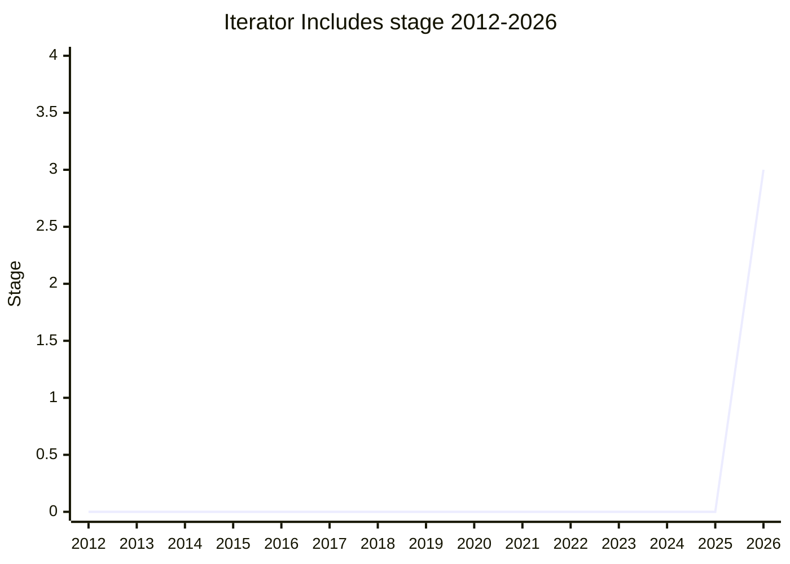

## Overview

Iterator Includes adds `Iterator.prototype.includes(value)`, the iterator version of `Array.prototype.includes`. The plan is to line up with `Array` as far as possible: the name, `SameValueZero` comparison, and the skipped-elements parameter. Once you already have an iterator, writing the equivalent of `includes` by hand is tedious, so it is standardized as a helper.

The champion is [MF](../people/MF.md) (Michael Ficarra). A member of the `iterator` family.

## Stage history

| Meeting                                                 | What happened                                                                                          | Stage   |
| ------------------------------------------------------- | ------------------------------------------------------------------------------------------------------ | ------- |
| [2026-03](../../raw/notes/meetings/2026-03/march-10.md) | **Reached Stage 2.7** (Stage 1, 2, and 2.7 asked for together). Agreed on an `Array`-compatible design | → 2.7   |
| [2026-03](../../raw/notes/meetings/2026-03/march-12.md) | Approved a PR fixing a spec bug that did not close the receiver on invalid arguments                   | 2.7     |
| [2026-05](../../raw/notes/meetings/2026-05/may-20.md)   | **Reached Stage 3**. test262 coverage is complete and delegate review is done                          | 2.7 → 3 |

```mermaid
xychart-beta
    title "Iterator Includes stage 2012-2026"
    x-axis [2012, 2013, 2014, 2015, 2016, 2017, 2018, 2019, 2020, 2021, 2022, 2023, 2024, 2025, 2026]
    y-axis "Stage" 0 --> 4
    line [0, 0, 0, 0, 0, 0, 0, 0, 0, 0, 0, 0, 0, 0, 3]
```

> Horizontal axis = 2012-2026, vertical axis = Stage. First presented in 2026-03 and taken straight to Stage 2.7; Stage 3 in 2026-05. Only 2026 has a non-zero value, because the advance was short.

## Main issues

### Alignment with Array (2026-03)

Agreed to match `Array.prototype.includes` on the name, the comparison (`SameValueZero`), and the skipped-elements parameter. It also follows the newer normative conventions (the argument-conversion rules).

### Reaching Stage 3 (2026-05)

Consensus for Stage 3 with tests complete and review done. No design question is left open.

## Related proposals

- [Iterator Chunking](../proposals/iterator-chunking.md) / `iterator-join` / [Joint Iteration](../proposals/joint-iteration.md) — the same follow-on group of iterator helpers.
- family: [Iterator helpers and friends](../families/iterator.md)

## Sources

- [2026-03 march-10](../../raw/notes/meetings/2026-03/march-10.md) — Stage 2.7
- [2026-03 march-12](../../raw/notes/meetings/2026-03/march-12.md) — spec-bug fix PR
- [2026-05 may-20](../../raw/notes/meetings/2026-05/may-20.md) — Stage 3
