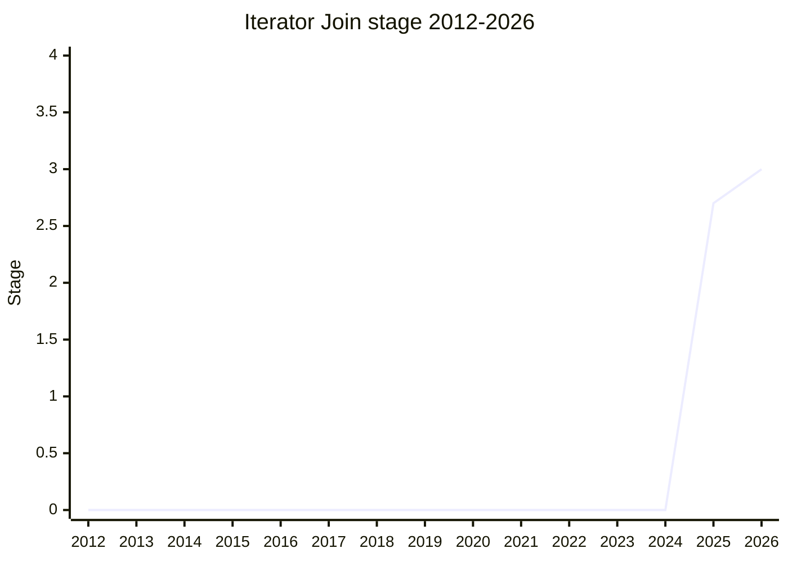

## 概要

Iterator Join は `Iterator.prototype.join(separator)` を追加する提案で、`Array.prototype.join` の iterator 版です。iterator が yield する値を区切り文字で連結して 1 つの文字列を返します。

champion は [KG](../people/KG.md)(Kevin Gibbons)。`iterator` family のメンバー。

## ステージ遷移

| 会合                                                       | できごと                                                          | Stage   |
| ---------------------------------------------------------- | ----------------------------------------------------------------- | ------- |
| [2025-11](../../raw/notes/meetings/2025-11/november-19.md) | 初出。`Iterator Join for stage 1, 2, or 2.7` として一括要求し前進 | → 2.7   |
| [2026-05](../../raw/notes/meetings/2026-05/may-20.md)      | **Stage 3 到達**。test262 テスト完備・delegate review 済み        | 2.7 → 3 |

> 横軸=2012-2026、縦軸=Stage。2025-11 に初出かつ Stage 2.7 まで一括前進、2026-05 に Stage 3。

## 主な論点

### Stage 3 到達(2026-05)

テスト完備・レビュー済みで Stage 3 に consensus。`Array.prototype.join` の素直な移植で、設計上の新規論点はありません。

## 関連提案

- [Iterator Chunking](../proposals/iterator-chunking.md) / [Iterator Includes](../proposals/iterator-includes.md) / [Joint Iteration](../proposals/joint-iteration.md) — 同じ iterator helpers 後続群。
- family: [Iterator helpers and friends](../families/iterator.md)

## 出典

- [2025-11 november-19](../../raw/notes/meetings/2025-11/november-19.md) — 初出・Stage 2.7
- [2026-05 may-20](../../raw/notes/meetings/2026-05/may-20.md) — Stage 3
