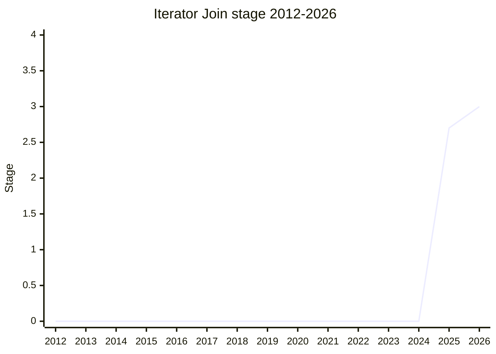

## Overview

Iterator Join adds `Iterator.prototype.join(separator)`, the iterator version of `Array.prototype.join`. It concatenates the values an iterator yields, separated by a delimiter, and returns one string.

The champion is [KG](../people/KG.md) (Kevin Gibbons). A member of the `iterator` family.

## Stage history

| Meeting                                                    | What happened                                                                 | Stage   |
| ---------------------------------------------------------- | ----------------------------------------------------------------------------- | ------- |
| [2025-11](../../raw/notes/meetings/2025-11/november-19.md) | First presented. Asked for Stage 1, 2, or 2.7 together, and advanced          | → 2.7   |
| [2026-05](../../raw/notes/meetings/2026-05/may-20.md)      | **Reached Stage 3**. test262 coverage is complete and delegate review is done | 2.7 → 3 |

```mermaid
xychart-beta
    title "Iterator Join stage 2012-2026"
    x-axis [2012, 2013, 2014, 2015, 2016, 2017, 2018, 2019, 2020, 2021, 2022, 2023, 2024, 2025, 2026]
    y-axis "Stage" 0 --> 4
    line [0, 0, 0, 0, 0, 0, 0, 0, 0, 0, 0, 0, 0, 2.7, 3]
```

> Horizontal axis = 2012-2026, vertical axis = Stage. First presented in 2025-11 and advanced straight to Stage 2.7; Stage 3 in 2026-05.

## Main issues

### Reaching Stage 3 (2026-05)

Consensus for Stage 3 with tests complete and review done. It is a straightforward port of `Array.prototype.join`, with no new design issue.

## Related proposals

- [Iterator Chunking](../proposals/iterator-chunking.md) / [Iterator Includes](../proposals/iterator-includes.md) / [Joint Iteration](../proposals/joint-iteration.md) — the same follow-on group of iterator helpers.
- family: [Iterator helpers and friends](../families/iterator.md)

## Sources

- [2025-11 november-19](../../raw/notes/meetings/2025-11/november-19.md) — first presented, Stage 2.7
- [2026-05 may-20](../../raw/notes/meetings/2026-05/may-20.md) — Stage 3
