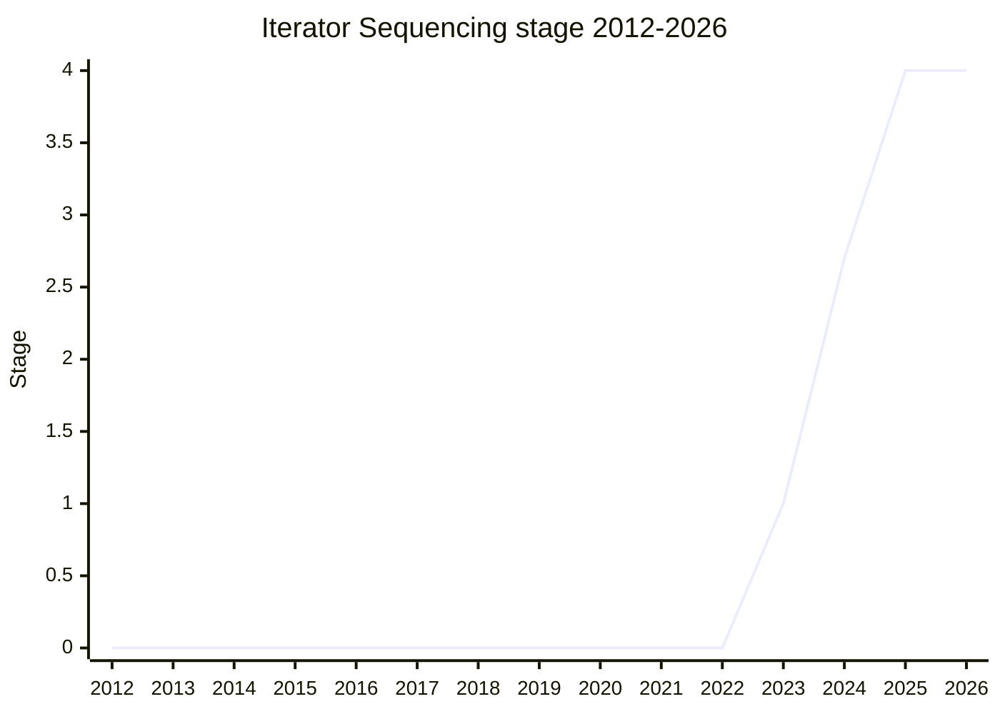

## Overview

Adds `Iterator.concat(...iterables)`: a function that produces a new iterator yielding all values of the passed iterables, in order. It is the concatenation counterpart for the iterator world (strings have `concat`, arrays have spread and `flat`), and pairs with the namespace methods of iterator helpers.

Championed by [MF](../people/MF.md) (Michael Ficarra). A member of the `iterator` family.

## Stage history

| Meeting                                                                             | What happened                                                                                                                               | Stage      |
| ----------------------------------------------------------------------------------- | ------------------------------------------------------------------------------------------------------------------------------------------- | ---------- |
| [2023-09](https://github.com/tc39/notes/blob/main/meetings/2023-09/september-27.md) | First presented. Reached Stage 1                                                                                                            | → 1        |
| [2024-02](https://github.com/tc39/notes/blob/main/meetings/2024-02/feb-6.md)        | Reached Stage 2                                                                                                                             | 1 → 2      |
| [2024-10](https://github.com/tc39/notes/blob/main/meetings/2024-10/october-08.md)   | Reached Stage 2.7                                                                                                                           | 2 → 2.7    |
| [2024-12](https://github.com/tc39/notes/blob/main/meetings/2024-12/december-02.md)  | Stage 3 requested; not granted - [SYG](../people/SYG.md) wanted the Test262 PR merged first. [MF](../people/MF.md) to ask again once merged | 2.7 (kept) |
| [2025-05](https://github.com/tc39/notes/blob/main/meetings/2025-05/may-28.md)       | Reached Stage 3                                                                                                                             | 2.7 → 3    |
| [2025-07](https://github.com/tc39/notes/blob/main/meetings/2025-07/july-28.md)      | Stage 3 update                                                                                                                              | 3          |
| [2025-11](https://github.com/tc39/notes/blob/main/meetings/2025-11/november-18.md)  | **Reached Stage 4** (two implementations for about a year: JSC, and SpiderMonkey shipping in Firefox 147)                                   | 3 → 4      |

> Stage 1 in 2023-09, Stage 2 in 2024-02, Stage 2.7 in 2024-10, Stage 3 in 2025-05, Stage 4 in 2025-11.

## Main issues

### A quiet, fast track (2023-2025)

The proposal advanced one stage per meeting with no recorded controversy, with one hiccup: at the 2024-12 Stage 3 request [SYG](../people/SYG.md) felt strongly that the Test262 tests - sitting in an unmerged PR - had to land first ("I want them to be in the repo to be runnable"), and [MF](../people/MF.md) withdrew rather than put test262 maintainers on the spot. Stage 3 came in 2025-05. JSC implemented it in 2024-10 behind a flag, SpiderMonkey followed in 2024-11; the Stage 4 request in 2025-11 noted two implementations for approximately one year and no signals from V8, which is not required for Stage 4.

## Related proposals

- [Joint Iteration](../proposals/joint-iteration.md) (`Iterator.zip`) / [Iterator Chunking](../proposals/iterator-chunking.md) / [Iterator Includes](../proposals/iterator-includes.md) / [Iterator Join](../proposals/iterator-join.md) - the same wave of iterator-helper follow-ons.
- family: [Iterator helpers and friends](../families/iterator.md)

## Sources

- [2023-09 september-27](https://github.com/tc39/notes/blob/main/meetings/2023-09/september-27.md) - Stage 1
- [2024-02 feb-6](https://github.com/tc39/notes/blob/main/meetings/2024-02/feb-6.md) - Stage 2
- [2024-10 october-08](https://github.com/tc39/notes/blob/main/meetings/2024-10/october-08.md) - Stage 2.7
- [2024-12 december-02](https://github.com/tc39/notes/blob/main/meetings/2024-12/december-02.md) - Stage 3 request deferred (Test262 tests unmerged)
- [2025-11 november-18](https://github.com/tc39/notes/blob/main/meetings/2025-11/november-18.md) - Stage 4
