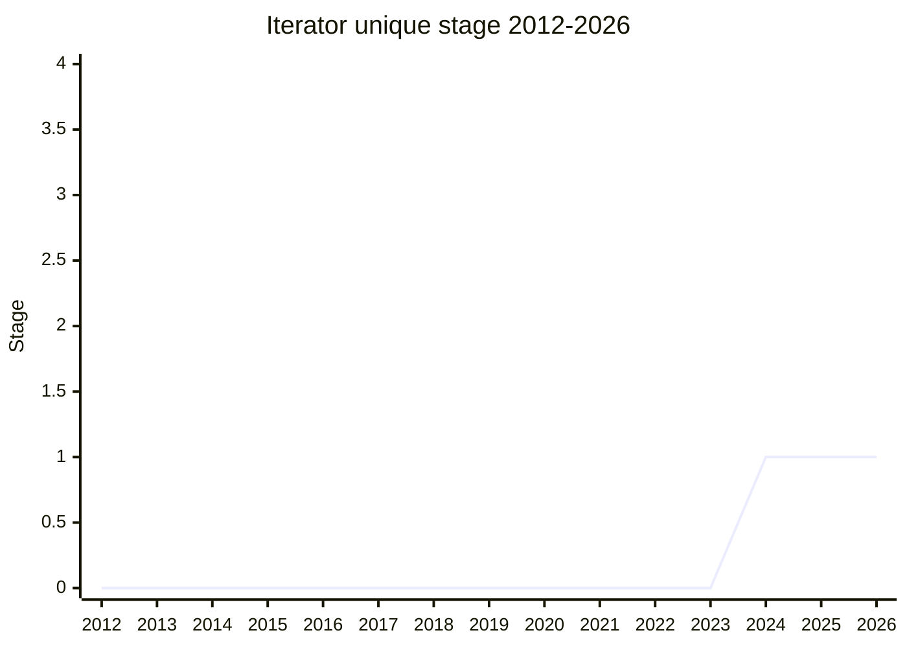

## Overview

Adds a uniquing method to iterators: deduplicate the values of an iterator, yielding "the first value in some identified equivalence class" ([MF](../people/MF.md)). The primary shape takes an optional mapper function that maps each value to an exemplar of its equivalence class - the `distinctBy` example maps US state names to their first letter and yields the first state for each letter. Without a mapper, values are deduplicated by their own value (backed by a `Set`).

It is a follow-on to [Iterator helpers](../proposals/iterator-helpers.md), addressing the same everyday-sequence-operation gap that [Joint Iteration](../proposals/joint-iteration.md) and [Iterator Sequencing](../proposals/iterator-sequencing.md) cover for zipping and concatenation. [MF](../people/MF.md) surveyed other languages and JS libraries: the mapping variant is nearly universal, `unique` and `distinct` are the common names (Haskell's `nub` being the outlier), and only a couple of languages offer a comparator variant.

Championed by [MF](../people/MF.md) (Michael Ficarra). A member of the `iterator` family.

## Stage history

| Meeting                                                                      | Event                                                                                                                                                                                                                                                                                    | Stage |
| ---------------------------------------------------------------------------- | ---------------------------------------------------------------------------------------------------------------------------------------------------------------------------------------------------------------------------------------------------------------------------------------- | ----- |
| [2024-02](https://github.com/tc39/notes/blob/main/meetings/2024-02/feb-6.md) | First presented ("Iterator unique for stage 1"). Concerns raised on hidden unbounded memory, comparator-vs-mapper, and why-not-a-library; Stage 1 agreed with plus-ones from [LCA](../people/LCA.md), [JHD](../people/JHD.md), [RBN](../people/RBN.md), [JHX](../people/JHX.md), and JSC | → 1   |

> First presented 2024-02 and at Stage 1 since.

## Main issues

### Hidden unbounded memory (the "pit of success")

The most persistent concern. Deduplicating requires buffering every distinct value seen, so memory use is unbounded - and invisible at the call site. [GCL](../people/GCL.md) noted Rust deliberately lacks this operation, making you build a vector explicitly instead. [KG](../people/KG.md) had raised the same point privately; [MF](../people/MF.md) conceded "it's tricky to notice that you're running into that unbounded memory usage just by calling unique here". [DLM](../people/DLM.md) added two more surprises: an infinite iterator producing only one distinct value becomes an unexpected infinite loop, and the mapper's side effects fire even for values that end up discarded.

> [SYG](../people/SYG.md): "It's not the unbounded part that worries me. It's the hidden part that really worries me... V8 would definitely like to have some story about the pit of success here from a performance and memory use point of view."

[LCA](../people/LCA.md) floated an alternative that dissolves the problem: have the user pass in the set-like object that does the deduplication, making the unboundedly large object explicit - which would also solve the group and comparator use cases. Not adopted (yet), but recorded as an idea to consider.

### Comparator vs mapper

[MF](../people/MF.md) strongly prefers the mapper: a two-argument comparator "requires a much less efficient implementation. It also permits comparators that are nonsensical, whereas the mapper doesn't, just by construction." [RBN](../people/RBN.md) countered that real comparators (e.g. .NET) pair an equality test with a hash function for hashtable lookup - much more efficient - and that `Array.prototype.sort` already permits nonsensical comparators anyway ([MF](../people/MF.md): sort is _allowed_ to produce any order for a bad comparator, so the situations differ). [KG](../people/KG.md) argued consistency with `Map.groupBy` (a mapper-based API) points the same way, "especially if we get composite keys". [SYG](../people/SYG.md) pinned down the efficiency claim: a mapper enables "a more set oriented implementation instead of a quadratic one".

### Why not a library?

[MLS](../people/MLS.md) argued the operation "should be best wrapped... there are existing libraries that do this", worrying about both memory and computational complexity landing in the engine's higher tiers. [SYG](../people/SYG.md) pressed [MF](../people/MF.md) to answer the why-not-a-library question conclusively within Stage 1; [MF](../people/MF.md) accepted that "we can't provide anything that's more efficient or more ergonomic than what we would do anyway with a library" is a possible outcome - the polyfill is only about a dozen lines. [SFC](../people/SFC.md) pointed to `Map.groupBy` as the natural precedent and asked that the motivation be established independently of it.

### Arrays too

[JHD](../people/JHD.md) (echoing [DLM](../people/DLM.md)'s question): "any problem we want to solve on either arrays or iterators, we kind of want to solve on both" - JSC's plus-one explicitly agreed with adding to arrays as well. [LCA](../people/LCA.md) countered that `new Set(...arr)` already deduplicates arrays; [JHD](../people/JHD.md): that doesn't allow the mapping functionality, and it still goes through an iterator.

## Related proposals

- [Iterator helpers](../proposals/iterator-helpers.md) - the base proposal this follows on from.
- [Composite Keys](../proposals/composite-keys.md) - the open "composite keys" question (mapping several aspects of a value to one exemplar) leans on the same post-Records-&-Tuples direction [ACE](../people/ACE.md) outlined; [MF](../people/MF.md) confirmed the mapper design is compatible with it.
- [Iterator Sequencing](../proposals/iterator-sequencing.md) / [Joint Iteration](../proposals/joint-iteration.md) / [Iterator Chunking](../proposals/iterator-chunking.md) - the same wave of iterator-helper follow-ons.
- family: [Iterator helpers and friends](../families/iterator.md)

## Sources

- [2024-02 feb-6](https://github.com/tc39/notes/blob/main/meetings/2024-02/feb-6.md) - Stage 1
