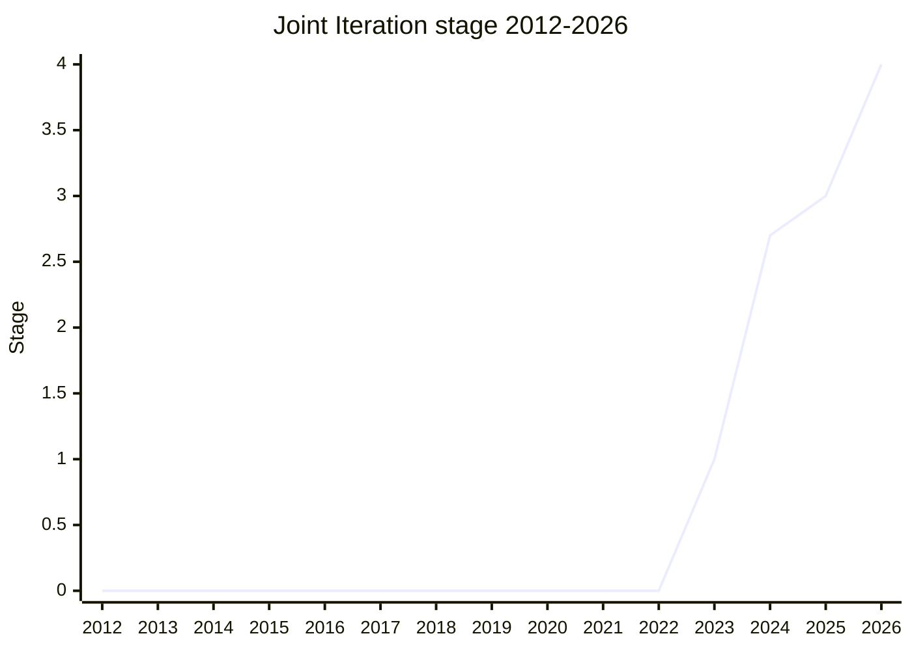

## 概要

Joint Iteration は、2 つ以上の iterator / iterable を**位置的に対応する値ごとにまとめて処理する**ための提案です。多くの言語・フレームワークで `zip()` と呼ばれる操作にあたり、最終的な API は静的メソッド 2 つから成ります。

- `Iterator.zip` — iterable of iterables を受け取り、入力数に揃った**タプル(配列)**を yield する(positional shape)。
- `Iterator.zipKeyed` — 値が iterable であるオブジェクトを受け取り、同じ名前を持つ**オブジェクト(record)**を yield する(named shape)。`Promise.all` の named 版に類似。

第 2 引数は options bag で、動作モードを `"shortest"`(既定。最初に尽きた時点で停止)/ `"longest"`(最後まで継続し `padding` 値で補完)/ `"strict"`(全 iterator が同時に終わらなければ TypeError)から選びます。入力に渡された文字列は(iterable だが)iterate しない設計で、これは Iterator Helpers が文字列の暗黙 iterate から離れた方針と整合します。champion は [MF](../people/MF.md) で、全ステージを一貫して担当しました。

## ステージ遷移

| 会合                                                        | できごと                                                                                                                   | Stage   |
| ----------------------------------------------------------- | -------------------------------------------------------------------------------------------------------------------------- | ------- |
| [2023-09](../../raw/notes/meetings/2023-09/september-27.md) | Stage 1 到達。`Joint iteration for Stage 1`([MF](../people/MF.md))                                                         | 0 → 1   |
| [2023-11](../../raw/notes/meetings/2023-11/november-28.md)  | Stage 1 update。`Iterator.zip` API のプレビュー提示。遷移なし                                                              | 1       |
| [2024-02](../../raw/notes/meetings/2024-02/feb-6.md)        | Stage 2 到達                                                                                                               | 1 → 2   |
| [2024-04](../../raw/notes/meetings/2024-04/april-11.md)     | array zip を含めるかの継続議論。blocker でなく GitHub で継続。遷移なし                                                     | 2       |
| [2024-06](../../raw/notes/meetings/2024-06/june-12.md)      | **Stage 2.7 到達**。3 つの open question をその場で解決(`zipToArrays`→`zip`、文字列非 iterate、2 Boolean→単一 mode 文字列) | 2 → 2.7 |
| [2024-07](../../raw/notes/meetings/2024-07/july-30.md)      | naming discussion。`zipToObject`→`zipKeyed` に rename。遷移なし                                                            | 2.7     |
| [2025-11](../../raw/notes/meetings/2025-11/november-18.md)  | **Stage 3 到達**。test262 テストと spec 準拠 polyfill が pass                                                              | 2.7 → 3 |
| [2026-05](../../raw/notes/meetings/2026-05/may-19.md)       | **Stage 4 到達**。SpiderMonkey 出荷済み・V8 実装完了                                                                       | 3 → 4   |

> 横軸=2012-2026、縦軸=Stage。初出は 2023-09(Stage 1)。2024-02 に Stage 2、2024-06 に Stage 2.7(同年内に複数遷移したため年末値は 2.7)。2025-11 に Stage 3、2026-05 に Stage 4。

## 主な論点

### メソッドの分割と命名(`zip` / `zipKeyed`)

当初 [MF](../people/MF.md) は型で分岐する単一メソッドを提案しましたが、委員会は分割を支持し `zipToArrays` / `zipToObjects` になりました。2024-06 でその場決定により `zipToArrays`→`zip` に、2024-07 で `zipToObject`→`zipKeyed` に rename。[SYG](../people/SYG.md)(V8)の事前声明が命名とモード設計の見直しを促しました。

> ([SYG](../people/SYG.md) の prepared statement, [RPR](../people/RPR.md) 代読, 2024-06) V8 は Stage 2.7 に対し次の懸念を持つが、他に委員会の合意があれば**ブロックはしない**: 現行のメソッド名を好まない; 相互排他なオプションに文字列定数 1 つではなく 2 つの Boolean を使うのを好まない。

### モード選択(2 Boolean → 単一 mode 文字列)

[SYG](../people/SYG.md) の懸念を受け、2024-06 で 2 つの Boolean を `"shortest"` / `"longest"` / `"strict"` の単一文字列オプションに統一しました。相互排他なモードを表すのに Boolean を 2 つ並べる設計を避けるためです。

### 文字列を iterate するか

文字列は iterable ですが、2024-06 で「入力として渡された文字列を iterate しない」ことを選択しました。[LCA](../people/LCA.md) が委員会全体の一貫方針として「文字列を暗黙に iterate しない」ことを支持しています。

### array 版(`Array.zip`)を含めるか

[JHD](../people/JHD.md) は array を直接 zip する版を望みましたが、[MF](../people/MF.md) は「joint iteration の use case は直後に `toArray` 以外の操作が続くのが普通で、motivation が疑わしい」として本体から除外しました。

> ([MF](../people/MF.md), 2024-10) その motivation の疑わしさで joint iteration 提案を損ないたくなかったので、本体には含めなかった。

array 版は別提案 `array-zip`(2024-10 Stage 1, [JHD](../people/JHD.md))として分離されました。

## 関連提案

- `iterator-helpers` — 文字列非 iterate の方針はこれと整合(提案ページ未作成)。
- `async-iterator-helpers` — [MM](../people/MM.md) が API 対応関係の確認を促した(未作成)。
- `array-zip` — joint iteration 本体から分離された array 版(2024-10 Stage 1、未作成)。
- 同系統に `iterator-sequencing` / `iterator-chunking` がある(未作成)。

## 出典

- [2023-09 september-27](../../raw/notes/meetings/2023-09/september-27.md) — Stage 1
- [2023-11 november-28](../../raw/notes/meetings/2023-11/november-28.md) — Stage 1 update(`Iterator.zip` プレビュー)
- [2024-02 feb-6](../../raw/notes/meetings/2024-02/feb-6.md) — Stage 2
- [2024-04 april-11](../../raw/notes/meetings/2024-04/april-11.md) — array zip 継続議論
- [2024-06 june-12](../../raw/notes/meetings/2024-06/june-12.md) — Stage 2.7 + 命名/mode/string 決定
- [2024-07 july-30](../../raw/notes/meetings/2024-07/july-30.md) — `zipKeyed` への rename
- [2025-11 november-18](../../raw/notes/meetings/2025-11/november-18.md) — Stage 3
- [2026-05 may-19](../../raw/notes/meetings/2026-05/may-19.md) — Stage 4
