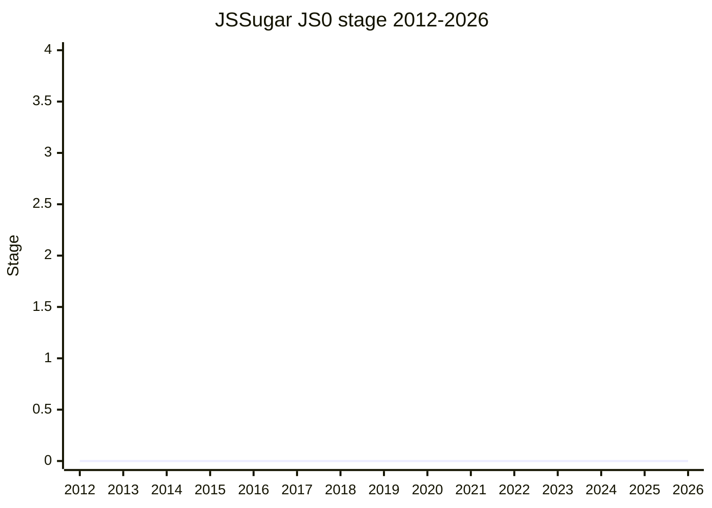

## Overview

JSSugar/JS0 is a direction for the language's evolution rather than a proposal in the normal sense: split JavaScript into two layers. **JS0** would be the smaller core language that engines actually implement; **JSSugar** would be the rest - features that live in tooling and compile down to JS0. [SYG](../people/SYG.md) (V8/Google) presented the problem statement at the 104th meeting (2024-10, Tokyo): the cost of language complexity (security, performance, stability) falls on users and engines and is no longer offset by the value of new features, engines have grown conservative, and the ecosystem already transpiles everything through tools like Babel and TypeScript anyway - so make that split explicit and design for it.

It never entered the stage process: no Stage 1 ask was ever made, and [SYG](../people/SYG.md) was explicit on day 1 that "this is not a proposal, in the normal sense, there's no concrete details for the JSSugar/JS0 idea" - only a problem statement and a direction, with a (then private) repo to be made public for feedback. The committee debated it heavily across two days without consensus. It keeps resurfacing since: as a design frame in Decimal's numeric-types vision (2024-12), as an explicit counterpoint in [DE](../people/DE.md)'s layering design principle (2025-02), and as the committee's vocabulary for proposals engines decline to implement - most concretely in the 2026-05 Decorators demotion to Stage 2.7, where [KM](../people/KM.md) argued decorators would be better off in a JSSugar layer.

## Stage history

| Meeting                                                                           | Event                                                                                                                                                     | Stage |
| --------------------------------------------------------------------------------- | --------------------------------------------------------------------------------------------------------------------------------------------------------- | ----- |
| [2024-10](https://github.com/tc39/notes/blob/main/meetings/2024-10/october-08.md) | Problem statement and two-layer direction (JS0 + JSSugar) presented by [SYG](../people/SYG.md). Heavy debate, no consensus sought; repo to be made public | 0     |
| [2024-10](https://github.com/tc39/notes/blob/main/meetings/2024-10/october-10.md) | Continuation. "Less stable" clarified as fixable-in-tools post-Stage-4, not feature churn; packaging/adoption questions left open. No conclusion          | 0     |

> Never entered the stage process: presented 2024-10 without a Stage 1 ask, so the line stays at 0. The mentions in 2024-12 through 2026-05 were inside other agenda items' discussions, not stage events.

## Main issues

### Is complexity actually held constant?

The pitch rests on the premise that language complexity is roughly constant and the two-layer split just relocates it. [WH](../people/WH.md) rejected that premise from the floor:

> The premise was that there is a constant amount of complexity, and abstractions just move it around from one of those three to another. I don't think that that's necessarily the case. Complexity is not constant.

In [WH](../people/WH.md)'s view most of today's complexity came from past bad decisions (`Object.prototype.__proto__`, `with`, excessive forward hoisting for TDZ), so the best reduction is more care now - citing `unsafe` blocks from [Structs](shared-structs.md) as the timely counter-example. [NRO](../people/NRO.md) added the tooling-side weakness of the premise: tool maintainers are underfunded volunteers, so "features live in tools" assumes a maintenance capacity that does not currently exist. [SYG](../people/SYG.md) accepted he could not substantiate against this - "if well-funded, relatively, but also in absolute terms, well-funded browser teams don't have the risk appetite and tools don't have risk appetite because they are less funded. I hope the committee sees that as a failure."

### What can transpilation actually unlock?

[DE](../people/DE.md) and [NRO](../people/NRO.md) argued JSSugar does not unlock genuinely new kinds of language features, because transpilers are structurally limited to local transforms - the same analysis limit engines face:

> the basics of transpiling is really about very local transforms that don't cross lots of boundaries and don't do a lot of analysis. So I think overall, JSSugar doesn't allow us to do different kinds of things in JavaScript that aren't possible to implement interpreters

[SYG](../people/SYG.md)'s response was as much about incentives as feasibility: the ecosystem incorrectly assumed "VMs are these magical go faster boxes", and making the tool layer explicit would force costs into the open instead of "hoping eventually, it will magically get faster". Day 3 also clarified the stability claim - JSSugar being "less stable" means post-Stage-4 mistakes can be fixed in tools, not that features churn; [YSV](../people/YSV.md) remained cautious about any versioning.

### Would JSSugar have changed Decorators?

[RBN](../people/RBN.md) - as a transpiler author - disputed with data the claim that JSSugar design constraints would have changed outcomes like Decorators: moving TypeScript from experimental to standard decorators raised emit/bundle size by 34% overall and up to 110% for Material Web components.

> I think it is important to consider that any JSSugar syntax is something we have to pay for in down levelling and it's likely that anyone who is very concerned about their bundle size, may end up not using these features because they will never be native.

[SYG](../people/SYG.md) countered that Google teams still transpile to ES5 because dropping it regresses runtime performance (TDZ, class features); [NRO](../people/NRO.md) noted Babel is finally dropping ES5-by-default in its next major and warned against reasoning in "ES edition" terms. The bundle-size and adoption/performance feedback-loop questions ([JHD](../people/JHD.md), [DE](../people/DE.md)) stayed open.

### Embedders and the whole-language question

[PFC](../people/PFC.md) challenged the browser-centricity of the split from the non-browser-embedder side (GNOME's embedded SpiderMonkey): transpilation is "a browser centric concept", and embedders doing crash reporting in a SIGSEGV handler cannot load a source-map library to debug JSSugar. He asked whether non-browser runtimes could implement JS0 and JSSugar as one language in the post-split world; [SYG](../people/SYG.md) said technically possible and probed whether it was realistic. [CM](../people/CM.md) saw core-plus-compiled-languages as a normal, workable pattern.

### Afterlife: echoes in later meetings

The initiative never came back as its own agenda item, but the vocabulary stuck:

- **2024-12, [Decimal](decimal.md) "Vision for numeric types"**: [SFC](../people/SFC.md)'s Solution 5 (`Number.prototype` decimal methods) was framed explicitly as JS0 + JSSugar cooperation - TypeScript introduces a `decimal number` type whose `+` compiles to `.decimalAdd()`, "a nice way of JSZero & JSSugar to work together".
- **2025-02, "Language design goal: Things should layer"**: [DE](../people/DE.md)'s layering design principle (conditional consensus on a modified statement) was explicitly scoped as separate from JSSugar/JS0 - "a logical editorial layering rather than necessarily two languages" - but cited how the JSSugar/JS0 discussion flipped the old "tooling will handle it later" argument.
- **2026-01, Composable value-backed accessors**: in the tooling-benefit debate, [KM](../people/KM.md) noted the committee never endorsed JS0/JSSugar, then "I guess I would ask the committee, if that were the case, to reconsider a JSSugar, JS0 world." [SHS](../people/SHS.md): "So JS0, JSSugar are worth continuing to discuss in my opinion."
- **2026-05, [Decorators](decorators.md) demoted to Stage 2.7**: with no engine willing to ship decorators, [KM](../people/KM.md) argued something like them "would be better off as the JSSugar layer that Shu has talked about in the past" - standardizing how tools lower such features and what their semantics are, "not necessarily something that the browsers directly or engines necessarily directly implement."

## Related proposals

- [Decorators](decorators.md) - the concrete case [KM](../people/KM.md) pointed at the JSSugar layer in 2026-05; Stage 3 since 2022 with zero shipping implementations.
- [Extractors](extractors.md) - granted Stage 2 in 2024-10 with [SYG](../people/SYG.md) stating he didn't think it "meets the bar to be implemented natively in engines" and [DE](../people/DE.md) asking to "figure out the relationship to JSSugar by Stage 2.7".
- [Decimal](decimal.md) - [SFC](../people/SFC.md)'s 2024-12 numeric-types vision sketched JS0 + JSSugar as complementary layers.

## Sources

- [2024-10 october-08](https://github.com/tc39/notes/blob/main/meetings/2024-10/october-08.md) - presentation and day 1 debate ([SYG](../people/SYG.md))
- [2024-10 october-10](https://github.com/tc39/notes/blob/main/meetings/2024-10/october-10.md) - continuation, no conclusion
- [2024-12 december-05](https://github.com/tc39/notes/blob/main/meetings/2024-12/december-05.md) - [SFC](../people/SFC.md)'s numeric-types vision (JS0 + JSSugar remark)
- [2025-02 february-20](https://github.com/tc39/notes/blob/main/meetings/2025-02/february-20.md) - layering design principle discussion ([DE](../people/DE.md))
- [2026-01 january-21](https://github.com/tc39/notes/blob/main/meetings/2026-01/january-21.md) - accessors/tooling discussion ([KM](../people/KM.md), [SHS](../people/SHS.md))
- [2026-05 may-19](https://github.com/tc39/notes/blob/main/meetings/2026-05/may-19.md) - Decorators demoted to Stage 2.7; [KM](../people/KM.md)'s JSSugar-layer argument
