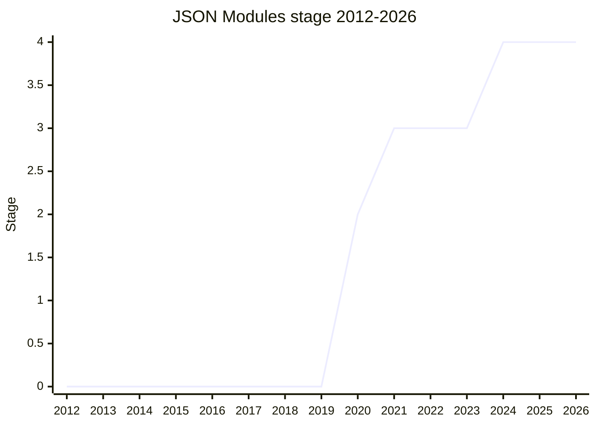

## Overview

Defines what a host must do when an import with `with { type: "json" }` succeeds: parse the payload as JSON and expose the resulting object as the module's only export (the default export; there are no named exports). The goal is consistent JSON-module behavior across hosts. The proposal was **split off from Import Assertions** in 2020 - [DDC](../people/DDC.md): "this is not the end of the import assertions mechanics. This is just the bit about saying what should the host do when the assertions list includes the type JSON assertion" - so before the split it shared [Import Attributes](import-attributes.md)' history (Stage 1 in 2019-12, Stage 2 in 2020-06). In hosts with MIME-type security concerns (the web) the assertion is required; hosts without them may treat JSON as a module without it.

The champions are [MBS](../people/MBS.md), [SSA](../people/SSA.md), [DDC](../people/DDC.md), and [DE](../people/DE.md).

## Stage history

| Meeting                                                                           | Event                                                                                                                                    | Stage |
| --------------------------------------------------------------------------------- | ---------------------------------------------------------------------------------------------------------------------------------------- | ----- |
| [2020-11](https://github.com/tc39/notes/blob/main/meetings/2020-11/nov-18.md)     | First standalone agenda item (spec split off from Import Assertions), asked for Stage 3; deferred over the mutable-vs-immutable question | 2     |
| [2020-11](https://github.com/tc39/notes/blob/main/meetings/2020-11/nov-19.md)     | Continuation: champions to return next meeting with the choice settled; nobody wanted to block either direction                          | 2     |
| [2021-01](https://github.com/tc39/notes/blob/main/meetings/2021-01/jan-25.md)     | **Reached Stage 3, with mutable semantics**                                                                                              | 2 → 3 |
| [2021-01](https://github.com/tc39/notes/blob/main/meetings/2021-01/jan-27.md)     | Conditional, pending reviews from [BFS](../people/BFS.md) and [YSV](../people/YSV.md)                                                    | 3     |
| [2023-07](https://github.com/tc39/notes/blob/main/meetings/2023-07/july-12.md)    | Status update                                                                                                                            | 3     |
| [2024-06](https://github.com/tc39/notes/blob/main/meetings/2024-06/june-11.md)    | Status update                                                                                                                            | 3     |
| [2024-10](https://github.com/tc39/notes/blob/main/meetings/2024-10/october-08.md) | **Reached Stage 4** (presented together with Import Attributes). Shipped in Safari and Chrome                                            | 3 → 4 |

> Before the 2020 split it shared [Import Attributes](import-attributes.md)' history. As its own proposal: effectively Stage 2 at the split (2020-11), Stage 3 in 2021-01, Stage 4 in 2024-10.

## Main issues

### Mutable or immutable?

The question that defined the proposal. The champion group argued for **mutable** JSON (matching JS modules and future web module types like CSS modules; immutable-by-default locks out mutation use cases entirely), while [YSV](../people/YSV.md) preferred immutable singletons with a follow-on proposal for mutable copies. At the 2020-11 Stage 3 request the committee's temperature read favored immutable - incorrectly, it turned out:

> ([DDC](../people/DDC.md), 2021-01) Our impression was that the temperature was more towards the immutable side ... This turned out not to be correct, and we do have a blocking objection if we were to do immutable JSON modules.

The resolution was Stage 3 "with mutable semantics" (2021-01). [CM](../people/CM.md) remained a skeptic - proposing userland immutable wrappers - but not a blocker:

> ([CM](../people/CM.md), 2020-11) You could wrap the mutable import in a module whose job is to import JSON modules and return them in immutable form ... It's just, I'm cranky.

### What a host must do

The proposal is deliberately small: it only specifies the behavior when the `type: "json"` assertion is present (reject the import, or parse the JSON and expose it as the default export), plugging into the HTML synthetic module machinery. Whether the assertion is _required_ is host policy - the web requires it for MIME security reasons, other hosts may not. This split of responsibility is why most of the spec lives on the host side, and why the proposal advanced to Stage 4 bundled with Import Attributes' syntax rather than on its own.

## Related proposals

- [Import Attributes](import-attributes.md) - the syntax this builds on; advanced to Stage 4 in the same two-minute session.
- [Import Bytes](import-bytes.md) - the next module type in the same attribute family (`type: "bytes"`).
- `json-parse-immutable` - the Records-&-Tuples-adjacent answer to "I wanted immutable JSON" (no page yet).

## Sources

- [2020-11 nov-18](https://github.com/tc39/notes/blob/main/meetings/2020-11/nov-18.md) / [nov-19](https://github.com/tc39/notes/blob/main/meetings/2020-11/nov-19.md) - Stage 3 request deferred; mutable vs immutable debated
- [2021-01 jan-25](https://github.com/tc39/notes/blob/main/meetings/2021-01/jan-25.md) / [jan-27](https://github.com/tc39/notes/blob/main/meetings/2021-01/jan-27.md) - Stage 3 (mutable semantics, conditional on reviews)
- [2023-07 july-12](https://github.com/tc39/notes/blob/main/meetings/2023-07/july-12.md) - status update
- [2024-06 june-11](https://github.com/tc39/notes/blob/main/meetings/2024-06/june-11.md) - status update
- [2024-10 october-08](https://github.com/tc39/notes/blob/main/meetings/2024-10/october-08.md) - Stage 4 ([NRO](../people/NRO.md))
