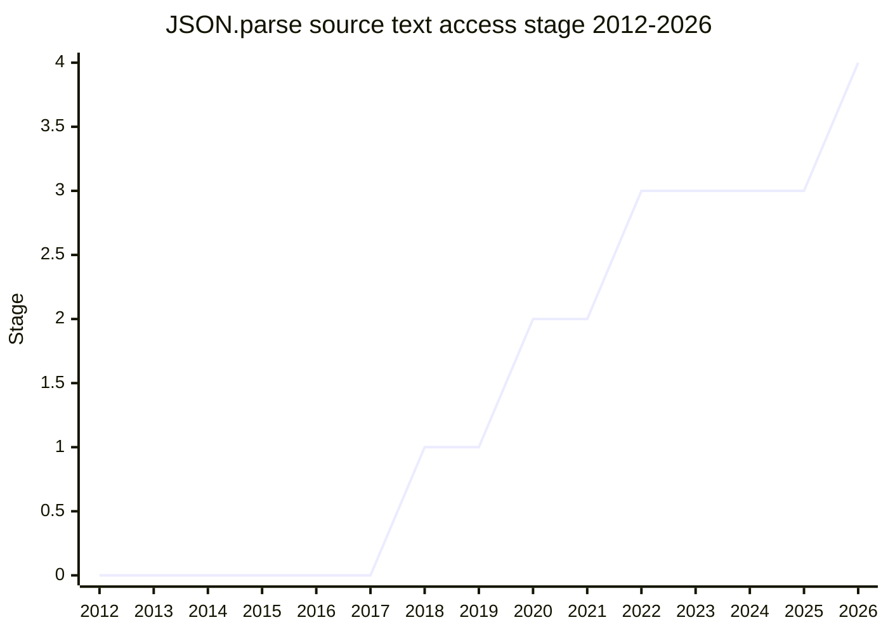

## Overview

`JSON.parse` is lossy: once parsed, the original source text of each value is gone, so a reviver cannot tell whether `1e999` was written as `1e999` or `Infinity`, and large integers cannot be revived into `BigInt` without re-parsing raw text. This proposal gives `JSON.parse` (and later `JSON.stringify`) access to the source text of the values being parsed, so a reviver can make exact decisions (`BigInt` revival, `Date`-like revival, etc.).

Championed by [RGN](../people/RGN.md) (Richard Gibson). Presented as early as 2018, it took seven years to reach Stage 4, with the final stretch extending the mechanism to `JSON.stringify`.

## Stage history

| Meeting                                                                            | What happened                                                                                                                                     | Stage |
| ---------------------------------------------------------------------------------- | ------------------------------------------------------------------------------------------------------------------------------------------------- | ----- |
| [2018-09](https://github.com/tc39/notes/blob/main/meetings/2018-09/sept-27.md)     | First presented (motivation: lossy `JSON.parse`, reviver gets no source text). Stage 1 accepted                                                   | → 1   |
| [2020-02](https://github.com/tc39/notes/blob/main/meetings/2020-02/february-5.md)  | Reached Stage 2                                                                                                                                   | 1 → 2 |
| [2022-06](https://github.com/tc39/notes/blob/main/meetings/2022-06/jun-07.md)      | Reached Stage 3                                                                                                                                   | 2 → 3 |
| [2025-11](https://github.com/tc39/notes/blob/main/meetings/2025-11/november-18.md) | **Reached Stage 4** as the normative PR extending both `JSON.parse` and `JSON.stringify` for interaction with the source text of primitive values | 3 → 4 |

> Stage 1 in 2018-09, Stage 2 in 2020-02, Stage 3 in 2022-06, Stage 4 in 2025-11.

## Main issues

### A long stall, then shipping (2025-11)

By the Stage 4 request the proposal had been quiet for years but was essentially done: implementations in V8, SpiderMonkey, and JavaScriptCore, merged test262 tests (with a few gaps being shored up), and no remaining open issues on the proposal repository. The Stage 4 advancement rode on the normative PR (ecma262#3714) that also extends `JSON.stringify` for interaction with the source text of primitive values, and passed with no objections.

## Related proposals

- `JSON.tryParse` - a separate Stage 1 exploration of error-tolerant parsing.

## Sources

- [2018-09 sept-27](https://github.com/tc39/notes/blob/main/meetings/2018-09/sept-27.md) - first presented, Stage 1
- [2020-02 february-5](https://github.com/tc39/notes/blob/main/meetings/2020-02/february-5.md) - Stage 2
- [2022-06 jun-07](https://github.com/tc39/notes/blob/main/meetings/2022-06/jun-07.md) - Stage 3
- [2025-11 november-18](https://github.com/tc39/notes/blob/main/meetings/2025-11/november-18.md) - Stage 4
