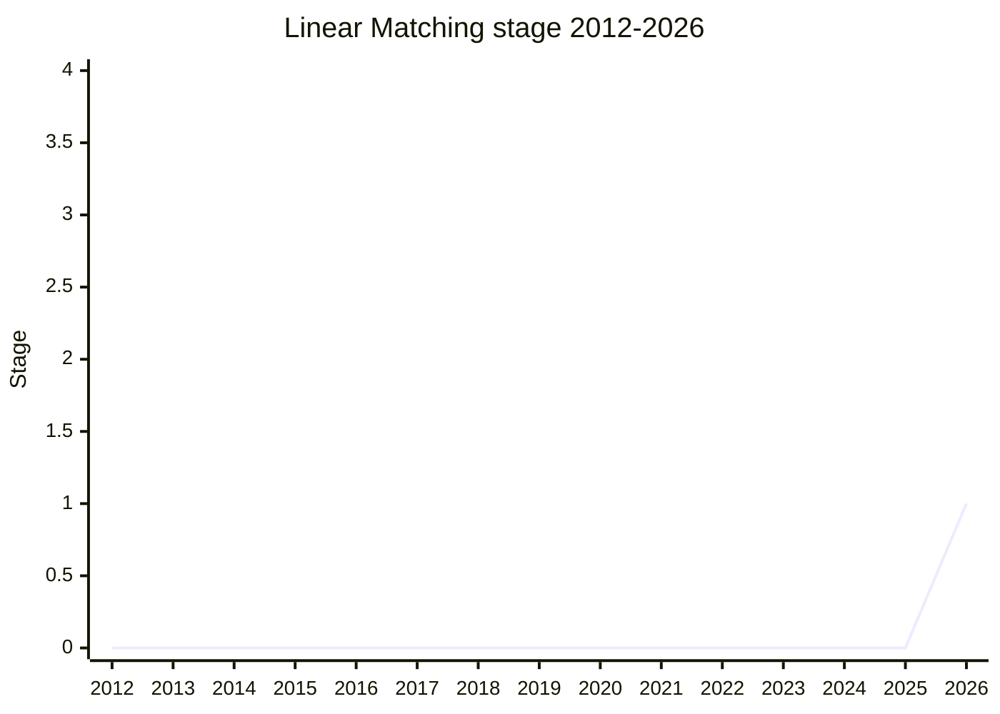

## 概要

Linear Matching は、**ReDoS(Regular expression Denial of Service)への組み込み対策**を探る提案です。現在の JavaScript には、regexp が超線形時間で評価されて unrecoverable に hang することを防ぐ手段がありません。ReDoS は CVE が常時発行される脆弱性クラスで、特定の入力(ユーザ入力に由来しうる)で初めて発火するため事前検出が難しく、linter は spec に性能保証が無い以上信頼できず、userland の linear エンジンは巨大かつ低速です。

Stage 1 の問題文は「**catastrophic で unrecoverable な失敗のリスクなしに正規表現をマッチさせる組み込みの方法が現在存在しない**」。解の候補としては、engine への linear 実行可否の問い合わせ、linear 保証付きの exec 変種、regex flag、timeout/resource limit 後の linear 実装への fallback、linear 保証 subset の仕様化が挙げられていますが、solution は未確定です。champion group は [MF](../people/MF.md)(canonical 上の champion)+ [AUR](../people/AUR.md)(Aurèle Barrière)+ [CPC](../people/CPC.md)(Clément Pit-Claudel、EPFL)。

## ステージ遷移

| 会合                                                   | できごと                                                                                                                                                                                                                                                   | Stage |
| ------------------------------------------------------ | ---------------------------------------------------------------------------------------------------------------------------------------------------------------------------------------------------------------------------------------------------------- | ----- |
| [2026-05](../../raw/notes/meetings/2026-05/may-21.md)  | 前段議論「agreeing to consider impact of RegExp proposals to linear implementations」。linearity への影響考慮に広い支持                                                                                                                                    | -     |
| [2026-07](../../raw/notes/meetings/2026-07/july-22.md) | **Stage 1 到達**([JHD](../people/JHD.md)/[DJM](../people/DJM.md)/[CPC](../people/CPC.md)/[PFC](../people/PFC.md)/[SFC](../people/SFC.md)/[LVU](../people/LVU.md)/[CDA](../people/CDA.md)/[MM](../people/MM.md)/[WH](../people/WH.md) ら多数支持、反対なし) | 0 → 1 |

> 横軸=2012-2026、縦軸=Stage。2026-05 に前段の合意形成、2026-07 に Stage 1。

## 主な論点

### engine 差・version 差を露出する API への懸念

[KG](../people/KG.md) は「engine に linear 実行可否を尋ねる」type の解に不快感を示しました。

> assert として使う人が必ず出る。engine の更新で non-linear になればページが壊れ、engine はその変更を ship できなくなる

[KM](../people/KM.md) も「一度 linear になったものは二度と non-linear にできない(または linear と偽るしかない)」と同調し、[OFR](../people/OFR.md) は「version 間でも答えが変わりうるのは相当悪い状況」と指摘。[CPC](../people/CPC.md) は「後の stage で **linear 必須の subset を仕様で定義**すれば、engine の現状を当てるのではなく標準への準拠で uniform になる」と応答し、[OFR](../people/OFR.md) も問題文の範囲では納得しました。

### backtracking との共存と実装負担

[OFR](../people/OFR.md) は V8 の実験的 linear エンジン(`l` flag)に出荷予定が無いことを明かし、「重要なのは平均時間で、それは backtracking が常に速い。linear は opt-in にせざるを得ず、実装は事実上 2 つの regex エンジンを ship することになる。負担が大きすぎるとして断る可能性もある」と述べました。[MF](../people/MF.md) も backtracking が通常速いことに同意し、個人的には「resource 枯渇まで backtracking で走らせ、linear 実装へ fallback する」系の解を選好。[KM](../people/KM.md) は tier-up counter の前例から「fallback 判定のカウント自体が平均性能を 5-10% 落としうる」と補足しました。[AUR](../people/AUR.md) は「backtracking エンジンへの小さな変更で linear 時間(メモリは犠牲)を得るアルゴリズムもある」と実装コスト緩和の可能性を示しました。

### 「linear」の定義

[WH](../people/WH.md) は「入力文字列長に線形でも、regex 長には指数的でありうる。何について量化しているかに注意せよ」と警告し、[AUR](../people/AUR.md) も「linear を名乗るエンジンの多くは matchAll 相当で quadratic になる」と補足。[SFC](../people/SFC.md) は Rust regex crate が「linear」を引用符付きで定義(展開後 regex 長 × 入力長の積に線形、fast とは限らない)している先例を挙げ、[MF](../people/MF.md) は「subquadratic 保証でも問題文は満たせる」と柔軟性を確認しました。[RGN](../people/RGN.md) はこの整理を経て問題文を「very well crafted」と評価しています。

### 安全な既定値という視点

[KM](../people/KM.md) が「regex の機微を理解しないまま使う開発者に、いつどちらを推奨するのか」と adoption story を問うたのに対し、[CPC](../people/CPC.md) は

> ユーザの大半が機微を理解していないのに、既定が unsafe なものである方がむしろ怖い。まず safe な選択肢を用意し、そちらへ誘導する議論はその後だ

と応じ、Rust ecosystem では平均でより速い backtracking 実装があっても linear な Rust Regex が事実上の標準である事例を挙げました。[MM](../people/MM.md) は timeout のような dynamic non-determinism を導入する解には反対(deterministic な fallback は容認)しつつ Stage 1 を支持しています。

## 関連提案

- [RegExp Buffer Boundaries](../proposals/regexp-buffer-boundaries.md) — RegExp 系の隣接提案。2026-05 の前段議論は「新しい RegExp 提案が linearity に与える影響を考慮する」という形でこれらと接続する。

## 出典

- [2026-05 may-21](../../raw/notes/meetings/2026-05/may-21.md) — 前段の合意形成
- [2026-07 july-22](../../raw/notes/meetings/2026-07/july-22.md) — Stage 1 到達
