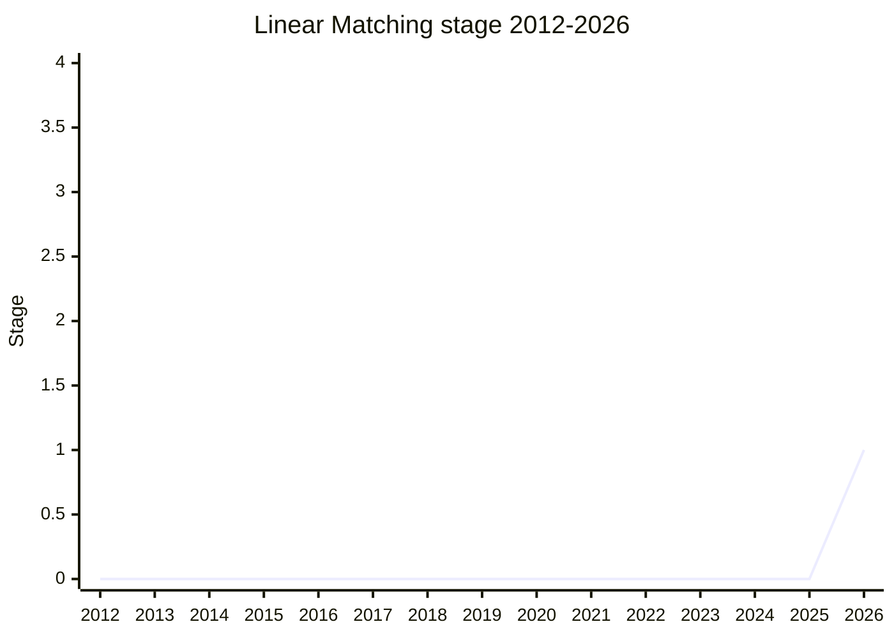

## Overview

Linear Matching explores **a built-in defense against ReDoS (Regular expression Denial of Service)**. JavaScript today has no way to stop a regexp from being evaluated in super-linear time and hanging unrecoverably. ReDoS is a vulnerability class for which CVEs are constantly issued. It is hard to detect ahead of time because it fires only on particular inputs (which may come from user input); a linter cannot be trusted, because the spec gives no performance guarantee; and userland linear engines are huge and slow.

The Stage 1 problem statement is: "**there is currently no built-in way to match a regular expression without the risk of a catastrophic, unrecoverable failure**." Candidate solutions include asking the engine whether it can run linearly, an exec variant with a linear guarantee, a regex flag, falling back to a linear implementation after a timeout or resource limit, and specifying a subset that is guaranteed linear, but the solution is not settled. The champion group is [MF](../people/MF.md) (the champion on the canonical list) + [AUR](../people/AUR.md) (Aurèle Barrière) + [CPC](../people/CPC.md) (Clément Pit-Claudel, EPFL).

## Stage history

| Meeting                                                                        | What happened                                                                                                                                                                                                                                                                          | Stage |
| ------------------------------------------------------------------------------ | -------------------------------------------------------------------------------------------------------------------------------------------------------------------------------------------------------------------------------------------------------------------------------------- | ----- |
| [2026-05](https://github.com/tc39/notes/blob/main/meetings/2026-05/may-21.md)  | Preliminary discussion, "agreeing to consider impact of RegExp proposals to linear implementations." Broad support for considering the impact on linearity                                                                                                                             | -     |
| [2026-07](https://github.com/tc39/notes/blob/main/meetings/2026-07/july-22.md) | **Reached Stage 1** (broad support from [JHD](../people/JHD.md)/[DJM](../people/DJM.md)/[CPC](../people/CPC.md)/[PFC](../people/PFC.md)/[SFC](../people/SFC.md)/[LVU](../people/LVU.md)/[CDA](../people/CDA.md)/[MM](../people/MM.md)/[WH](../people/WH.md) and others, no opposition) | 0 → 1 |

```mermaid
xychart-beta
    title "Linear Matching stage 2012-2026"
    x-axis [2012, 2013, 2014, 2015, 2016, 2017, 2018, 2019, 2020, 2021, 2022, 2023, 2024, 2025, 2026]
    y-axis "Stage" 0 --> 4
    line [0, 0, 0, 0, 0, 0, 0, 0, 0, 0, 0, 0, 0, 0, 1]
```

> Horizontal axis = 2012-2026, vertical axis = Stage. Preliminary consensus-building in 2026-05, Stage 1 in 2026-07.

## Main issues

### An API that exposes engine and version differences

[KG](../people/KG.md) was uncomfortable with the kind of solution that "asks the engine whether it can run linearly."

> Someone will inevitably use it as an assert. If an engine update makes it non-linear, pages break, and the engine can no longer ship that change.

[KM](../people/KM.md) agreed that once something has become linear it can never become non-linear again (or you can only pretend it is still linear), and [OFR](../people/OFR.md) pointed out that it is a pretty bad situation if the answer can also change between versions. [CPC](../people/CPC.md) responded that if a later stage **defines in the spec a subset that must be linear**, it becomes uniform by conformance to the standard rather than by guessing what the engine currently does, and [OFR](../people/OFR.md) was satisfied within the scope of the problem statement.

### Coexistence with backtracking, and the implementation cost

[OFR](../people/OFR.md) disclosed that V8's experimental linear engine (the `l` flag) has no plans to ship, and said that what matters is average time, where backtracking is always faster. Linear would have to be opt-in, an implementation would in effect ship two regex engines, and the burden might be large enough that they decline. [MF](../people/MF.md) also agreed that backtracking is usually faster, and personally prefers the kind of solution that runs with backtracking until resources are exhausted, then falls back to a linear implementation. [KM](../people/KM.md) added, from the precedent of the tier-up counter, that the counting used to decide the fallback can itself drop average performance by 5–10%. [AUR](../people/AUR.md) pointed to a way to ease the implementation cost: there are algorithms that get linear time (at the expense of memory) with a small change to a backtracking engine.

### What "linear" means

[WH](../people/WH.md) warned that something can be linear in the input-string length and still exponential in the regex length, so be careful what you are quantifying over, and [AUR](../people/AUR.md) added that many engines that call themselves linear become quadratic on the equivalent of matchAll. [SFC](../people/SFC.md) cited the Rust regex crate, which defines "linear" in quotes (linear in the product of the expanded regex length and the input length, and not necessarily fast), and [MF](../people/MF.md) confirmed the flexibility that even a subquadratic guarantee can satisfy the problem statement. After that framing, [RGN](../people/RGN.md) called the problem statement "very well crafted."

### A safe default

When [KM](../people/KM.md) asked for the adoption story — for developers who use regexes without understanding the subtleties, when do we recommend which? — [CPC](../people/CPC.md) answered:

> It is scarier that the default is the unsafe one when most users do not understand the subtleties. First provide a safe choice; the argument for steering people toward it comes after.

He cited the Rust ecosystem, where linear Rust Regex is the de facto standard even though a backtracking implementation is faster on average. [MM](../people/MM.md) opposed solutions that introduce dynamic non-determinism such as a timeout (a deterministic fallback is acceptable) while supporting Stage 1.

## Related proposals

- [RegExp Buffer Boundaries](../proposals/regexp-buffer-boundaries.md) — an adjacent RegExp proposal. The 2026-05 preliminary discussion connects to these in the form of "consider the impact that new RegExp proposals have on linearity."

## Sources

- [2026-05 may-21](https://github.com/tc39/notes/blob/main/meetings/2026-05/may-21.md) — preliminary consensus-building
- [2026-07 july-22](https://github.com/tc39/notes/blob/main/meetings/2026-07/july-22.md) — Reached Stage 1
