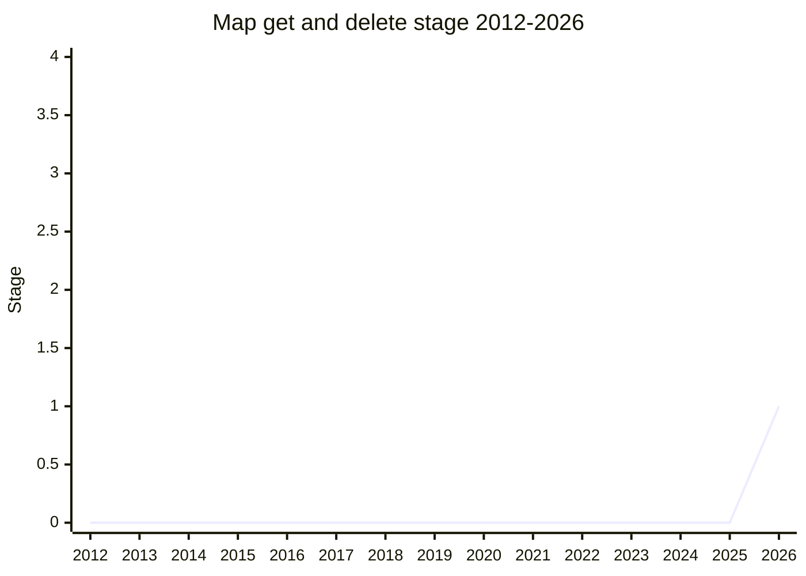

## 概要

Map get and delete(旧称 **Map take**)は、`Map` / `WeakMap` から**値の取得と entry の削除を単一操作で行う method** を追加する提案です。pending な callback や in-flight request の一時保管として Map を使い、値を取り出したら即座に削除するパターンは頻出で、現状は `get` + `delete` の 2 回の hash lookup が必要です。これを 1 回にまとめ、可読性と効率を改善します。polyfill は自明(get して delete して返すだけ)で、本質は頻出操作の最適化です。

[DRO](../people/DRO.md)(Devin Rousso、Invited Expert)が提案。当初の method 名 `take` は `Iterator.prototype.take` と意味が衝突するため、**`getAndDelete` へ rename** する方向で Stage 1 に到達しました。canonical(tc39/proposals)上の提案名も "Map get and delete" です。

## ステージ遷移

| 会合                                                   | できごと                                                                                                                 | Stage |
| ------------------------------------------------------ | ------------------------------------------------------------------------------------------------------------------------ | ----- |
| [2026-07](../../raw/notes/meetings/2026-07/july-20.md) | 「Map take for stage 1, 2, or 2.7」として初提示。名前(take)と Set 対応が争点になり時間切れで翌日へ                       | -     |
| [2026-07](../../raw/notes/meetings/2026-07/july-21.md) | continuation で **Stage 1 到達**。`getAndDelete` へ rename、Set/WeakSet には追加しない、undefined と不在の区別は継続検討 | 0 → 1 |

> 横軸=2012-2026、縦軸=Stage。2026-07 初出、同会合(Day 2 continuation)で Stage 1。

## 主な論点

### 名前: `take` は使えない

[KG](../people/KG.md) は

> `Iterator.prototype.take` が既に存在し意味が大きく異なる以上、take という名前は成立しない。`getOrDelete` や extract なら advancement を支持する

と主張し([MF](../people/MF.md) / [CM](../people/CM.md) も同調)、continuation で `getAndDelete` への rename が決まりました。Rust / Python 等の先行例では take / remove / pop など命名は割れており、JavaScript 固有の衝突(iterator helpers)が決め手です。

### Set / WeakSet にも置くか

Day 1 で [MM](../people/MM.md) は「Map にあって Set に無いのは驚きだ。両方か、どちらも無しか」と対称性を主張し、[DRO](../people/DRO.md) も一旦同意しました。しかし continuation で「Set には `get` が無く、`delete` が在否の boolean を返すので、取得と削除を束ねる意味がない」([MF](../people/MF.md) / [NRO](../people/NRO.md))と整理され、[WH](../people/WH.md) も含めて **Set/WeakSet には追加しない**ことで決着しました。

### `undefined` 値と key 不在の区別

`take` の返り値だけでは「key が無かった」のか「値が `undefined` だった」のか区別できません。[DRO](../people/DRO.md) は `has` の併用や `{present, value}` object を返す代案を示しつつ、実用上の必要を感じていないとしました。[KG](../people/KG.md) は「同じ曖昧さは既存の `Map.prototype.get` にもある」と指摘。[MF](../people/MF.md) は「この method 単体でなく、設計空間(取得+削除系の operation 群)の探索を Stage 2 の前提にすべき」と要求し、[CDA](../people/CDA.md) と共に即時の Stage 2 に反対しました。[ACE](../people/ACE.md) は設計確定後に次回 Stage 1 → 2.7 直行の可能性を見立て、spec reviewer に事前 volunteer しています。

## 関連提案

- [Upsert](../proposals/upsert.md) — `Map.prototype.getOrInsert` / `getOrInsertComputed`。「lookup + 変更」を 1 操作に束ねる同系統の提案(こちらは挿入側)。

## 出典

- [2026-07 july-20](../../raw/notes/meetings/2026-07/july-20.md) — 初提示(時間切れ)
- [2026-07 july-21](../../raw/notes/meetings/2026-07/july-21.md) — continuation、Stage 1 到達
