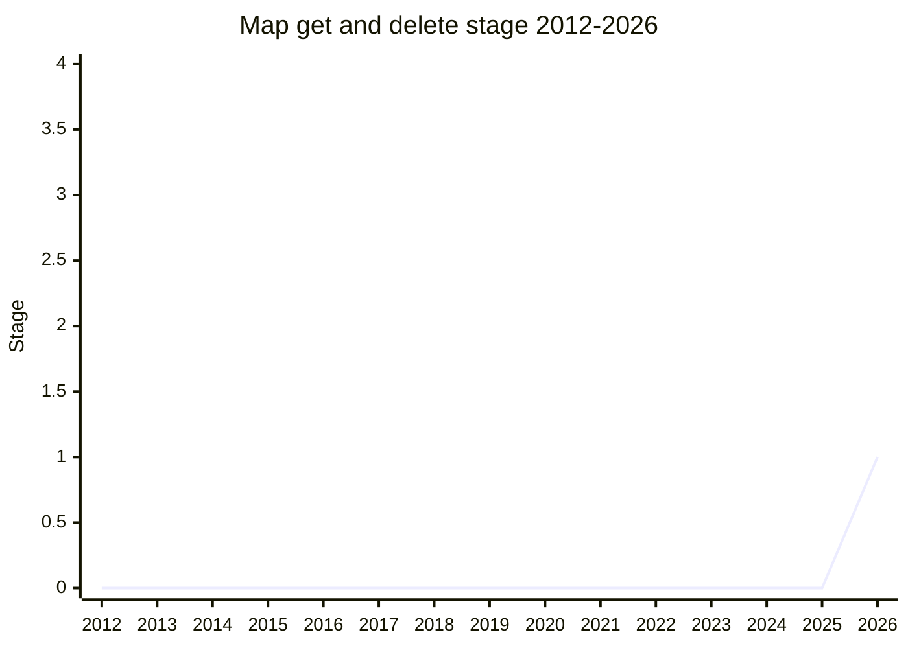

## Overview

Map get and delete (formerly **Map take**) adds a **method that gets a value and deletes the entry in a single operation** on `Map` / `WeakMap`. Using a Map as temporary storage for pending callbacks or in-flight requests, and deleting the value as soon as it is taken out, is a common pattern, and today it needs two hash lookups, `get` + `delete`. Combining them into one improves readability and efficiency. The polyfill is trivial (get, delete, and return), and the essence is optimizing a frequent operation.

Proposed by [DRO](../people/DRO.md) (Devin Rousso, Invited Expert). The original method name `take` collides in meaning with `Iterator.prototype.take`, so it reached Stage 1 on a path of **renaming it to `getAndDelete`**. The proposal name on the canonical list (tc39/proposals) is also "Map get and delete".

## Stage history

| Meeting                                                | What happened                                                                                                                                                        | Stage |
| ------------------------------------------------------ | -------------------------------------------------------------------------------------------------------------------------------------------------------------------- | ----- |
| [2026-07](../../raw/notes/meetings/2026-07/july-20.md) | First presented as "Map take for stage 1, 2, or 2.7". The name (`take`) and Set support were in dispute, and time ran out, so it continued the next day              | -     |
| [2026-07](../../raw/notes/meetings/2026-07/july-21.md) | In the continuation, **reached Stage 1**. Rename to `getAndDelete`, do not add it to Set/WeakSet, and keep investigating how to distinguish `undefined` from absence | 0 → 1 |

```mermaid
xychart-beta
    title "Map get and delete stage 2012-2026"
    x-axis [2012, 2013, 2014, 2015, 2016, 2017, 2018, 2019, 2020, 2021, 2022, 2023, 2024, 2025, 2026]
    y-axis "Stage" 0 --> 4
    line [0, 0, 0, 0, 0, 0, 0, 0, 0, 0, 0, 0, 0, 0, 1]
```

> Horizontal axis = 2012-2026, vertical axis = Stage. First presented in 2026-07, and Stage 1 at the same meeting (Day 2 continuation).

## Main issues

### The name: `take` will not work

[KG](../people/KG.md) argued

> Since `Iterator.prototype.take` already exists and means something quite different, the name take cannot stand. I would support advancement with `getOrDelete` or extract

and [MF](../people/MF.md) / [CM](../people/CM.md) agreed. The continuation settled on renaming it to `getAndDelete`. Prior art in Rust, Python, and others splits across names such as take, remove, and pop; the deciding factor is a JavaScript-specific collision (iterator helpers).

### Whether to put it on Set / WeakSet as well

On day 1, [MM](../people/MM.md) argued for symmetry: "It is surprising for Map to have it and Set not to. Both, or neither." [DRO](../people/DRO.md) initially agreed. In the continuation, though, it was sorted out that "Set has no `get`, and `delete` returns a boolean for presence or absence, so there is no point in bundling get and delete" ([MF](../people/MF.md) / [NRO](../people/NRO.md)), and with [WH](../people/WH.md) included the committee settled on **not adding it to Set/WeakSet**.

### Distinguishing an `undefined` value from a missing key

The return value of `take` alone cannot tell "the key was absent" from "the value was `undefined`". [DRO](../people/DRO.md) offered alternatives — also using `has`, or returning a `{present, value}` object — while saying he did not feel a practical need. [KG](../people/KG.md) pointed out that "the same ambiguity already exists on `Map.prototype.get`". [MF](../people/MF.md) asked that "exploring the design space (the family of get-and-delete operations), not this method alone, should be a prerequisite for Stage 2", and together with [CDA](../people/CDA.md) opposed an immediate Stage 2. [ACE](../people/ACE.md) saw a possible jump straight from Stage 1 to 2.7 at the next meeting once the design is settled, and has volunteered in advance as a spec reviewer.

## Related proposals

- [Upsert](upsert.md) — `Map.prototype.getOrInsert` / `getOrInsertComputed`. A proposal in the same family that bundles "lookup + mutation" into one operation (this one on the insert side).

## Sources

- [2026-07 july-20](../../raw/notes/meetings/2026-07/july-20.md) — first presentation (ran out of time)
- [2026-07 july-21](../../raw/notes/meetings/2026-07/july-21.md) — continuation, reached Stage 1
