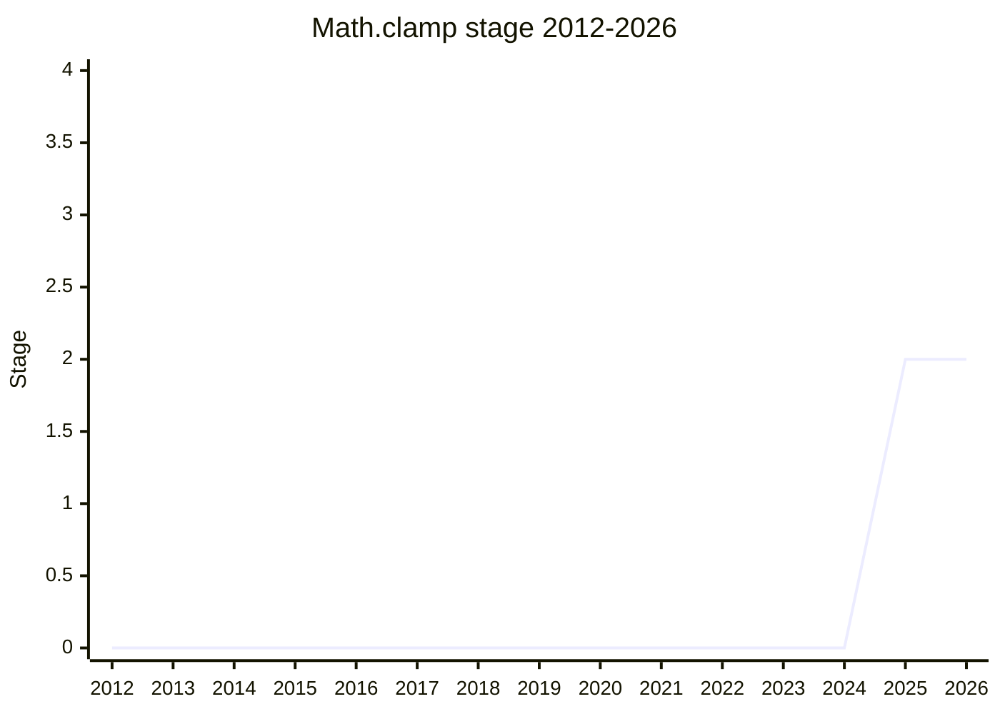

## Overview

Clamp a value into a range: `clamp(value, min, max)` returns `value` if it lies between the bounds, `min` if below, `max` if above. A small, old utility (CSS has `clamp()`, every numeric library has one) that nevertheless forces three awkward committee decisions: where it lives, what happens when the bounds are inverted, and how `BigInt` fits in.

The proposal repo is named `Math.clamp`, but the committee decided at Stage 2 (2025-05) that the method will live as **`Number.prototype.clamp`** (and eventually a `BigInt.prototype` counterpart), with `BigInt` support deferred to a separate proposal. Championed by [OMT](../people/OMT.md) (Oliver Medhurst).

## Stage history

| Meeting                                                                            | What happened                                                                                                                                                                                                   | Stage |
| ---------------------------------------------------------------------------------- | --------------------------------------------------------------------------------------------------------------------------------------------------------------------------------------------------------------- | ----- |
| [2025-02](https://github.com/tc39/notes/blob/main/meetings/2025-02/february-18.md) | `Math.clamp` for Stage 1 or 2. Reached Stage 1                                                                                                                                                                  | → 1   |
| [2025-05](https://github.com/tc39/notes/blob/main/meetings/2025-05/may-29.md)      | For Stage 2. Blockers settled in the session: `Number.prototype.clamp` over `Math.clamp` (broad support), `BigInt` deferred; a continuation later the same day settled the throw question and confirmed Stage 2 | 1 → 2 |

> Stage 1 in 2025-02, Stage 2 in 2025-05. The access path is `Number.prototype.clamp` as of the Stage 2 decision; the repo name still says `Math.clamp`.

## Main issues

### `Math.clamp` or `Number.prototype.clamp`?

The main Stage 2 blocker. [OMT](../people/OMT.md) came in favoring the `Math` namespace but flipped: the prototype "makes it much less confusing even though it's unusual", makes the parameter order obvious (`this` is the value), and paves the way for `BigInt.prototype.clamp`. [MF](../people/MF.md) was strongest for the prototype: "I think that's really the only way that we can make it obvious what the parameter order is. Whenever we have a method that takes three parameters of the same type... if the order is not the expected order of the numeric values, then I think that it can be unintuitive." [DLM](../people/DLM.md) agreed on readability; the temperature check found only supporters. [NRO](../people/NRO.md) used the occasion to complain about process: SpiderMonkey's internal meeting could not tell which shape was being proposed, and "it would have been great if it was clear by the agenda deadline, especially when you're asking already for Stage 2.7".

### Throwing on inverted bounds (+0/-0)

[WH](../people/WH.md) read the spec text and found it throws when `min` ≤ `max` for `+0`/`-0` inputs: "It's crucial for its behavior to respect ordinary IEEE arithmetic. Unfortunately this seems to be fairly controversial." He suggested returning `min` on inversion (as [TAB](../people/TAB.md) noted CSS does), and made it a Stage 2 gate: "I consider throwing when given valid input not to be a minor design feature." The counter-position was [JHD](../people/JHD.md)'s - absent from the room but arguing for throwing on the issue, per [RPR](../people/RPR.md). [MF](../people/MF.md) brokered the compromise: advance to Stage 2 **assuming the no-throw behavior** and confirm with [JHD](../people/JHD.md) later.

In the continuation [JHD](../people/JHD.md) conceded the ±0 case reluctantly ("the way JavaScript treats it per IEEE is confusing and bad... there's no point in continuing that one") but kept the general principle: "when people do thing that are nonsense, we should throw errors. We shouldn't try and do a best guess as to what they want" - and on following CSS, "we should always completely ignore because the argument order is bonkers" (comparing `String.prototype.substring`, which silently sorts swapped arguments). He reserved the right to revisit the min/max throw within Stage 2. The recorded conclusion: Stage 2, `Number.prototype.clamp`, `min` of +0 and `max` of -0 does not throw, and NaN handling still to be worked out between [WH](../people/WH.md) and [JHD](../people/JHD.md).

### BigInt: in or out?

[OMT](../people/OMT.md) proposed deferring: "there really isn't a precedent for BigInt math functions yet, so who knows what trouble it might uncover", and a separate BigInt-math proposal (J. S. Choi's) already exists - [MF](../people/MF.md) wanted that champion consulted first. [WH](../people/WH.md) flagged the lurking design question for the future BigInt version: clamping one-sided toward a missing bound wants a BigInt infinity, which BigInts don't have; [TAB](../people/TAB.md) pointed to the `Iterator.range` precedent of accepting Number's ±Infinity alongside BigInts. Deferred as part of the Stage 2 consensus.

## Related proposals

- `iterator-range` - precedent for letting Number's ±Infinity stand in for a BigInt bound.
- [Math.sumPrecise](math-sum-precise.md) - neighboring Math-namespace numeric work; the prototype decision here is one data point in the ongoing `Math.*` vs prototype placement debate.

## Sources

- [2025-02 february-18](https://github.com/tc39/notes/blob/main/meetings/2025-02/february-18.md) - Stage 1
- [2025-05 may-29](https://github.com/tc39/notes/blob/main/meetings/2025-05/may-29.md) - Stage 2 (two sessions); `Number.prototype.clamp`, no-throw default, BigInt deferred
