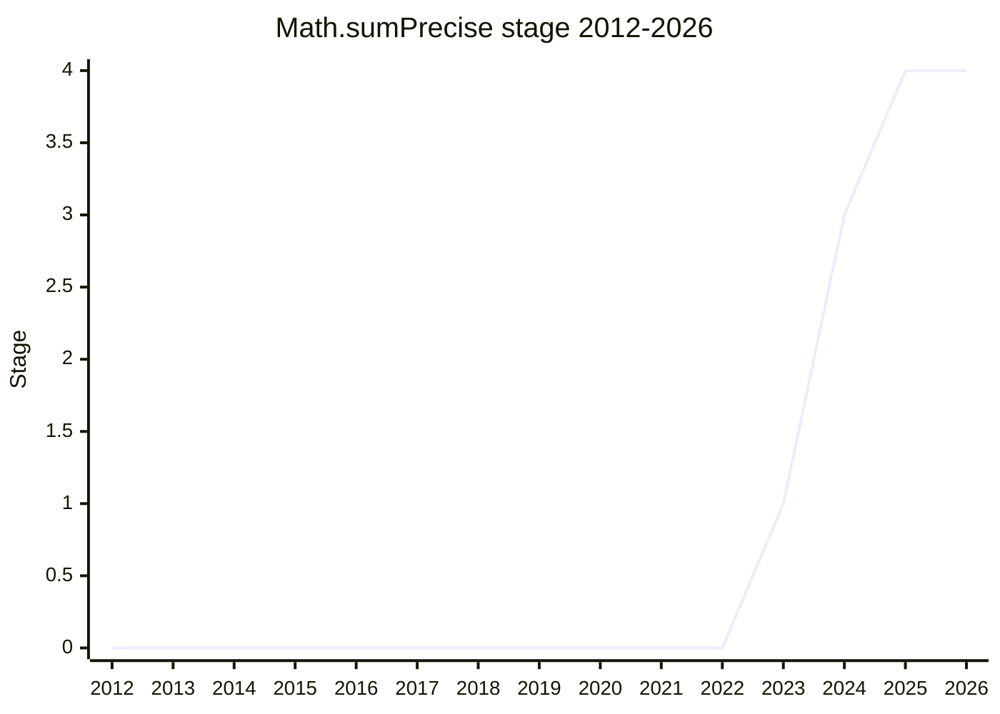

## Overview

A method for summing a list of floating-point numbers without intermediate rounding: `Math.sumPrecise(iterable)` returns the result of summing the inputs as exact real numbers and converting once to a double - the most precise result possible. Naive summation (`reduce((a, b) => a + b)`) accumulates floating-point errors and is not commutative; varargs (`Math.max`-style) were rejected up front because spreading a large array blows the stack, so the API takes a single iterable of numbers (no coercion, no `BigInt`, empty list is `-0` - the floating-point addition identity).

The champion is [KG](../people/KG.md). The core design question - whether maximal precision is even practical - was answered with Shewchuk's 1996 exact-summation algorithm (multiple doubles acting as a wide accumulator, ~500 bytes, a few times slower than naive summation), pointed out by [WH](../people/WH.md), who also reviewed the spec's formulation: "I’ve reviewed this extensively. I certainly support this for Stage 2.7."

## Stage history

| Meeting                                                                            | What happened                                                                                                                               | Stage   |
| ---------------------------------------------------------------------------------- | ------------------------------------------------------------------------------------------------------------------------------------------- | ------- |
| [2023-11](https://github.com/tc39/notes/blob/main/meetings/2023-11/november-28.md) | First presented as `Math.sum`. Reached Stage 1; [KG](../people/KG.md) to study Shewchuk's algorithm for precise floating-point summation    | → 1     |
| [2024-02](https://github.com/tc39/notes/blob/main/meetings/2024-02/feb-6.md)       | Reached Stage 2 for the iterable-only version ("under some name", `-0` questions to be resolved later); [JHD](../people/JHD.md) as reviewer | 1 → 2   |
| [2024-04](https://github.com/tc39/notes/blob/main/meetings/2024-04/april-09.md)    | Presented as `Math.sumExact` for Stage 2.7. Reached Stage 2.7 under the name `sumPrecise` ([MM](../people/MM.md)'s suggestion)              | 2 → 2.7 |
| [2024-10](https://github.com/tc39/notes/blob/main/meetings/2024-10/october-09.md)  | Reached Stage 3 (agenda billed it as the "last chance to suggest other names")                                                              | 2.7 → 3 |
| [2025-07](https://github.com/tc39/notes/blob/main/meetings/2025-07/july-28.md)     | Reached Stage 4                                                                                                                             | 3 → 4   |

> First presented 2023-11; Stage 2 in 2024-02, Stage 2.7 in 2024-04, Stage 3 in 2024-10, Stage 4 in 2025-07.

## Main issues

### Naming: `sumExact` vs `sumPrecise`

Presented as `Math.sumExact`, the name drew immediate pushback from [MM](../people/MM.md) at Stage 2.7: "The term exact actually does bother me in that it promises more than it is possible for it to deliver... What about `sumPrecise`?" [KG](../people/KG.md) accepted on the spot. The related question of a `From` suffix (`sumExactFrom`) to signal that the argument is an iterable - [MF](../people/MF.md): "I think everything named "from" takes an iterable" - was polled and dropped (most preferred without it). [DLM](../people/DLM.md): "although I never thought I’d participate in a naming discussion, I do prefer `sumPrecise` to `sumExact`." The Stage 3 agenda item still carried "last chance to suggest other names".

### NaN and early exit (commutativity)

[MF](../people/MF.md) preferred exiting as soon as the running sum enters the NaN state ("once we see our first NaN, we can know that the operation will only ever throw or produce NaN"), saving work on long iterables. [KG](../people/KG.md) inclined to draining the iterator for consistency: "It’s really nice to be commutative" - the same input set gives the same result regardless of order. [WH](../people/WH.md) probed the edge case (positive and negative infinity encountered without a literal NaN) and suggested a poll; the discussion was left open at Stage 2.7, with the spec ultimately specifying the drain-the-iterator behavior.

## Related proposals

- [Decimal](decimal.md) - the name `sumExact` was rejected partly because users might expect decimal arithmetic; exact base-10 arithmetic is that proposal's territory.
- [Amount](amount.md) - exact numeric handling for values with units.

## Sources

- [2023-11 november-28](https://github.com/tc39/notes/blob/main/meetings/2023-11/november-28.md) - first presentation, Stage 1
- [2024-02 feb-6](https://github.com/tc39/notes/blob/main/meetings/2024-02/feb-6.md) - Stage 2 (iterable-only version)
- [2024-04 april-09](https://github.com/tc39/notes/blob/main/meetings/2024-04/april-09.md) - Stage 2.7 as `sumPrecise`; naming, NaN, and -0 discussions
- [2024-10 october-09](https://github.com/tc39/notes/blob/main/meetings/2024-10/october-09.md) - Stage 3
- [2025-07 july-28](https://github.com/tc39/notes/blob/main/meetings/2025-07/july-28.md) - Stage 4
