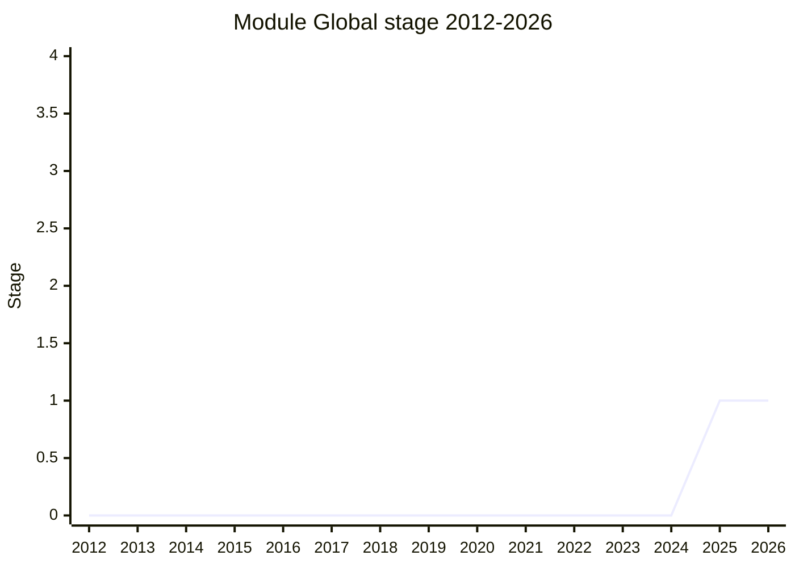

## Overview

A way to evaluate a module and its dependencies **in the context of a new global scope within the same realm** - a new module map. Presented in 2025-07 as "Module Import Hook and new Global": a `Global` constructor (options bag with `keys`, `importHook`, `importMetaHook`) that decouples the concept of global from realm, letting one realm hold multiple globals. It replaces the Evaluators proposal (itself carved out of the Compartment umbrella) and is the loading layer for implementing Compartments in user code.

Motivations: DSLs and test runners (isolated `describe`/`before` environments), shimming built-in modules, emulating another host, and - the champions' core case - **supply-chain attack mitigation** (LavaMoat-style per-package policy enforcement, hardened JS). AI-generated code isolation joined the list in 2025-07: generated code that collides on global names or mis-polyfills would be contained without identity discontinuity ("partial isolation which I deliberately did not call sandboxing" - [ZTZ](../people/ZTZ.md)).

Champions: [ZTZ](../people/ZTZ.md), [KKL](../people/KKL.md), [RGN](../people/RGN.md), [MM](../people/MM.md) (Endo / Agoric). Today this is shimmed by stacking `with` blocks, sloppy mode, direct `eval`, `arguments`, and a Proxy - "all of the sharpest edges of JavaScript and then using them pointed at each other" ([KKL](../people/KKL.md)) - which loses strict-mode fidelity, leaks fingerprintable probe points, and needs Babel pre-transforms.

## Stage history

| Meeting                                                                             | What happened                                                                                                                                                                                                                                                                                                                                        | Stage |
| ----------------------------------------------------------------------------------- | ---------------------------------------------------------------------------------------------------------------------------------------------------------------------------------------------------------------------------------------------------------------------------------------------------------------------------------------------------- | ----- |
| [2025-07](https://github.com/tc39/notes/blob/main/meetings/2025-07/july-30.md)      | Presented as "Module Import Hook and new Global" for Stage 1. Discussion hit the time limit needing a refined problem statement; the continuation granted Stage 1 with the statement "a way to evaluate a module and its dependencies in the context of a new Global scope within the same Realm" and a tentative rename to `proposal-module-global` | → 1   |
| [2025-09](https://github.com/tc39/notes/blob/main/meetings/2025-09/september-23.md) | Stage 1 update (three sessions). Redesign announced: merge back Compartment ideas, no new paths to evaluation as the focus, drop unserializable hooks on `ModuleSource`; committee seeks a ShadowRealm-redundancy justification                                                                                                                      | 1     |

> First presented 2025-07; Stage 1 in the same session (after a continuation).

## Main issues

### Too much detail, and an eval-centric design (Stage 1)

[KG](../people/KG.md)'s meta-feedback: "I would caution against doing this level of detail at this stage, because we haven't even, as a committee, agreed this is a problem worth solving." On the design itself he was positive about same-realm evaluation ("is an interesting idea. I feel positively about that idea if it is feasible") but hostile to the eval basis: "I do not think anyone should be using `eval` or anything like `eval`... I don't want the basis of this to be the use of `eval`." [MM](../people/MM.md) defended keeping per-global evaluators for compatibility with the enormous body of existing evaluator-using code; [KG](../people/KG.md) remained more optimistic about the world running under `no-unsafe-eval`. At the 2025-09 update [KG](../people/KG.md) accepted the reframing: eval may exist inside the compartment "as long as the proposal does not expect that to be the primary way that you leave it."

### Multiple globals per realm may not be viable

[JHD](../people/JHD.md) flagged that the problem statement implies more than one global scope per realm, while other discussions at the same meeting suggested realm-global may need to stay one-to-one; he asked Stage 1 be conditioned on the statement not implying it. [KG](../people/KG.md): "I mean, I think the proposal just dies in that case." [KKL](../people/KKL.md) agreed the proposal dies if the web platform's reality forbids it, but was optimistic; implementer consultation was made an explicit next step (and [OFR](../people/OFR.md)/[KM](../people/KM.md) raised JIT and cross-global performance concerns at the 2025-09 update - specialization assumptions tied to a single global object, throw-exemption oddities; [PHE](../people/PHE.md) countered with Moddable's experience of compartments as "as close to zero overhead as we can find", about 3 kilobytes of memory per compartment).

### Relationship to ShadowRealm: redundant?

The recurring challenge. [KG](../people/KG.md) (2025-09): "I don't understand why this proposal exists if ShadowRealms exist and I don't understand why it makes different decisions... I'm not convinced that it is a problem that warrants solving twice." The champions' answers: they are complementary ([KKL](../people/KKL.md): "por que no los dos"); [MAH](../people/MAH.md): "it's like asking why can't we reconcile VM and containers?"; [MM](../people/MM.md) recounted ShadowRealm's origin in Salesforce's plugin needs (code that cannot be locked down) and noted ShadowRealm is not useful for the supply-chain case. The meeting conclusion records the champions **must** provide a written explanation of why ShadowRealm and Compartment are not redundant.

### `importHook` on `ModuleSource` (dropped)

[KG](../people/KG.md) objected at Stage 1: `ModuleSource`s must be transferable to workers, and "you can't have them carry things on the main realm that is in a different thread." The 2025-09 redesign dropped unserializable hooks on `ModuleSource` entirely (a serializable base/origin replaces them), folding this concern into the broader "no new categories of global, minimal new concepts" direction.

### CSP intersection

The 2025-07 design claimed no _new_ CSP intersection beyond what ESM source phase imports (Stage 2.7) already established (the evaluate-vs-import distinction exists), and a first-class `import` on the global would let module-based code run under `no-unsafe-eval` policies. The 2025-09 "no new paths of evaluation" feedback narrowed this further.

## Related proposals

- `compartments` - the stalled umbrella whose loading layer this proposal revives; the 2025-09 redesign merges Compartment ideas back in.
- [Import Bytes](import-bytes.md) - `ModuleSource` / module-map machinery this proposal builds upon.
- `shadow-realms` - the same-realm-vs-cross-realm isolation counterpart.

## Sources

- [2025-07 july-30](https://github.com/tc39/notes/blob/main/meetings/2025-07/july-30.md) - first presentation and continuation, Stage 1
- [2025-09 september-23](https://github.com/tc39/notes/blob/main/meetings/2025-09/september-23.md) - Stage 1 update; supply-chain motivation, Compartment merge, ShadowRealm question
