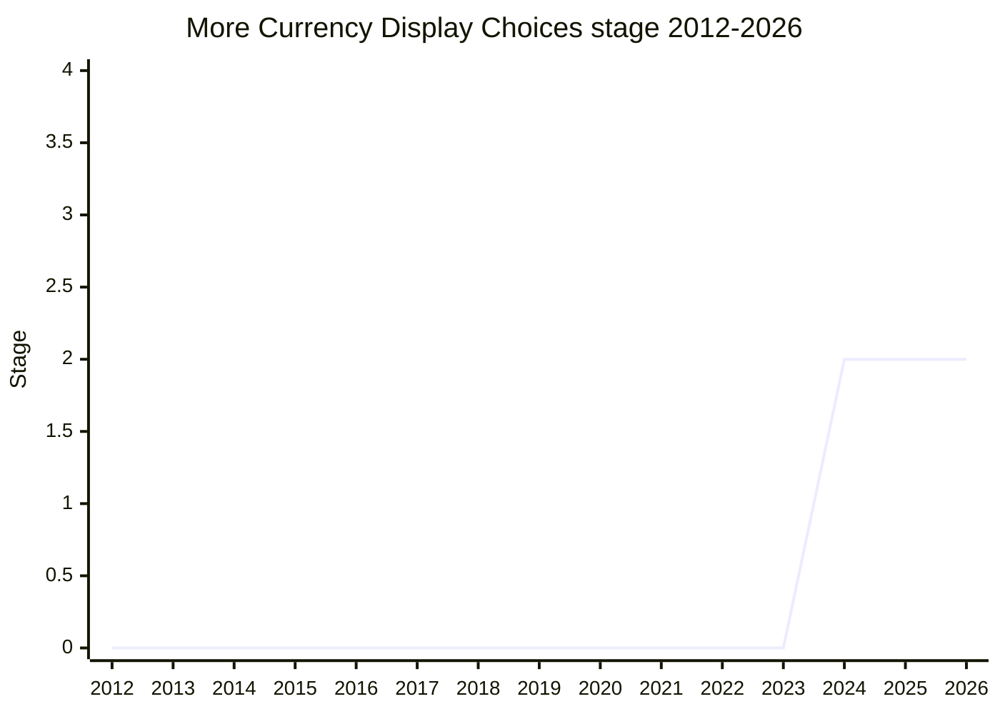

## Overview

Two new values for `Intl.NumberFormat`'s `currencyDisplay` option: `'formalSymbol'` (always the long form, e.g. "US$" for USD even in en-US, where the default `'symbol'` collapses to "$" for the local currency) and `'never'` (format as currency - getting the currency's fractional-digit defaults and other locale rules - while displaying no currency indicator at all). A deliberately small ECMA-402 proposal: both values already exist inside ICU, so the work is exposing them.

The two use cases are complementary. First, every currency _other than_ the locale's own already gets a qualified symbol ("CA$" for CAD in en-US); there was no way to ask for the qualified form for the local currency too. Second, currency-aware formatting is sometimes wanted for values where the symbol is noise - the currency determines digits and placement, but the digits are shown bare.

## Stage history

| Meeting                                                                            | Event                                                                                                                                                                   | Stage |
| ---------------------------------------------------------------------------------- | ----------------------------------------------------------------------------------------------------------------------------------------------------------------------- | ----- |
| [2024-12](https://github.com/tc39/notes/blob/main/meetings/2024-12/december-02.md) | Presented by [EAO](../people/EAO.md). Stage 2 with [JHD](../people/JHD.md) and [NRO](../people/NRO.md) as committed spec reviewers ([DLM](../people/DLM.md) supportive) | → 2   |

> First presented in 2024-12 and advanced straight to Stage 2 in the same session.

## Main issues

### Proposal or normative PR?

The feature is small enough that TG2 discussed whether it should bypass staging entirely and land as a normative PR. The committee chose the stage process anyway - not because the design was open, but to keep a place for the remaining bikeshedding (the `'formalSymbol'` vs `'wideSymbol'` name; whether `'never'` is the right spelling, chosen for symmetry with `signDisplay: 'never'`). [JHD](../people/JHD.md) confirmed the framing: there was "nothing further to be designed", which is exactly why Stage 2 (rather than 1) was appropriate.

### Not listed in the proposals repo

The proposal does not appear in the tc39/proposals lists (Stage 2 tables or otherwise), so its Stage 2 status rests on the meeting notes alone. Nothing since 2024-12 in the agenda index records a further transition.

## Related proposals

- `Intl.NumberFormat` v3 - the option surface this extends (no page yet).
- [Stable Formatting](stable-formatting.md) - the other recent ECMA-402 formatting debate.

## Sources

- [2024-12 december-02](https://github.com/tc39/notes/blob/main/meetings/2024-12/december-02.md) - Stage 2 ([EAO](../people/EAO.md))
