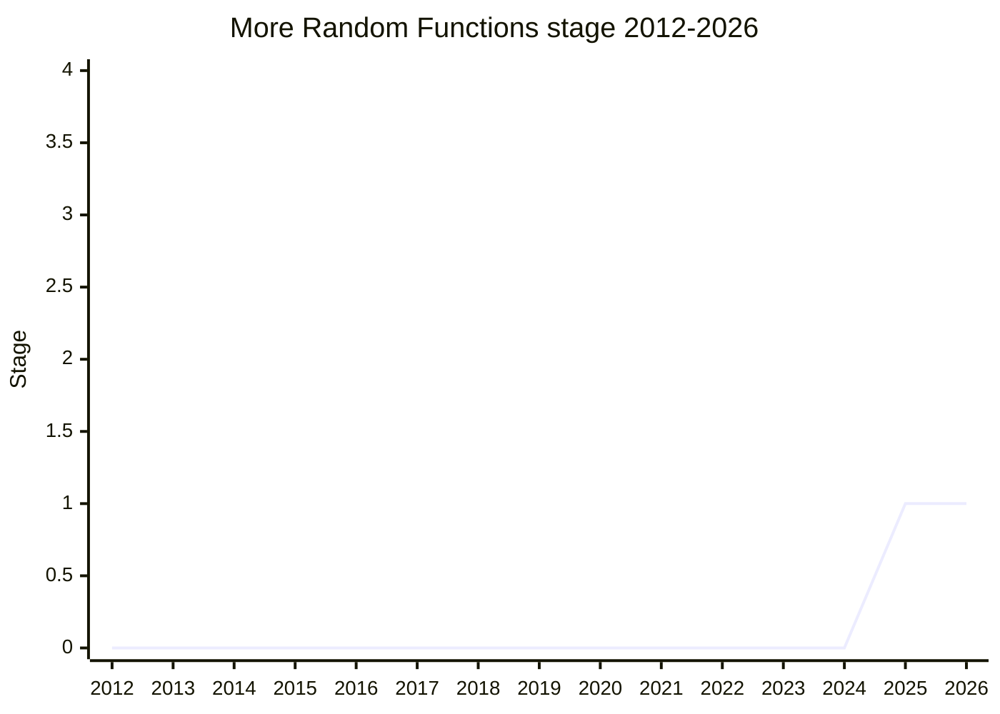

## Overview

A `Random` namespace object for the random-value operations `Math.random` never grew: random integers and BigInts from a range, random bytes into a `Uint8Array`, and (once split out) array shuffling/selection and non-uniform distributions. The motivation is partly ergonomic (random integers are the elephant in the room - "I'm never 100% certain I do it right", [TAB](../people/TAB.md)) and partly a quality story: `Math.random` was "poisoned by the race to the bottom" of benchmark competition and is stuck at a bare `0-1` float, while every new function is specified to run on the same **ChaCha12** backbone as [SeededPRNG](seeded-prng.md) / `Random.Seeded`, so implementations don't build it twice and the browser-provided randomness can in principle be swapped for a seeded generator. WebCrypto stays untouched for cryptographic use.

The Stage 1 grant (2025-05) was deliberately scoped: the namespace, the ChaCha12 specification, the SeededPRNG sync, and the number/int methods only - shuffling, selection, and the non-uniform distributions were split into future proposals. Championed by [TAB](../people/TAB.md).

## Stage history

| Meeting                                                                       | What happened                                                                                                                                                                                                       | Stage |
| ----------------------------------------------------------------------------- | ------------------------------------------------------------------------------------------------------------------------------------------------------------------------------------------------------------------- | ----- |
| [2025-05](https://github.com/tc39/notes/blob/main/meetings/2025-05/may-29.md) | Presented as an omnibus "More Random Functions" for Stage 1. Omnibus criticized; scoped to the `Random` namespace (parts 1/3/4) plus random number/int, with shuffling and distributions split off. Stage 1 granted | → 1   |

> First presented 2025-05 and granted Stage 1 in the same session (scoped as described above).

## Main issues

### Omnibus proposal, or several small ones?

[MF](../people/MF.md)'s main objection: "Just because we would put them all in a single namespace doesn't mean they are a related proposal" - shuffling, distributions, and range-integers solve different problems and "it's likely they will advance at different rates", so he asked for three or four separate proposals. [TAB](../people/TAB.md) agreed and had presented broadly on purpose: "I was somewhat afraid if I went with this slide as the proposal, it's too easy to say 'why don't we just add that to `Math`'" - the omnibus was there to establish the grouping before carving it up. Stage 1 was granted per-part: the namespace, PRNG specification, SeededPRNG sync, and number/int got it; the array and distribution methods will return as their own proposals. [MF](../people/MF.md) also poked at the "copy what Rust does" design method: "it sounds more like a solution looking for a problem than a problem trying to be solved."

### One `Random` namespace, or two new globals?

[MM](../people/MM.md) objected to introducing both `Random` and `SeededPRNG` as globals and proposed making all methods live only on a single global seeded instance - which [KG](../people/KG.md) dismantled on two grounds: instances expose their state (unwanted on a global), and the replay use case needs seed extraction. Meanwhile [EAO](../people/EAO.md) and [SFC](../people/SFC.md) argued the opposite consolidation: one namespace, with the seeded class as `new Random.Seeded` inside it. [SFC](../people/SFC.md) made the principle explicit: "as a committee, I think we should sort of consider that to be the desired outcome" (citing `Temporal` as the model). The champions accepted, and the conclusion moved `SeededPRNG` under the namespace as `Random.Seeded` - the same conclusion recorded on the [SeededPRNG](seeded-prng.md) side.

### Specifying an unobservable PRNG

Part 3 mandates ChaCha12 as the engine for all the new functions, but [KG](../people/KG.md) questioned what that even means for `Random.random()`: "I don't know what it would mean exactly, since this PRNG wouldn't be observable. It's not clear to me how we could specify it." If the output distribution is all that escapes, mandating the algorithm may be unobservable wording - an open question carried past the Stage 1 grant.

## Related proposals

- [SeededPRNG](seeded-prng.md) - the class that became `Random.Seeded`; same backbone, same method surface.
- [Math.sumPrecise](math-sum-precise.md) - the other active Math-adjacent numeric-library line.

## Sources

- [2025-05 may-29](https://github.com/tc39/notes/blob/main/meetings/2025-05/may-29.md) - first presentation, scoped Stage 1
