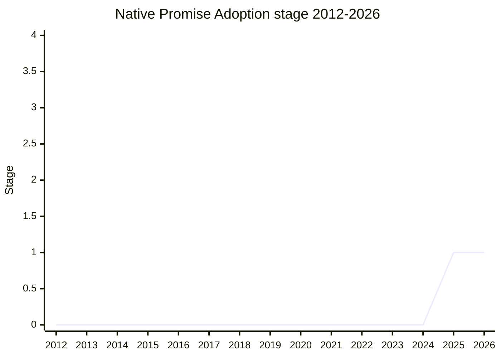

## Overview

Make the promise resolve functions **internally adopt the state of a native promise** instead of fetching and calling its public `.then`, following what the Promises/A+ resolution procedure always intended ("If x is a promise, adopt its state"). Today, resolving a promise with another native promise reads `.then` off the resolution value and calls it later - so `Promise.prototype.then` pollution can interfere with code that never handles a promise itself. The motivating case is an async function returning another async function's result: `await` itself is already pollution-proof (it uses an internal then), but the return-value resolution is not.

The champion is [MAH](../people/MAH.md) (Mathieu Hofman). The change was spun out of the PromiseResolve species-check normative PR (tc39/ecma262#3689, approved in principle the same session) because it carries the web-compatibility risk, and it is a pre-requisite for follow-up "faster promise adoption" work ([JRL](../people/JRL.md)'s tick-reduction proposal can then focus purely on timing).

Note: this proposal is not (yet) listed in `raw/proposals`' tables; its stage here follows the notes.

## Stage history

| Meeting                                                                             | What happened                                                                                                                               | Stage |
| ----------------------------------------------------------------------------------- | ------------------------------------------------------------------------------------------------------------------------------------------- | ----- |
| [2025-09](https://github.com/tc39/notes/blob/main/meetings/2025-09/september-22.md) | First presented for Stage 1 (spun out of normative PR #3689). **Reached Stage 1**, with browsers asked to add compatibility instrumentation | → 1   |

> First presented 2025-09; Stage 1 in the same session.

## Main issues

### Web compatibility: promise-tracking libraries (zone.js)

The change is observable only when the resolution value's `.then` differs from the intrinsic one (an own `.then`, or a modified prototype) - i.e. pollution and promise-tracking libraries. [MAH](../people/MAH.md) analyzed zone.js: it transpiles all async code to promise code and monkey-patches `Promise.prototype.then` to assimilate native promises, but it cannot track a native promise being resolved with another native promise - which is exactly the case this proposal stops routing through `.then`. [JRL](../people/JRL.md) stress-tested it: "I tried to break zone.JS with this implementation, by monkey patching things. After several hours, I wasn't able to break zone.JS" - even if a promise escapes the zone, it eventually calls the monkey-patched `.then` and recaptures the zone ("It's impossible to escape"). [SHS](../people/SHS.md) confirmed AsyncContext is fine for the same reason. Browsers responded well (Mozilla may already have counters); instrumentation will be added alongside the PromiseResolve change.

### Why not a narrow fix?

Special-casing only the async-function return value would be "a weird pin hole through the result value handling". Automatically awaiting the return value is not an option either - it would change `try` / `catch` / `finally` semantics, as already happens (surprisingly) in async generator functions. Doing it in the resolve functions gives one consistent rule for all promise resolution.

## Related proposals

- `native-promise-predicate` - same champion, same session: a side-effect-free brand check for native promises.
- `thenable-curtailment` - the same direction from the other side: `SafePromiseResolve`, resolving a promise without running user code.

## Sources

- [2025-09 september-22](https://github.com/tc39/notes/blob/main/meetings/2025-09/september-22.md) - first presentation, Stage 1
