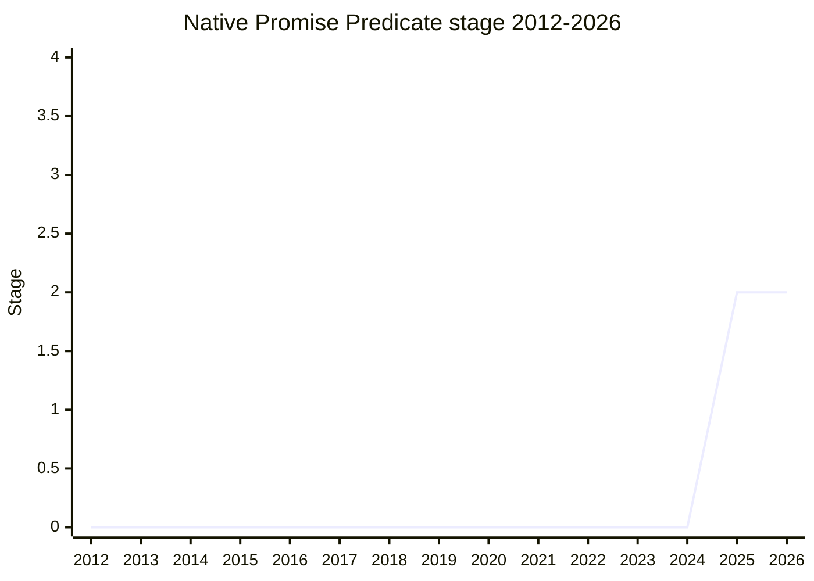

## Overview

A **side-effect-free brand check for native promises**: a predicate on the `Promise` constructor (name TBD) whose only step is the internal `IsPromise` operation. Today there is no clean way to detect a native promise - `Promise.resolve(x) === x` works but has side effects, and duck-testing `.then` misclassifies thenables. Precedent invoked: `Error.isError` (a pure brand check) and `Array.isArray` (though proxy-piercing is explicitly not proposed here). Use cases: membranes, which want to pass promises by copy (recreate the promise on the other side), and detecting whether a value is one that `await` will specially handle.

The champion is [MAH](../people/MAH.md) (Mathieu Hofman); it completes the same theme as `native-promise-adoption` and the PromiseResolve check presented in the same session.

## Stage history

| Meeting                                                                             | What happened                                                                                                                                                                                                   | Stage |
| ----------------------------------------------------------------------------------- | --------------------------------------------------------------------------------------------------------------------------------------------------------------------------------------------------------------- | ----- |
| [2025-09](https://github.com/tc39/notes/blob/main/meetings/2025-09/september-22.md) | First presented for Stage 1 or 2. **Reached Stage 1 and then Stage 2 in the same session** - name deliberately left open; reviewers [JHD](../people/JHD.md) / [JSL](../people/JSL.md) / [JRL](../people/JRL.md) | 0 → 2 |

> First presented 2025-09; Stage 1 and Stage 2 in the same session.

## Main issues

### Naming: `isPromise` vs `isNativePromise` vs `isThenable`

[JHD](../people/JHD.md): "The name should be `isPromise`... at this point, most of a decade of await and AsyncFunctions... killing promise subclasses and forcing every promise libraries promises to become native ones, I don't think the qualifier is helpful." [CZW](../people/CZW.md) worried the name encourages misuse - in most userland code the right check is "is it thenable", and `Promise.isPromise` would push people toward brand checks. [KG](../people/KG.md) took the opposite tack: "regardless of whether they should be checking is-thenable, they will use this to check. That's what they will do and we cannot stop them from doing that. Which inclines me to name it isNativePromise to discourage this." [PFC](../people/PFC.md) and [CM](../people/CM.md) preferred the longer name (less likely to be picked from IDE autocomplete). [ZTZ](../people/ZTZ.md) suggested `isThenable`; [MAH](../people/MAH.md) rejected it on TOCTOU grounds - a `then` getter can return different values on each read, which is why Promises/A+ requires fetching `.then` exactly once. The name was deliberately left as a Stage 2 concern ("name bikeshed before next stage").

### Membrane transparency

A pure brand check cannot be hidden by membranes - but [MAH](../people/MAH.md) argued it exposes nothing new: a side-effectful detection of native promises already exists, so membranes gain no new leak, and membranes want to recreate promises across the boundary anyway (as they do for errors).

## Related proposals

- `native-promise-adoption` - same champion, same session; the internal adoption this predicate would let user code reason about.
- `thenable-curtailment` - `SafePromiseResolve`: resolving a promise without running user code.

## Sources

- [2025-09 september-22](https://github.com/tc39/notes/blob/main/meetings/2025-09/september-22.md) - first presentation, Stage 1 + Stage 2
