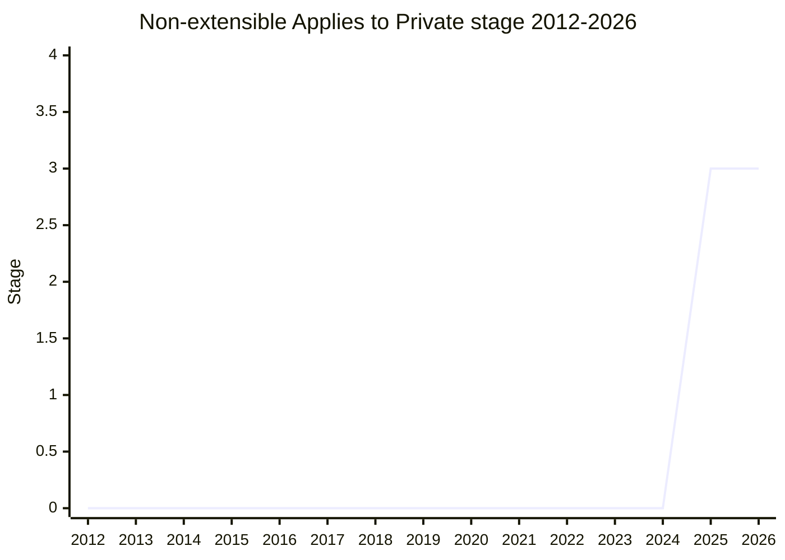

## Overview

Making extensibility apply to private fields: attempting to add a private field to an object that is **non-extensible throws a `TypeError`**. Today it silently succeeds - even on a frozen object - which the champions argue is counterintuitive, since the public-property equivalent already throws. Concretely, the two spec operations that can add a private field (`AddPrivateField` and private-method installation) gain an extensibility precondition check.

Extracted from the **Stabilize** proposal (its "fixed integrity" trait, bundled into the existing non-extensible rather than added as a new integrity trait). The proposal text was written by [SYG](../people/SYG.md); presented by [MM](../people/MM.md). Beyond the semantics fix, two structural motivations: (1) **structs** (proceeding as a separate proposal) can then keep a fixed shape - otherwise return-override plus private-field addition could force a private field onto an already-constructed struct instance, costing the performance promise; (2) capability reasoning - stamping private fields onto existing objects via return override is effectively a syntax-reachable WeakMap side channel that survives freezing a class and its prototypes.

## Stage history

| Meeting                                                                             | What happened                                                                                                                                                                                                                                                              | Stage   |
| ----------------------------------------------------------------------------------- | -------------------------------------------------------------------------------------------------------------------------------------------------------------------------------------------------------------------------------------------------------------------------- | ------- |
| [2025-04](https://github.com/tc39/notes/blob/main/meetings/2025-04/april-15.md)     | Presented for stage 1/2/2.7 at once. **Reached Stage 1, Stage 2 (reviewers [JHD](../people/JHD.md) / [DE](../people/DE.md)), then Stage 2.7 in the same session** (2.7 once the editor sign-offs came in: [KG](../people/KG.md) in real time, [MF](../people/MF.md) later) | 0 → 2.7 |
| [2025-07](https://github.com/tc39/notes/blob/main/meetings/2025-07/july-29.md)      | Update: [NRO](../people/NRO.md)'s new Babel translation shown; new Google stats to be understood. To ask for Stage 3 next plenary after writing and merging test262 tests                                                                                                  | 2.7     |
| [2025-07](https://github.com/tc39/notes/blob/main/meetings/2025-07/july-30.md)      | Continuation ([OFR](../people/OFR.md)): the June uptick in Chrome's usage counter is noise. "No more blockers. Modulo test262 integration the proposal should be able to advance at the next occasion."                                                                    | 2.7     |
| [2025-09](https://github.com/tc39/notes/blob/main/meetings/2025-09/september-22.md) | **Reached Stage 3.** Test262 tests merged ([RGN](../people/RGN.md) helped write them; [PFC](../people/PFC.md)'s spec feedback addressed); Google's [OFR](../people/OFR.md): usage stats "super small"                                                                      | 2.7 → 3 |

> First presented 2025-04, where it cleared Stage 1, 2 and 2.7 in a single session; Stage 3 in 2025-09.

## Main issues

### A deliberately non-backwards-compatible change (breaking correct code)

Google deployed usage counters: ~0.000015% of page loads affected (still growing, not asymptoting), with six affected sites - all in Germany - showing two patterns: a class `_` enumerating its own fields while freezing itself mid-loop, and a superclass constructor freezing `this` with subclasses adding private fields afterward. [MM](../people/MM.md): "the disturbing thing about the proposal is this code, for whatever weird reason might exist, is currently correct. And the price of accepting this proposal is that this code would start misbehaving." [SYG](../people/SYG.md) added scale context: "page loads are on the order of many, many billions. So... even very tiny percentages can end up causing concentrated pain" - outreach was made to the German GIS vendor Cadenza and the sites using an Axial framework. Google, as co-sponsor, decided to go ahead; SpiderMonkey was favorable ([DLM](../people/DLM.md)), and [JHD](../people/JHD.md) supported it while grumbling about losing "the simplicity of the weak map analogy for private fields."

### Babel downlevelling

A long issue-thread on how Babel's downlevelling produces the affected patterns; [NRO](../people/NRO.md) devised a new Babel translation (shown in 2025-07) that works with full fidelity both before and after this proposal; at Stage 3 in 2025-09 [MM](../people/MM.md) said [NRO](../people/NRO.md) planned to implement it in Babel and that "this completely sidesteps the problem" - removing the main source of the breakage.

### Structs depend on it

The structs proposal's pitch is "better classes" with high-speed fixed-shape implementations. Under the old semantics, extensibility of private properties composed with return override could force engines either to give up fixed shape or to maintain a completely separate path for adding private fields to structs. With this change, the shape-breaking attempt simply throws.

## Related proposals

- `structs` - the proposal whose fixed-shape guarantee motivated this change.
- `stabilize` - the proposal this was extracted from (the fixed integrity trait).

## Sources

- [2025-04 april-15](https://github.com/tc39/notes/blob/main/meetings/2025-04/april-15.md) - first presentation; Stage 1, 2 and 2.7 in one session
- [2025-07 july-29](https://github.com/tc39/notes/blob/main/meetings/2025-07/july-29.md) - update (test262 tests needed before Stage 3)
- [2025-07 july-30](https://github.com/tc39/notes/blob/main/meetings/2025-07/july-30.md) - continuation (no more blockers)
- [2025-09 september-22](https://github.com/tc39/notes/blob/main/meetings/2025-09/september-22.md) - Stage 3
